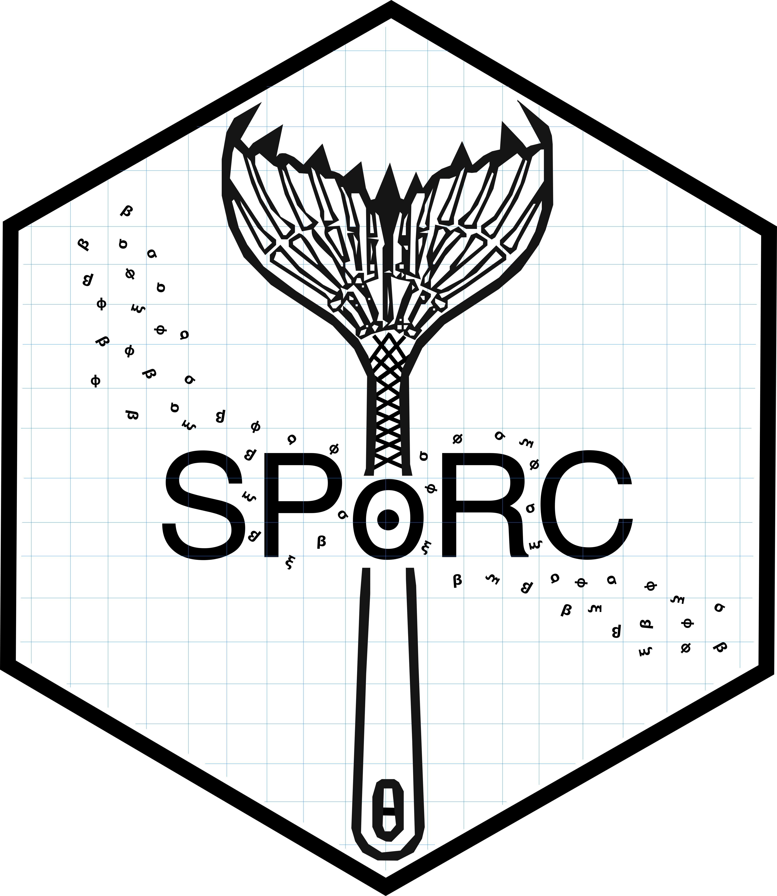

## SPoRC: Stochastic Population Model Over Regional Components <a href='https://github.com/chengmatt/SPoRC'></a>

### Overview
`SPoRC` is a flexible modeling framework for spatially structured population dynamics. It accounts for stochasticity in vital rates and movement among geographically defined components. The framework supports:

- Integration of multiple data sources  
- Regional structuring  
- Age- and sex-specific processes  

Thus, `SPoRC` is suitable for both single-region and spatial stock assessment applications.

### Installation

`SPoRC` is implemented in `RTMB` and optionally relies on additional packages for plotting and diagnostics.

#### Prerequisites

Ensure the following packages are installed:

```
install.packages("devtools")       # Development tools
install.packages("TMB")            # Template Model Builder
install.packages("RTMB")           # R interface to TMB
TMB:::install.contrib("https://github.com/vtrijoulet/OSA_multivariate_dists/archive/main.zip") # Optional: multivariate OSA distributions
```

#### Installing SPoRC
```
devtools::install_github("chengmatt/SPoRC", dependencies = TRUE)
```

**Note**: `SPoRC` is under active development. Users should exercise caution as features are subject to change without notice.
