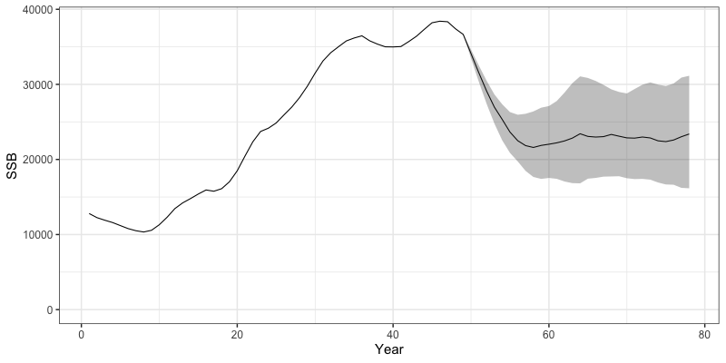
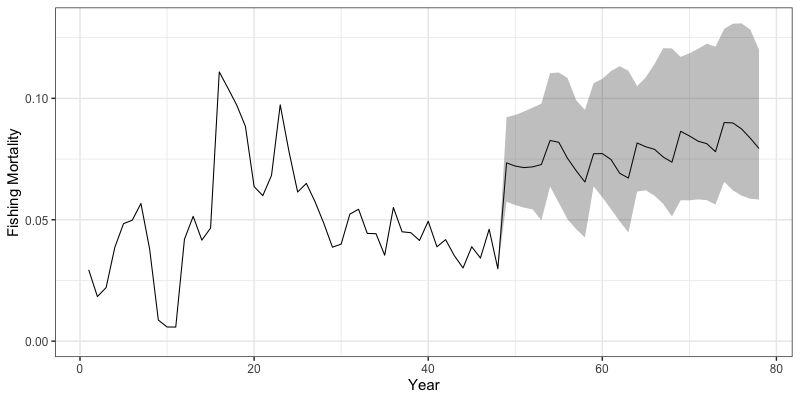

```{r, include = FALSE}
knitr::opts_chunk$set(
  collapse = TRUE,
  comment = "#>"
)
```

In addition to being an estimation model, `SPoRC` also has the capacity to conduct closed loop simulations to evaluate the impacts of estimation model assumptions and harvest strategies on different operating models. These closed loop simulations can be conducted on either spatially-explicit or panmicitic populations. In this vignette, we will demonstrate how to setup a single region, model conditioned (Dusky rockfish) closed loop simulation. Closed loop simulations can also be setup without any explicit conditioning on a given model (see Simulation Testing vignette Cross Testing example) The vignette will generally follow these steps:

1. Define a conditioned operating model (the truth),
2. Define an estimation model to use in the closed-loop simulation,
3. Setup the simulation loop to run an operating and estimation model,
4. Derive reference points and management advice (catch projections) using estimates from the estimation model, and
5. Return management advice back into the annual cycle, completing the closed loop simulation.

Let us first load in the `SPoRC` package.

```{r setup, eval = FALSE}
library(SPoRC)
library(ggplot2)
```

# Define Operating Model
We can then define an operating model we want to condition a population on. Here, parameter estiamtes will be based on model results from Dusky rockfish. We will first load in the model list for Dusky rockfish and redefine variables for use to condition the closed loop simulation.

```{r, eval = FALSE}
data("dusky_rtmb_model") # load in dusky rtmb model for conditioning
# define variables for use in setting up simulation
data <- dusky_rtmb_model$data
rep <- dusky_rtmb_model$rep
parameters <- dusky_rtmb_model$parameters
mapping <- dusky_rtmb_model$mapping
sd_rep <- dusky_rtmb_model$sdrep
```

Next, we condition the closed-loop simulation using the `condition_closed_loop_simulations` function. The simulation will run for 30 additional closed-loop years, with the initial model years serving as a burn-in period. A total of 50 simulations will be executed, assuming that data are available every fifth year. Accordingly, assessments will be conducted every five years, with catch advice set five years in advance. Future recruitment will be sampled from the burn-in period, while uncertainty in the composition data (input sample sizes) will follow the fishing mortality pattern.
```{r, eval = FALSE}
closed_loop_yrs <- 30 # number of closed loop years to do
burnin_years <- 1:length(data$years) # number of conditioning years
n_sims <- 50 # number of simulations to do
assess_freq <- 5 # assessments every 5 years
data_yr_freq <- 5 # data year frequency

# setup simulation list to condition closed loop simulations
set.seed(123) # seed for resampling
sim_list <- condition_closed_loop_simulations(closed_loop_yrs = closed_loop_yrs,
                                              n_sims =  n_sims,
                                              data =  data,
                                              parameters = parameters,
                                              mapping = mapping,
                                              sd_rep = sd_rep,
                                              rep = rep,
                                              random = NULL,
                                              recruitment_opt = 'resample_from_input',
                                              ISS_FishAgeComps_fill = "F_pattern",
                                              ISS_FishLenComps_fill = "F_pattern",
                                              )

assessment_years <- seq(sim_list$feedback_start_yr, sim_list$n_yrs, assess_freq) # assessment years
years_to_use <- c(burnin_years, seq(sim_list$feedback_start_yr, sim_list$n_yrs, data_yr_freq)) # data years
```

# Define Management Options
Following the conditioning process, we define how reference points are used to set catch advice and specify assumptions for catch projections. Reference points are based on the most recent year's demographic rates and a single-region spawning potential ratio (SPR, $F_{40%}$). Projections follow a threshold harvest control rule (HCR) that sets fishing mortality according to stock status. Future recruitment is assumed to be deterministic at the mean, and projections extend over the assessment interval.
```{r, eval = FALSE}
# reference points options
reference_points_opt <- list(
  n_avg_yrs = 1,           # number of years over which to average demographic rates
  SPR_x = 0.4,             # target spawning potential ratio
  calc_rec_st_yr = 20,     # year used for recruitment in bx% calculations
  rec_age = 4,             # age at recruitment
  type = 'single_region',  # reference points calculated for a single region
  what = "SPR"             # method for reference points calculation (SPR)
)

# projection options
proj_opt <- list(
  n_proj_yrs = assess_freq + 1,  # number of years to project (assessment interval + 1)
  HCR_function = function(x, frp, brp, alpha = 0.05) {
    stock_status <- x / brp  # calculate stock status
    # Determine fishing mortality based on stock status
    if(stock_status >= 1) {
      f <- frp  # full F if stock is above reference
    } else if(stock_status > alpha && stock_status < 1) {
      f <- frp * (stock_status - alpha) / (1 - alpha)  # scaled F if stock is between alpha and reference
    } else {
      f <- 0  # no fishing if stock is below threshold
    }
    return(f)
  },
  recruitment_opt = 'mean_rec',  # deterministic mean recruitment
  fmort_opt = 'HCR',             # fishing mortality follows the HCR
  bh_rec_opt = NULL               # no Beverton-Holt recruitment
)
```

# Define Estimation Model
Next, we specify an estimation model (EM) function that uses simulated data to construct a SPoRC model. The helper function `simulation_data_to_SPoRC` extracts and transforms the simulated data into the dimensions required by `SPoRC.` For Dusky rockfish, a single-region model is used with one fishery and one survey fleet. The model assumes single-sex dynamics with 30 ages and directly fits length compositions. Most demographic rates are fixed, consistent with the operational assessment, and both fishery and survey selectivities are modeled as logistic. No stock-recruitment relationship is assumed, and annual recruitment is set to the mean value with annual deviations constrained by `sigmaR.`
```{r, eval = FALSE}
#' Setup Estimation Model (EM) Inputs for SPoRC
#'
#' Prepares the estimation model input list for a given simulation year
#' and replicate within the SPoRC closed-loop simulation framework.
#'
#' @param sim_env Simulation environment generated by `Setup_sim_env()`.
#' @param y Integer. Current simulation year index.
#' @param sim Integer. Simulation replicate index.
#'
#' @return A fully configured EM input list suitable for fitting with `fit_model()`.
setup_em <- function(sim_env, y, sim) {

  # Extract simulation data for current year and replicate
  sim_data <- simulation_data_to_SPoRC(sim_env, y, sim)

  # Model dimensions
  input_list <- Setup_Mod_Dim(years = 1:y, # vector of years
                              ages = 1:sim_env$n_ages, # vector of ages
                              lens = 1:sim_env$n_lens, # number of lengths
                              n_regions = sim_env$n_regions, # number of regions
                              n_sexes = sim_env$n_sexes, # number of sexes
                              n_fish_fleets = sim_env$n_fish_fleets, # number of fishery fleet
                              n_srv_fleets = sim_env$n_srv_fleets, # number of survey fleets
                              verbose = F
                              )

  # Recruitment setup
  input_list <- Setup_Mod_Rec(
    input_list = input_list,
    do_rec_bias_ramp = 1, # Doing bias ramp, but basically setting it so that no lognormal bias correction happens (as in the dusky model)
    bias_year = rep(length(input_list$data$years), 4),
    sigmaR_switch = 1, # when to switch from early to late sigmaR (switch in first year)
    ln_sigmaR = rep(-0.1068576 , 2), # 2 values for early and late sigma
    # Starting values for early and late sigmaR
    rec_model = "mean_rec",
    sigmaR_spec = "fix", # fix early sigmaR and late sigmaR
    init_age_strc = 1, # geometric series to derive initial age structure
    ln_global_R0 = log(2.7), # starting value for mean_rec
    t_spawn = 0 # spawn timing
  )

  # Biological setup
  input_list <- Setup_Mod_Biologicals(
    input_list = input_list,
    # Data inputs
    WAA = sim_data$WAA,
    MatAA = sim_data$MatAA,
    # Model options
    fit_lengths = 1,
    SizeAgeTrans = sim_data$SizeAgeTrans,
    AgeingError = sim_data$AgeingError,
    M_spec = "fix",     # fixing natural mortality
    Fixed_natmort = array(0.07, dim = c(input_list$data$n_regions, length(input_list$data$years),
                                        length(input_list$data$ages), input_list$data$n_sexes)),
    addtocomp = 0.00001
  )

  # Movement and tagging
  input_list <- Setup_Mod_Tagging(input_list = input_list, UseTagging = 0)
  input_list <- Setup_Mod_Movement(
    input_list = input_list,
    use_fixed_movement = 1,
    Fixed_Movement = NA,
    do_recruits_move = 0
  )

  # Fishery catch & fishing mortality
  input_list <- Setup_Mod_Catch_and_F(
    input_list = input_list,
    # Data inputs
    ObsCatch = sim_data$ObsCatch,
    Catch_Type = array(1, dim = c(length(input_list$data$years), input_list$data$n_fish_fleets)),
    UseCatch = sim_data$UseCatch,
    # Model options
    Use_F_pen = 1,
    sigmaC_spec = "fix",
    # Fixing sigma C and F
    ln_sigmaC = sim_data$ln_sigmaC,
    ln_sigmaF = array(log(sqrt(1/2)), dim = c(input_list$data$n_regions, input_list$data$n_fish_fleets))
  )

  # Survey selectivity and catchability
  input_list <- Setup_Mod_FishIdx_and_Comps(
    input_list = input_list,
    # Data inputs
    ObsFishIdx = sim_data$ObsFishIdx,
    ObsFishIdx_SE = sim_data$ObsFishIdx_SE,
    UseFishIdx = sim_data$UseFishIdx,
    ObsFishAgeComps = sim_data$ObsFishAgeComps,
    ObsFishLenComps = sim_data$ObsFishLenComps,
    UseFishAgeComps = sim_data$UseFishAgeComps,
    UseFishLenComps = sim_data$UseFishLenComps,
    ISS_FishAgeComps = sim_data$ISS_FishAgeComps,
    ISS_FishLenComps = sim_data$ISS_FishLenComps,
    # Model options
    fish_idx_type = c("none"),
    FishAgeComps_LikeType = c("Multinomial"),
    FishLenComps_LikeType = c("Multinomial"),
    FishAgeComps_Type = c("agg_Year_1-terminal_Fleet_1"),
    FishLenComps_Type = c("agg_Year_1-terminal_Fleet_1")
  )

  # Survey indices and compositions
  input_list <- Setup_Mod_SrvIdx_and_Comps(
    input_list = input_list,
    # Data inputs
    ObsSrvIdx = sim_data$ObsSrvIdx,
    ObsSrvIdx_SE = sim_data$ObsSrvIdx_SE,
    UseSrvIdx = sim_data$UseSrvIdx,
    ObsSrvAgeComps = sim_data$ObsSrvAgeComps,
    ObsSrvLenComps = sim_data$ObsSrvLenComps,
    UseSrvAgeComps = sim_data$UseSrvAgeComps,
    UseSrvLenComps = sim_data$UseSrvLenComps,
    ISS_SrvAgeComps = sim_data$ISS_SrvAgeComps,
    ISS_SrvLenComps = sim_data$ISS_SrvLenComps,
    # Model options
    srv_idx_type = c("biom"),
    SrvAgeComps_LikeType = c("Multinomial"),
    SrvLenComps_LikeType = c("Multinomial"),
    SrvAgeComps_Type = c("agg_Year_1-terminal_Fleet_1"),
    SrvLenComps_Type = c("agg_Year_1-terminal_Fleet_1")
  )


  # Fishery selectivity and catchability
  input_list <- Setup_Mod_Fishsel_and_Q(
    input_list = input_list,
    # Model options
    fish_sel_model = c("logist2_Fleet_1"), # fishery selex model
    fish_fixed_sel_pars_spec = c("est_all"), # whether to estiamte all fixed effects for fishery selectivity
    fish_q_spec = c("fix") # whether to estiamte all fixed effects for fishery catchability
  )

  # Survey selectivity and catchability
  srv_q_prior <- data.frame(
    region = 1,
    block = 1,
    fleet = 1,
    mu = 1,
    sd = 0.447213595
  )

  input_list <- Setup_Mod_Srvsel_and_Q(
    input_list = input_list,
    # Model options
    srv_sel_model = c("logist2_Fleet_1"), # survey selectivity form
    srv_fixed_sel_pars_spec = c("est_all"), # whether to estimate all fixed effects for survey selectivity
    srv_q_spec = c("est_all"),  # whether to estiamte all fixed effects for survey catchability
    Use_srv_q_prior = 1, # Use catchability prior
    srv_q_prior = srv_q_prior, # Use catchability prior
    # survey timing
    t_srv = array(0, dim = c(input_list$data$n_regions, input_list$data$n_srv_fleets))
  )

  # Data weighting
  input_list <- Setup_Mod_Weighting(
    input_list = input_list,
    Wt_Catch = 1,
    Wt_FishIdx = 1,
    Wt_SrvIdx = 1,
    Wt_Rec = 1,
    Wt_F = 1,
    Wt_Tagging = 0,
    Wt_FishAgeComps = array(1, dim = c(input_list$data$n_regions, length(input_list$data$years),
                                       input_list$data$n_sexes, input_list$data$n_fish_fleets)),
    Wt_FishLenComps = array(1, dim = c(input_list$data$n_regions, length(input_list$data$years),
                                       input_list$data$n_sexes, input_list$data$n_fish_fleets)),
    Wt_SrvAgeComps = array(1, dim = c(input_list$data$n_regions,length(input_list$data$years),
                                      input_list$data$n_sexes, input_list$data$n_srv_fleets)),
    Wt_SrvLenComps = array(0, dim = c(input_list$data$n_regions, length(input_list$data$years),
                                      input_list$data$n_sexes, input_list$data$n_srv_fleets))
  )

  return(input_list)
}
```


# Define and Run Closed-Loop Simulation

Once the Operating Model (OM), Estimation Model (EM), and management options are specified, the closed-loop simulation can be implemented using iterative loops.  
> **Note:** This example is not parallelized, but parallelization over the simulation loop (`n_sims`) can improve computational efficiency. The simulation is also **not wrapped in a single function**, which allows flexibility for different management strategies (e.g., empirical harvest control rules, combinations of empirical and model-based rules, or using assessment-based catch advice in some years and empirical indicators in others).

The simulation generally includes the following components:
1. **Simulation Loop**  
   Iterates over each simulation (`sim in 1:n_sims`).  
2. **Year Loop**  
   Iterates over each modelled year (`y in 1:n_yrs`).  
3. **Annual Dynamics**  
   Within these loops, `run_annual_cycle(y, sim, sim_env)` updates population dynamics, natural mortality, growth, maturity, and movement.  
4. **Management Feedback (optional)**  
   Begins from a specified feedback year (`feedback_start_yr`). During these years, assessments can be conducted.  
5. **Assessment Model (optional)**  
   If an assessment is run:  
   - Use `setup_em(sim_env, y, sim)` to prepare EM inputs.  
   - Optionally exclude certain years using `set_data_indicator_unused()` (all years are still simulated in `run_annual_cycle`).  
6. **Reference Points (optional)**  
   Compute reference points via `get_closed_loop_reference_points()`, using either EM estimates or true OM values.  
7. **Catch Projections (optional)**  
   Project the population forward to determine catch advice using either true OM values or EM estimates.  
8. **Convert Catch Advice to Fishing Mortality**  
   TACs are converted to fishing mortality rates for the simulation to use in the next year, completing the feedback loop.
```{r, eval = FALSE}
set.seed(123) # set seed
sim_env <- Setup_sim_env(sim_list) # Setup simulation environment using conditioned values

# Start Simulation
for (sim in 1:sim_env$n_sims) {
  for (y in 1:sim_env$n_yrs) {

    # Run Annual Dynamics -----------------------------------------------------
    run_annual_cycle(y, sim, sim_env)

    # Start Management Feedback -----------------------------------------------
    if(y >= sim_env$feedback_start_yr) {

      if(y %in% assessment_years) {

        dusky_input_list <- setup_em(sim_env, y, sim) # setup model EM inputs for each year

        # Extract out data, parameters, and mapping
        asmt_data <- dusky_input_list$data
        parameters <- dusky_input_list$par
        mapping <- dusky_input_list$map

        # set data to 0 (assuming assessments are not conducted if no new data are availiable)
        asmt_data <- set_data_indicator_unused(data = asmt_data,
                                               unused_years = setdiff(1:sim_env$n_yrs, years_to_use),
                                               what = c("FishIdx", "FishAgeComps", "SrvIdx", "SrvAgeComps", "FishLenComps", "SrvLenComps"))

        ### Run Assessment ----------------------------------------------------------
        obj <- fit_model(asmt_data,
                         parameters,
                         mapping,
                         random = NULL,
                         newton_loops = 1,
                         silent = T
        )
      }

     if(y %in% assessment_years) {

       ### Get Reference Points ----------------------------------------------------
       reference_points <- get_closed_loop_reference_points(
         use_true_values = FALSE,
         sim_env = sim_env,
         asmt_data = asmt_data,
         asmt_rep = obj$rep,
         y = y,
         sim = sim,
         reference_points_opt = reference_points_opt,
         n_proj_yrs = proj_opt$n_proj_yrs
       )

       ### Run Projections to Determine Catch Advice ---------------------------------------------------
       # Get inputs for projection
       tmp_terminal_NAA <- array(obj$rep$NAA[,y,,], dim = c(asmt_data$n_regions, length(asmt_data$ages), asmt_data$n_sexes)) # terminal numbers at age
       tmp_WAA <- array(rep(asmt_data$WAA[,y,,], each = proj_opt$n_proj_yrs), dim = c(asmt_data$n_regions, proj_opt$n_proj_yrs, length(asmt_data$ages), asmt_data$n_sexes)) # weight at age
       tmp_WAA_fish <- array(rep(asmt_data$WAA_fish[,y,,,], each = proj_opt$n_proj_yrs), dim = c(asmt_data$n_regions, proj_opt$n_proj_yrs, length(asmt_data$ages), asmt_data$n_sexes, asmt_data$n_fish_fleets)) # weight at age fishery
       tmp_MatAA <- array(rep(asmt_data$MatAA[,y,,], each = proj_opt$n_proj_yrs), dim = c(asmt_data$n_regions, proj_opt$n_proj_yrs, length(asmt_data$ages), asmt_data$n_sexes)) # maturity at age
       tmp_fish_sel <- array(rep(obj$rep$fish_sel[,y,,,], each = proj_opt$n_proj_yrs), dim = c(asmt_data$n_regions, proj_opt$n_proj_yrs, length(asmt_data$ages), asmt_data$n_sexes, asmt_data$n_fish_fleets)) # selectivity
       tmp_terminal_F <- array(obj$rep$Fmort[,y,], dim = c(asmt_data$n_regions, asmt_data$n_fish_fleets)) # terminal fishing mortality
       tmp_natmort <- array(rep(obj$rep$natmort[,y,,], each = proj_opt$n_proj_yrs), dim = c(asmt_data$n_regions, proj_opt$n_proj_yrs, length(asmt_data$ages), asmt_data$n_sexes)) # natural mortality
       tmp_recruitment <- array(obj$rep$Rec[,1:y], dim = c(asmt_data$n_regions, length(1:y))) # recruitment to use for projections
       tmp_sexratio <- array(replicate(n = proj_opt$n_proj_yrs, obj$rep$sexratio[,y,]), dim = c(asmt_data$n_regions, proj_opt$n_proj_yrs, asmt_data$n_sexes)) # recruitment sex ratio
       tmp_Movement <- array(dim = c(asmt_data$n_regions, asmt_data$n_regions, proj_opt$n_proj_yrs, length(asmt_data$ages), asmt_data$n_sexes))
       for(proj_yr in 1:proj_opt$n_proj_yrs) tmp_Movement[,,proj_yr,,] <- obj$rep$Movement[,,y,,] # Movement projections

       # Do projection to get TAC
       proj <- Do_Population_Projection(
         n_proj_yrs = proj_opt$n_proj_yrs,
         n_regions = sim_env$n_regions,
         n_ages = sim_env$n_ages,
         n_sexes = sim_env$n_sexes,
         sexratio = tmp_sexratio,
         n_fish_fleets = sim_env$n_fish_fleets,
         do_recruits_move = sim_env$do_recruits_move,
         recruitment = tmp_recruitment,
         terminal_NAA = tmp_terminal_NAA,
         terminal_F = tmp_terminal_F,
         natmort = tmp_natmort,
         WAA = tmp_WAA,
         WAA_fish = tmp_WAA_fish,
         MatAA = tmp_MatAA,
         fish_sel = tmp_fish_sel,
         Movement = tmp_Movement,
         f_ref_pt = reference_points$f_ref_pt,
         b_ref_pt = reference_points$b_ref_pt,
         HCR_function = proj_opt$HCR_function,
         recruitment_opt = proj_opt$recruitment_opt,
         fmort_opt = proj_opt$fmort_opt,
         t_spawn = sim_env$t_spawn,
         bh_rec_opt = proj_opt$bh_rec_opt
       )

       # Get TAC
       tmp_TAC <- proj$proj_Catch[,-1,,drop = FALSE] # get catch advice from projected year
     }

      ### TAC to Fishing Mortality ------------------------------------------------
      if(y < sim_env$n_yrs) {
        last_assess_year <- max(assessment_years[assessment_years <= y]) # get last assessment year
        tac_year_index <- y - last_assess_year + 1 # get years to index TACs
        rf_grid <- expand.grid(r = seq_len(sim_env$n_regions), f = seq_len(sim_env$n_fish_fleets)) # set up region, fleet grid to bisection across
        tmp_f <- mapply(function(r, f) { # do bisection to go from region and fleet specific catch to region and fleet specific F rates
          bisection_F(
            f_guess = 0.05, # guess for fishing mortality rate
            catch = tmp_TAC[r, tac_year_index, f], # catch values to use
            NAA = sim_env$NAA[r, y+1, , , sim], # numbers at age in simulation (truth)
            WAA = sim_env$WAA[r, y+1, , , sim], # weight-at-age in simulation (truth)
            natmort  = sim_env$natmort[r, y+1, , , sim], # natural mortality in simulation (truth)
            fish_sel = sim_env$fish_sel[r, y+1, , , f, sim] # fishery selectivity in simulation (truth)
          )
        }, r = rf_grid$r, f = rf_grid$f)
        sim_env$Fmort[,y+1,,sim] <- array(tmp_f, dim = c(sim_env$n_regions, sim_env$n_fish_fleets)) # assign bisection values back into simulation
      } # end if

    } # feedback year
  } # end y loop
} # end sim loop
```


We can then inspect some outputs from the closed loop simulation. Note that all results are now saved in the `sim_env` environment object. Plotted below are trajectories of catch, fishing mortality, and spawning stock biomass for a given simulation. 
```{r, eval = FALSE}
# Trajectories of spawning biomass
reshape2::melt(sim_env$SSB) %>%
  filter(value != 0) %>%
  rename(Region = Var1, Year = Var2, Sim = Var3) %>%
  group_by(Region, Year) %>%
  summarize(median = median(value),
            lwr = quantile(value, 0.025),
            upr = quantile(value, 0.975)) %>%
  ggplot(aes(x = Year, y = median, ymin = lwr, ymax = upr)) +
  geom_line() +
  geom_ribbon(alpha = 0.3) +
  coord_cartesian(ylim = c(0,NA)) +
  theme_bw(base_size = 15) +
  labs(y = 'SSB')

# Trajectories of catches
reshape2::melt(sim_env$TrueCatch) %>%
  filter(value != 0) %>%
  group_by(Var2, Var4, Var1) %>%
  summarize(value = sum(value)) %>%
  group_by(Var1, Var2) %>%
  summarize(median = median(value),
            lwr = quantile(value, 0.025),
            upr = quantile(value, 0.975)) %>%
  rename(Region = Var1, Year = Var2) %>% 
  ggplot(aes(x = Year, y = median, ymin = lwr, ymax = upr)) +
  geom_line() +
  geom_ribbon(alpha = 0.3) +
  coord_cartesian(ylim = c(0,NA)) +
  theme_bw(base_size = 15) +
  labs(x = 'Year', y = 'Catch')

# Trajectories of fishing mortality
reshape2::melt(sim_env$Fmort) %>%
  filter(value != 0) %>%
  group_by(Var2, Var4, Var1) %>%
  summarize(value = sum(value)) %>%
  group_by(Var1, Var2) %>%
  summarize(median = median(value),
            lwr = quantile(value, 0.025),
            upr = quantile(value, 0.975)) %>%
  rename(Region = Var1, Year = Var2) %>%
  ggplot(aes(x = Year, y = median, ymin = lwr, ymax = upr)) +
  geom_line() +
  geom_ribbon(alpha = 0.3) +
  coord_cartesian(ylim = c(0,NA)) +
  theme_bw(base_size = 15) +
  labs(y = 'Fishing Mortality', x = 'Year')
```




