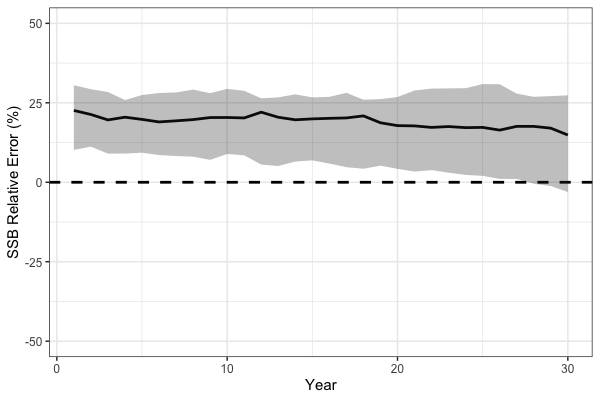
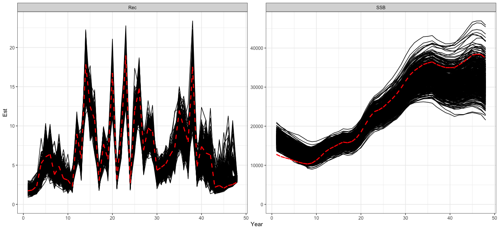

```{r setup, include=FALSE}
knitr::opts_chunk$set(
  collapse = TRUE,
  comment = "#>"
)
```

# Simulation Cross-Testing in `SPoRC`
Simulation testing stock assessment models is integral to evaluating robustness and understanding how models perform under model misspecification. The `SPoRC` framework supports simulation testing in three forms:  
- Self-testing: the estimation model (EM) has the same structure as the operating model (OM).  
- Cross-testing: the EM differs structurally from the OM, allowing assessment of bias and sensitivity to incorrect assumptions.  
- Closed loop simulations (see Closed Loop Simulations vignette example). 

In this first section of the vignette, we present a cross-test example. The operating model (OM; simulated truth) assumes a logistic selectivity curve for the fishery, while the estimation model (`SPoRC`; EM) incorrectly specifies a dome-shaped (gamma) selectivity curve.  

The OM defines the biological processes, fishing dynamics, survey structure, and recruitment assumptions. Unless otherwise noted, the OM observation model uses default settings:  

- Composition Input Sample Size = 100, with Multinomial sampling (Fishery and Survey)
- Survey index SD = 0.2, with lognormal observations
- Catch SD = 0.02, with lognormal observations  

## Define Model Dimensions

We start by defining the structural dimensions of the operating model.

```{r, eval=FALSE}
sim_list <- Setup_Sim_Dim(
  n_sims        = 50,  # number of simulations
  n_yrs         = 30,  # number of years
  n_regions     = 1,   # single region
  n_ages        = 10,  # number of ages
  n_lens        = NULL,# no length structure
  n_sexes       = 1,   # single sex
  n_fish_fleets = 1,   # one fishery fleet
  n_srv_fleets  = 1    # one survey fleet
)

# Create storage containers
sim_list <- Setup_Sim_Containers(sim_list)
```

## Fishing Processes

The fishery selectivity in the OM is logistic, centered around age 5.

```{r, eval=FALSE}
sim_list <- Setup_Sim_Fishing(sim_list = sim_list, # update simulate list
                              # Logistic selectivity
                              fish_sel_input = replicate(
                                n = sim_list$n_sims,
                                array(rep(1 / (1 + exp(-3 * ((1:sim_list$n_ages) - 5))), each = sim_list$n_yrs),
                                      dim = c(sim_list$n_regions, sim_list$n_yrs, sim_list$n_ages,
                                              sim_list$n_sexes, sim_list$n_fish_fleets))
                              )
)

```

## Survey Processes

We specify survey selectivity as logistic, centered around age 3.

```{r, eval=FALSE}
sim_list <- Setup_Sim_Survey(
  sim_list = sim_list,
  # Logistic selectivity
  srv_sel_input = replicate(
    n = sim_list$n_sims,
    array(rep(1 / (1 + exp(-1 * ((1:sim_list$n_ages) - 3))), each = sim_list$n_yrs),
          dim = c(sim_list$n_regions, sim_list$n_yrs, sim_list$n_ages,
                  sim_list$n_sexes, sim_list$n_srv))
  )
)
```

## Biological Dynamics

Biological parameters are set for natural mortality, maturity-at-age, and weight-at-age. These values are relatively arbitrary and are specified to generically represent a fairly short-lived species.

```{r, eval=FALSE}
sim_list <- Setup_Sim_Biologicals(
  sim_list = sim_list, # simualtion list
  natmort_input = replicate(n = sim_list$n_sims, array(0.3, dim = c(sim_list$n_regions, sim_list$n_yrs,
                                                                    sim_list$n_ages, sim_list$n_sexes))), # natural mortality
  WAA_input = replicate(n = sim_list$n_sims, array(rep(5 / (1 + exp(-3 * ((1:sim_list$n_ages) - 3))), each = sim_list$n_yrs),
                                                   dim = c(sim_list$n_regions, sim_list$n_yrs, sim_list$n_ages, sim_list$n_sexes))), # weight at age
  WAA_fish_input = replicate(n = sim_list$n_sims, array(rep(5 / (1 + exp(-3 * ((1:sim_list$n_ages) - 3))), each = sim_list$n_yrs),
                                                        dim = c(sim_list$n_regions, sim_list$n_yrs, sim_list$n_ages, sim_list$n_sexes, sim_list$n_fish_fleets))), # fishery weight at age
  WAA_srv_input = replicate(n = sim_list$n_sims, array(rep(5 / (1 + exp(-3 * ((1:sim_list$n_ages) - 3))), each = sim_list$n_yrs),
                                                       dim = c(sim_list$n_regions, sim_list$n_yrs, sim_list$n_ages, sim_list$n_sexes, sim_list$n_srv_fleets))), # survey weight at age
  MatAA_input = replicate(n = sim_list$n_sims, array(rep(1 / (1 + exp(-3 * ((1:sim_list$n_ages) - 3))), each = sim_list$n_yrs),
                                                     dim = c(sim_list$n_regions, sim_list$n_yrs, sim_list$n_ages, sim_list$n_sexes))) # maturity at age
)

```

## Tagging and Movement

For this example, tagging is disabled and no movement is modeled.
```{r, eval=FALSE}
sim_list <- Setup_Sim_Tagging(
  sim_list = sim_list, # simulation list
  UseTagging = 0
)

# No Movement
sim_list$Movement <- array(1, dim = c(sim_list$n_regions, sim_list$n_regions, sim_list$n_yrs, sim_list$n_ages, sim_list$n_sexes, sim_list$n_sims))
```

## Recruitment

Recruitment is modeled with mean recruitment dynamics, where `R0_input` is the mean recruitment parameter centered at a value of 5.

```{r, eval=FALSE}
sim_list <- Setup_Sim_Rec(
  sim_list = sim_list,
  R0_input = replicate(n = sim_list$n_sims, expr = array(5, dim = c(sim_list$n_regions, sim_list$n_yrs))), # R0
  ln_sigmaR = log(c(1, 1)),
  recruitment_opt = 'mean_rec'
)
```

## Run the Operating Model

```{r, eval=FALSE}
set.seed(123)
sim_obj <- Simulate_Pop_Static(sim_list = sim_list, output_path = NULL) # get simulated datasets
```

The object `sim_obj` contains the simulated population, fishery, and survey data ready to pass to the EM for cross-testing.

## Define Estimation Model
After simulating the operating model (OM), we can set up the estimation model (EM) in `SPoRC`.  
In this cross-test, the EM incorrectly assumes a dome-shaped (gamma) fishery selectivity,  
even though the OM used logistic selectivity. In general, EM settings are identical to the OM, except for fishery selectivity.

```{r, eval = FALSE}
setup_em <- function(sim_obj, sim) {

  # Extract simulation data for current year and replicate
  sim_data <- simulation_data_to_SPoRC(sim_env = sim_obj, y = sim_obj$n_years, sim = sim)

  # Setup model dimensions
  input_list <- Setup_Mod_Dim(
    years = 1:sim_obj$n_years,
    ages = 1:sim_obj$n_ages,
    lens = sim_obj$n_lens,
    n_regions = sim_obj$n_regions,
    n_sexes = sim_obj$n_sexes,
    n_fish_fleets = sim_obj$n_fish_fleets,
    n_srv_fleets = sim_obj$n_srv_fleets,
    verbose = F
  )

  # Recruitment setup
  input_list <- Setup_Mod_Rec(
    input_list = input_list,
    do_rec_bias_ramp = 0, # not doing bias ramp
    sigmaR_switch = 1, # when to switch from early to late sigmaR (switch in first year)
    ln_sigmaR = rep(log(1) , 2), # 2 values for early and late sigma
    rec_model = "mean_rec",
    sigmaR_spec = "fix", # fix early sigmaR and late sigmaR
    init_age_strc = 0, # geometric series to derive initial age structure
    equil_init_age_strc = 2, # estimating all intial age deviations
    ln_global_R0 = log(5)
  )

  # Biological setup
  input_list <- Setup_Mod_Biologicals(
    input_list = input_list,
    # Data inputs
    WAA = sim_data$WAA,
    MatAA = sim_data$MatAA,
    WAA_fish = sim_data$WAA_fish,
    WAA_srv = sim_data$WAA_srv,
    fit_lengths = 0, # not fitting lengths
    AgeingError = sim_data$AgeingError,
    M_spec = "fix",     # fixing natural mortality
    Fixed_natmort = array(0.3, dim = c(input_list$data$n_regions, length(input_list$data$years),  length(input_list$data$ages), input_list$data$n_sexes))
  )

  # Movement and tagging
  input_list <- Setup_Mod_Tagging(input_list = input_list, UseTagging = 0)
  input_list <- Setup_Mod_Movement(
    input_list = input_list,
    use_fixed_movement = 1,
    Fixed_Movement = NA,
    do_recruits_move = 0
  )

  # Fishery catch & fishing mortality
  input_list <- Setup_Mod_Catch_and_F(
    input_list = input_list,
    # Data inputs
    ObsCatch = sim_data$ObsCatch,
    Catch_Type = array(1, dim = c(length(input_list$data$years), input_list$data$n_fish_fleets)),
    UseCatch = sim_data$UseCatch,
    # Model options
    Use_F_pen = 1,
    sigmaC_spec = "fix",
    # Fixing sigma C and F
    ln_sigmaC = sim_data$ln_sigmaC,
    ln_sigmaF = array(log(1), dim = c(input_list$data$n_regions, input_list$data$n_fish_fleets))
    )

  # Survey selectivity and catchability
  input_list <- Setup_Mod_FishIdx_and_Comps(
    input_list = input_list,
    # Data inputs
    ObsFishIdx = sim_data$ObsFishIdx,
    ObsFishIdx_SE = sim_data$ObsFishIdx_SE,
    UseFishIdx = sim_data$UseFishIdx,
    ObsFishAgeComps = sim_data$ObsFishAgeComps,
    ObsFishLenComps = sim_data$ObsFishLenComps,
    UseFishAgeComps = sim_data$UseFishAgeComps,
    UseFishLenComps = sim_data$UseFishLenComps,
    ISS_FishAgeComps = sim_data$ISS_FishAgeComps,
    ISS_FishLenComps = sim_data$ISS_FishLenComps,
    # Model options
    fish_idx_type = c("biom"),
    FishAgeComps_LikeType = c("Multinomial"),
    FishLenComps_LikeType = c("none"),
    FishAgeComps_Type = c("agg_Year_1-terminal_Fleet_1"),
    FishLenComps_Type = c("none_Year_1-terminal_Fleet_1")
  )

  # Survey indices and compositions
  input_list <- Setup_Mod_SrvIdx_and_Comps(
    input_list = input_list,
    # Data inputs
    ObsSrvIdx = sim_data$ObsSrvIdx,
    ObsSrvIdx_SE = sim_data$ObsSrvIdx_SE,
    UseSrvIdx = sim_data$UseSrvIdx,
    ObsSrvAgeComps = sim_data$ObsSrvAgeComps,
    ObsSrvLenComps = sim_data$ObsSrvLenComps,
    UseSrvAgeComps = sim_data$UseSrvAgeComps,
    UseSrvLenComps = sim_data$UseSrvLenComps,
    ISS_SrvAgeComps = sim_data$ISS_SrvAgeComps,
    ISS_SrvLenComps = sim_data$ISS_SrvLenComps,
    # Model options
    srv_idx_type = c("biom"),
    SrvAgeComps_LikeType = c("Multinomial"),
    SrvLenComps_LikeType = c("none"),
    SrvAgeComps_Type = c("agg_Year_1-terminal_Fleet_1"),
    SrvLenComps_Type = c("none_Year_1-terminal_Fleet_1")
  )


  # Fishery selectivity and catchability
  input_list <- Setup_Mod_Fishsel_and_Q(
    input_list = input_list,
    # Model options
    fish_sel_model = c("gamma_Fleet_1"), # fishery selex model (NOTE: ASSUMES DOMED)
    fish_fixed_sel_pars_spec = c("est_all"), # whether to estiamte all fixed effects for fishery selectivity
    fish_q_spec = "est_all" # estimate fishery q
  )

  # Survey selectivity and catchability
  input_list <- Setup_Mod_Srvsel_and_Q(
    input_list = input_list,
    # Model options
    srv_sel_model = c("logist2_Fleet_1"), # survey selectivity form
    srv_fixed_sel_pars_spec = c("est_all"), # whether to estimate all fixed effects for survey selectivity
    srv_q_spec = c("est_all")  # whether to estiamte all fixed effects for survey catchability
  )

  # Data weighting
  input_list <- Setup_Mod_Weighting(
    input_list = input_list,
    Wt_Catch = 1,
    Wt_FishIdx = 1,
    Wt_SrvIdx = 1,
    Wt_Rec = 1,
    Wt_F = 1,
    Wt_Tagging = 0,
    Wt_FishAgeComps = array(1, dim = c(input_list$data$n_regions, length(input_list$data$years),
                                       input_list$data$n_sexes, input_list$data$n_fish_fleets)),
    Wt_FishLenComps = array(1, dim = c(input_list$data$n_regions, length(input_list$data$years),
                                       input_list$data$n_sexes, input_list$data$n_fish_fleets)),
    Wt_SrvAgeComps = array(1, dim = c(input_list$data$n_regions,length(input_list$data$years),
                                      input_list$data$n_sexes, input_list$data$n_srv_fleets)),
    Wt_SrvLenComps = array(0, dim = c(input_list$data$n_regions, length(input_list$data$years),
                                      input_list$data$n_sexes, input_list$data$n_srv_fleets))
  )

  return(input_list)

}
```

## Run Cross-Test Analysis

After setting up the EM, we can run the cross-test by fitting the model to each simulated dataset.  
We store the resulting spawning stock biomass (SSB) estimates for comparison with the OM.

```{r, eval = FALSE}
ssb_results <- array(NA, dim = c(sim_list$n_yrs, sim_list$n_sims)) # storage container
for(i in 1:sim_obj$n_sims) {

  input_list <- setup_em(sim_obj, sim = i) # setup EM

  # fit model
  model <- fit_model(input_list$data,
                     input_list$par,
                     input_list$map,
                     random = NULL,
                     silent = T
                     )

  ssb_results[,i] <- model$rep$SSB # save results

} # end i loop
```

As expected, the simulation cross-test demonstrates that misspecification of fishery selectivity leads to biased estimates of key population quantities.  In particular, spawning stock biomass (SSB) is positively biased because the EM incorrectly assumes dome-shaped selectivity while the true OM selectivity is logistic, treating a portion of the population as invulnerable to the fishery, leading to an overestimation of stock size.

```{r, eval = FALSE}
# Process SSB results
ssb_df_res <- reshape2::melt(ssb_results) %>%
  rename(Year = Var1, Sim = Var2, Est = value) %>%
  dplyr::left_join(reshape2::melt(sim_obj$SSB) %>%
                     dplyr::rename(Region = Var1, Year = Var2, Sim = Var3, True = value), by = c("Year", "Sim")) %>%
  dplyr::mutate(RE = (Est - True) / True * 100) %>%
  dplyr::group_by(Year) %>%
  dplyr::summarise(median = median(RE),
                   lwr = quantile(RE, 0.1),
                   upr = quantile(RE, 0.8))

# plot!
print(
  ggplot(ssb_df_res, aes(x = Year, y = median, ymin = lwr, ymax = upr)) +
    geom_line(lwd = 1.3) +
    geom_hline(yintercept = 0, lwd = 1.3, lty = 2) +
    coord_cartesian(ylim = c(-50, 50)) +
    geom_ribbon(alpha = 0.3) +
    theme_bw(base_size = 15) +
    labs(x = 'Year', y = 'SSB Relative Error (%)')
)
```





# Self Testing

In addition to simulation cross-testing, users can also conduct self-tests. Simulation self-testing is useful because it helps evaluate model robustness in the context of parameter identifiability. Ideally, a simulation self-test should return unbiased parameter estimates on average. If it does not, this generally indicates a lack of identifiability for some parameters given the available data. Here, we demonstrate simulation self-testing using Dusky Rockfish as an example. Simulation self-testing is facilitated by the helper function `simulation_self_test`, which allows users to conduct simulations using a fitted `SPoRC` model (i.e., providing `data`, `parameters`, `mapping`, `rep`, and `sd_rep`). To reduce computation time, we parallelize the simulations across 8 cores and output estimates of SSB and recruitment.

```{r, eval = FALSE}
# load in dusky rockfish model
data("dusky_rtmb_model")

# Using Dusky Rockfish as example to conduct simulation self-testing
self_test <- simulation_self_test(
  data = dusky_rtmb_model$data,
  parameters = dusky_rtmb_model$parameters,
  mapping = dusky_rtmb_model$mapping,
  random = NULL,
  rep = dusky_rtmb_model$rep,
  sd_rep = dusky_rtmb_model$sdrep,
  n_sims = 500, 
  newton_loops = 3,
  do_sdrep = FALSE,
  do_par = TRUE,
  n_cores = 8,
  output_path = NULL,
  what = c("SSB", "Rec")
)
```

The self-test indicates that the model is generally able to recover the overall trends well. However, some biases manifest in the early and late periods, likely due to uncertainty in catch data in the early period and a lack of age composition data during these periods.
```{r, eval = FALSE}
# Process self test results
self_test_res <- reshape2::melt(self_test$SSB) %>%
  dplyr::rename(Region = Var1, Year = Var2, Sim = Var3, Est = value) %>%
  dplyr::left_join(reshape2::melt(dusky_rtmb_model$rep$SSB) %>%
                     dplyr::rename(Region = Var1, Year = Var2, Best = value),
                   by = c("Region", "Year")) %>%
  dplyr::mutate(Type = 'SSB') %>%
  dplyr::bind_rows(
    reshape2::melt(self_test$Rec) %>%
      dplyr::rename(Region = Var1, Year = Var2, Sim = Var3, Est = value) %>%
      dplyr::left_join(reshape2::melt(dusky_rtmb_model$rep$Rec) %>%
                         dplyr::rename(Region = Var1, Year = Var2, Best = value),
                       by = c("Region", "Year")) %>%
      dplyr::mutate(Type = 'Rec')
  )

print(
  ggplot() +
    geom_line(self_test_res, mapping = aes(x = Year, y = Est, group = Sim)) +
    geom_line(self_test_res, mapping = aes(x = Year, y = Best), color = 'red', lty = 2, lwd = 1.3) +
    coord_cartesian(ylim = c(0, NA)) +
    facet_wrap(~Type, scales = 'free') +
    theme_bw(base_size = 15)
)
```


