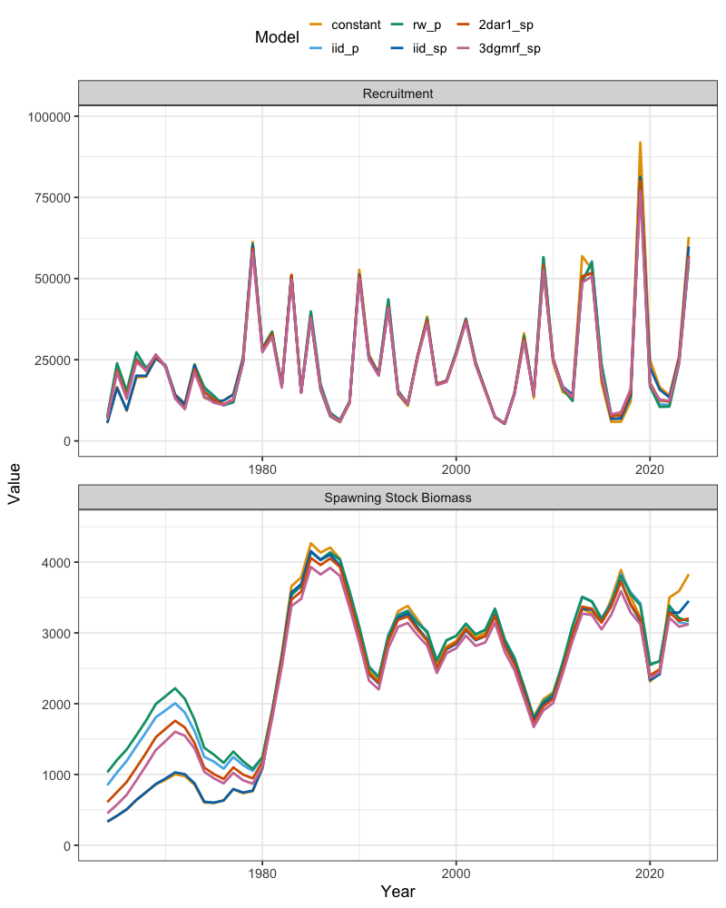
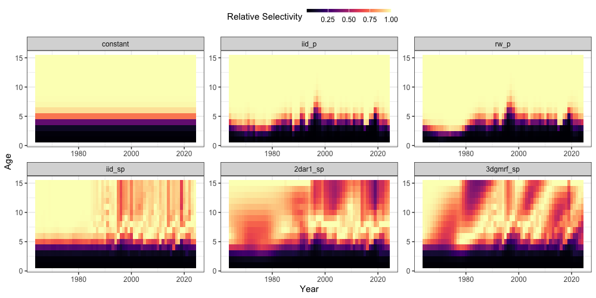

```{r, include = FALSE}
knitr::opts_chunk$set(
  collapse = TRUE,
  comment = "#>"
)
```
Several options are available to set up random effects in `SPoRC`. In this vignette, we will demonstrate how fishery selectivity random effects might be set up, using Eastern Bering Sea (EBS) as a case study. We will first load in the relevant packages and datasets.

```{r, eval = FALSE}
library(SPoRC)
library(here)
library(tidyverse)
```

The `SPoRC` framework allows flexible control over how fishery selectivity random effects are modeled. In general, the following arguments work together to define the random effects structure:

- `cont_tv_fish_sel`: form of continuous time-varying selectivity for each fleet.
- `fishsel_pe_pars_spec`: process error parameter estimation across regions and sexes.
- `fish_sel_devs_spec`: structure of selectivity deviations across regions, sexes, and fleets.
- `corr_opt_semipar`: correlation structure options for semi-parametric selectivity models.

Additional arguments (`fish_sel_blocks`, `fish_sel_model`, `fish_fixed_sel_pars_spec`, `fish_q_blocks`, and `fish_q_spec`) provide further control over blocks, functional forms, fixed effects, and catchability. As an example, Fleet 1 is modeled with independent year-to-year deviations on logistic selectivity parameters, estimating all process error parameters, with no correlation suppression and full estimation of deviations:

```{r, eval = FALSE}
model_inputs <- Setup_Mod_Fishsel_and_Q(
  input_list           = inputs, 
  fish_sel_model       = "logist1_Fleet_1",
  cont_tv_fish_sel     = c("iid_Fleet_1"),
  fishsel_pe_pars_spec = "est_all",
  corr_opt_semipar     = "none",
  fish_sel_devs_spec   = "est_all"
)
```

In this vignette, we extend the single-region pollock example to evaluate different random effects structures for fishery selectivity.  To do this, we define a wrapper function that constructs the input list for the Eastern Bering Sea pollock model, allowing the user to specify four arguments that control the structure of selectivity random effects.  By iterating over combinations of these options, we can investigate how different assumptions about selectivity-related random effects influence model fit and inference.  

We keep survey selectivity fixed for simplicity (to focus the comparison on the fishery), and use the Laplace approximation to integrate out the random effects. The setup for recruitment, mortality, biological processes, and survey
indices follows the earlier vignette “Setting up a Single Region Model (Eastern Bering Sea Pollock)”, so here we only highlight the sections that differ.

```{r eval = FALSE}
#' Setup Single-Region Population Model for EBS Pollock
#'
#' Constructs a single-region population model input list, tailored to the
#' \code{sgl_rg_ebswp_data} dataset. This function initializes dimensions,
#' recruitment, natural mortality, biologicals, movement, tagging, catch,
#' fishery indices and compositions, survey indices and compositions,
#' selectivity and catchability, and component weighting.
#'
#' @param cont_tv_fish_sel Character vector. Whether to estimate continuous
#' time-varying fishery selectivit (see \code{\link{Setup_Mod_FishIdx_and_Comps}}).
#' @param fishsel_pe_pars_spec Character vector. Specification for penalized
#' likelihood parameters for fishery selectivity deviations (see \code{\link{Setup_Mod_FishIdx_and_Comps}}).
#' @param corr_opt_semipar Character vector. Correlation options for
#' semi-parametric selectivity (see \code{\link{Setup_Mod_FishIdx_and_Comps}}).
#' @param fish_sel_devs_spec Character vector. Specification of fishery
#' selectivity deviations to be estimated (see \code{\link{Setup_Mod_FishIdx_and_Comps}}).
#'
#' @details
#' The function relies on the global dataset \code{sgl_rg_ebswp_data} to provide
#' years, ages, weight-at-age, maturity-at-age, observed catches, fishery and
#' survey indices, age and length compositions, and other required inputs.
#' 
#' The model is configured for:
#' - one region
#' - one sex
#' - one fishery fleet
#' - three survey fleets
#'
#' Natural mortality (\eqn{M}) is fixed at:
#' - 0.9 for age-1,
#' - 0.45 for age-2,
#' - 0.3 for age-3+.
#'
#' Recruitment is modeled using a Beverton–Holt stock–recruitment function
#' with fixed steepness. 
#'
#' Selectivity and catchability are parameterized separately for fishery and
#' survey fleets, with user control over random effects and correlation
#' structure for fishery selectivity deviations.
#'
#' @return A fully specified model input list to pass onto subsequent model fitting functions.
#'
#' @seealso
#' \code{\link{Setup_Mod_Dim}}, \code{\link{Setup_Mod_Rec}},
#' \code{\link{Setup_Mod_Biologicals}}, \code{\link{Setup_Mod_Movement}},
#' \code{\link{Setup_Mod_Tagging}}, \code{\link{Setup_Mod_Catch_and_F}},
#' \code{\link{Setup_Mod_FishIdx_and_Comps}},
#' \code{\link{Setup_Mod_SrvIdx_and_Comps}},
#' \code{\link{Setup_Mod_Fishsel_and_Q}}, \code{\link{Setup_Mod_Srvsel_and_Q}},
#' \code{\link{Setup_Mod_Weighting}}
#'
pol_model <- function(cont_tv_fish_sel, 
                      fishsel_pe_pars_spec,
                      corr_opt_semipar, 
                      fish_sel_devs_spec
                      ) {

  ## Initialize model dimensions and data list----
  input_list <- Setup_Mod_Dim(
    years = sgl_rg_ebswp_data$years,
    # vector of years
    ages = sgl_rg_ebswp_data$ages,
    # vector of ages
    lens = NA,
    # number of lengths
    n_regions = 1,
    # number of regions
    n_sexes = 1,
    # number of sexes
    n_fish_fleets = 1,
    # number of fishery fleets
    n_srv_fleets = 3, # number of survey fleets
    verbose = FALSE
  )

  inv_steepness <- function(s) qlogis((s - 0.2) / 0.8)

  # Setup recruitment stuff (using defaults for other stuff)
  input_list <- Setup_Mod_Rec(
    input_list = input_list,

    # Model options
    do_rec_bias_ramp = 0,
    # do bias ramp (0 == don't do bias ramp, 1 == do bias ramp)
    sigmaR_switch = 1,
    # when to switch from early to late sigmaR (switch in first year)
    ln_sigmaR = log(c(5, 1)),
    # Starting values for early and late sigmaR
    rec_model = "bh_rec",
    # recruitment model
    steepness_h = inv_steepness(0.623013),
    h_spec = "fix",
    # fixing steepness
    sigmaR_spec = "fix",
    # fix early sigmaR and late sigmaR
    init_age_strc = 1,
    ln_global_R0 = 10,
    t_spawn = 0.25,
    equil_init_age_strc = 2
  )

  # Setup a fixed natural mortality array for use
  fix_natmort <- array(0, dim = c(input_list$data$n_regions, length(input_list$data$years), length(input_list$data$ages), 1))
  fix_natmort[,,1,] <- 0.9 # age 1 M
  fix_natmort[,,2,] <- 0.45 # age 2 M
  fix_natmort[,,-c(1,2),] <- 0.3 # age 3+ M

  input_list <- Setup_Mod_Biologicals(
    input_list = input_list,

    # Data inputs
    WAA = sgl_rg_ebswp_data$WAA,
    MatAA = sgl_rg_ebswp_data$MatAA,

    # Model options
    # mean and sd for M prior
    fit_lengths = 0,
    # don't fit length compositions
    M_spec = "fix",
    # fixing natural mortality
    Fixed_natmort = fix_natmort
  )

  # Setup movement stuff (using defaults for other stuff)
  input_list <- Setup_Mod_Movement(
    input_list = input_list,
    use_fixed_movement = 1,
    Fixed_Movement = NA,
    do_recruits_move = 0
  )

  # Setup tagging stuff
  input_list <- Setup_Mod_Tagging(input_list = input_list, UseTagging = 0)

  input_list <- Setup_Mod_Catch_and_F(
    input_list = input_list,

    # Data inputs
    ObsCatch = sgl_rg_ebswp_data$ObsCatch,
    Catch_Type = sgl_rg_ebswp_data$Catch_Type,
    UseCatch = sgl_rg_ebswp_data$UseCatch,

    # Model options
    Use_F_pen = 1,
    # whether to use f penalty, == 0 don't use, == 1 use
    sigmaC_spec = "fix",
    # fixing catch standard deviation
    ln_sigmaC = array(log(0.05), dim = c(1, length(input_list$data$years), 1))
    # starting / fixed value for catch standard deviation
  )

  input_list <- Setup_Mod_FishIdx_and_Comps(
    input_list = input_list,
    # data inputs
    ObsFishIdx = sgl_rg_ebswp_data$ObsFishIdx,
    ObsFishIdx_SE = sgl_rg_ebswp_data$ObsFishIdx_SE,
    UseFishIdx = sgl_rg_ebswp_data$UseFishIdx,
    ObsFishAgeComps = sgl_rg_ebswp_data$ObsFishAgeComps,
    UseFishAgeComps = sgl_rg_ebswp_data$UseFishAgeComps,
    ISS_FishAgeComps = sgl_rg_ebswp_data$ISS_FishAgeComps,
    ObsFishLenComps = array(NA_real_, dim = c(1, length(input_list$data$years), length(input_list$data$lens), 1, 1)),
    UseFishLenComps = array(0, dim = c(1, length(input_list$data$years), 1)),
    ISS_FishLenComps = NULL,

    # Model options
    fish_idx_type = c("biom"),
    # indices for fishery
    FishAgeComps_LikeType = c("Multinomial"),
    # age comp likelihoods for fishery fleet
    FishLenComps_LikeType = c("none"),
    # length comp likelihoods for fishery
    FishAgeComps_Type = c("agg_Year_1-terminal_Fleet_1"),
    # age comp structure for fishery
    FishLenComps_Type = c("none_Year_1-terminal_Fleet_1")
    # length comp structure for fishery
  )

  # Setup survey indices and compositions
  input_list <- Setup_Mod_SrvIdx_and_Comps(
    input_list = input_list,

    # data inputs
    ObsSrvIdx = sgl_rg_ebswp_data$ObsSrvIdx,
    ObsSrvIdx_SE = sgl_rg_ebswp_data$ObsSrvIdx_SE,
    UseSrvIdx = sgl_rg_ebswp_data$UseSrvIdx,
    ObsSrvAgeComps = sgl_rg_ebswp_data$ObsSrvAgeComps,
    ISS_SrvAgeComps = sgl_rg_ebswp_data$ISS_SrvAgeComps,
    UseSrvAgeComps = sgl_rg_ebswp_data$UseSrvAgeComps,
    ObsSrvLenComps = array(NA_real_, dim = c(1, length(input_list$data$years), length(input_list$data$lens), 1, 3)),
    UseSrvLenComps = array(0, dim = c(1, length(input_list$data$years), 3)),
    ISS_SrvLenComps = NULL,

    # Model options
    srv_idx_type = c("biom", "biom", "biom"),
    # abundance and biomass for survey fleet 1, 2, and 3
    SrvAgeComps_LikeType = c("Multinomial", "Multinomial", "Multinomial"),
    # survey age composition likelihood for survey fleet 1, 2, and 3
    SrvLenComps_LikeType = c("none", "none", "none"),
    #  survey length composition likelihood for survey fleet 1, 2, and 3
    SrvAgeComps_Type = c(
      "agg_Year_1-terminal_Fleet_1",
      "agg_Year_1-terminal_Fleet_2",
      "none_Year_1-terminal_Fleet_3"
    ),
    # survey age comp type

    SrvLenComps_Type = c(
      "none_Year_1-terminal_Fleet_1",
      "none_Year_1-terminal_Fleet_2",
      "none_Year_1-terminal_Fleet_3"
    )
    # survey length comp type
  )


  # Setup fishery selectivity and catchability
  input_list <- Setup_Mod_Fishsel_and_Q(

    input_list = input_list,

    # Model options (NOTE: Iterating Different Fishery Selectivity Random Effects Here!)
    cont_tv_fish_sel = cont_tv_fish_sel,  # fishery selectivity, whether continuous time-varying
    fishsel_pe_pars_spec = fishsel_pe_pars_spec, # doing penalized likelihood for selex devs
    fish_sel_devs_spec = fish_sel_devs_spec, # estimating all sel devs
    corr_opt_semipar = corr_opt_semipar, # correlation options

    # fishery selectivity blocks
    fish_sel_blocks = c("none_Fleet_1"),
    # fishery selectivity form
    fish_sel_model = c("logist1_Fleet_1"),
    # fishery catchability blocks
    fish_q_blocks = c("none_Fleet_1"),
    # whether to estiamte all fixed effects for fishery selectivity
    fish_fixed_sel_pars_spec = c("est_all"),
    # whether to estiamte all fixed effects for fishery catchability
    fish_q_spec = c("est_all")
  )

  # Setup survey selectivity and catchability
  input_list <- Setup_Mod_Srvsel_and_Q(
    input_list = input_list,

    # Model options
    # survey selectivity blocks
    srv_sel_blocks = c("none_Fleet_1", "none_Fleet_2", "none_Fleet_3"),
    # survey selectivity form
    srv_sel_model = c(
      "logist1_Fleet_1",
      "logist1_Fleet_2",
      "logist1_Fleet_3"
    ),
    # survey catchability blocks
    srv_q_blocks = c("none_Fleet_1", "none_Fleet_2", "none_Fleet_3"),
    # whether to estiamte all fixed effects for survey selectivity
    srv_fixed_sel_pars_spec = c("est_all", "est_all", "est_shared_f_2"),
    # whether to estiamte all fixed effects for survey catchability
    srv_q_spec = c("est_all", "est_all", "est_all")
  )

  input_list <- Setup_Mod_Weighting(
    input_list = input_list,
    Wt_Catch = 1,
    Wt_FishIdx = 1,
    Wt_SrvIdx = 1,
    Wt_Rec = 1,
    Wt_F = 1,
    Wt_Tagging = 0,
    Wt_FishAgeComps = array(1, dim = c(input_list$data$n_regions,
                                       length(input_list$data$years),
                                       input_list$data$n_sexes,
                                       input_list$data$n_srv_fleets)),
    Wt_FishLenComps = array(1, dim = c(input_list$data$n_regions,
                                       length(input_list$data$years),
                                       input_list$data$n_sexes,
                                       input_list$data$n_srv_fleets)),
    Wt_SrvAgeComps = array(1, dim = c(input_list$data$n_regions,
                                      length(input_list$data$years),
                                      input_list$data$n_sexes,
                                      input_list$data$n_srv_fleets)),
    Wt_SrvLenComps = array(1, dim = c(input_list$data$n_regions,
                                      length(input_list$data$years),
                                      input_list$data$n_sexes,
                                      input_list$data$n_srv_fleets))
  )

  return(input_list)
}
```

Once the function `pol_model()` is defined, we can explore alternative random effects structures by iterating across argument combinations. For illustration, we define a small set of candidate models that vary only in the specification of fishery selectivity random effects:

1. Constant selectivity (no random effects),
2. iid selectivity (random effects on parameters),
3. Random walk selectivity (random effects on parameters),
4. Two-dimensional autoregressive selectivity (year × age; random effects are semi-parametric),
5. Three-dimensional autoregressive selectivity (year × age × cohort; random effects are semi-parametric),
6. Independent deviations (random effects are semi-parametric).

The dataframe below specifies the argument settings for each scenario.
```{r, eval = FALSE}
# models to iterate through
pol_model_var <- data.frame(
  cont_tv_fish_sel = c("none_Fleet_1", "iid_Fleet_1", "rw_Fleet_1", "2dar1_Fleet_1", "3dcond_Fleet_1", "3dcond_Fleet_1"),
  fishsel_pe_pars_spec = c("none", rep("est_all", 5)),
  fish_sel_devs_spec = c("none", rep("est_all", 5)),
  corr_opt_semipar = c(rep(NA, 5), "corr_zero_y_b_c")
  )
```

We can now loop through each row to generate the model inputs, fit the model using Laplace approximation, and store the results. The model fitting process can take a while!

**Note**: the `random` argument specifies which parameters should be treated as random effects in the Laplace approximation. In this case, it is set to `"ln_fishsel_devs"` whenever selectivity deviations are modeled as random; otherwise, it is `NULL.` 
```{r, eval = FALSE}
# model storage
models <- list()

# loop through models
for(i in 1:nrow(pol_model_var)) {

  # if selectivity deviations should be treated as random
  if(str_detect(pol_model_var$cont_tv_fish_sel[i], "none")) random <- NULL
  else random <- "ln_fishsel_devs"

  # get input list
  input_list <- pol_model(cont_tv_fish_sel = pol_model_var$cont_tv_fish_sel[i],
                          fishsel_pe_pars_spec = pol_model_var$fishsel_pe_pars_spec[i],
                          fish_sel_devs_spec = pol_model_var$fish_sel_devs_spec[i],
                          corr_opt_semipar = if(is.na(pol_model_var$corr_opt_semipar[i])) NULL else pol_model_var$corr_opt_semipar[i]
                          )

  # extract out lists updated with helper functions
  data <- input_list$data
  parameters <- input_list$par
  mapping <- input_list$map

  # Fit model
  ebswp_rtmb_model <- fit_model(data,
                                parameters,
                                mapping,
                                random = random,
                                newton_loops = 3,
                                silent = FALSE
  )

  ebswp_rtmb_model$sdrep <- RTMB::sdreport(ebswp_rtmb_model)
  sdrep <- ebswp_rtmb_model$sdrep
  rep <- ebswp_rtmb_model$rep
  models[[i]] <- ebswp_rtmb_model

} # end i loop
```


After fitting the models, we can summarize and compile the results to compare how alternative random effects structures influence model estimates and inference. In this example, we focus on differences in recruitment, spawning stock biomass, and fishery selectivity estimates.
```{r, eval = FALSE}
model_names <- c("constant", "iid_p", "rw_p", "2dar1_sp", "3dgmrf_sp", "iid_sp")
fishsel_all_df <- data.frame() # empty dataframe to bind to
ts_all_df <- data.frame() # empty dataframe to bind to
for(i in 1:length(models)) {

  # Get recruitment time-series
  rec_series <- reshape2::melt((models[[i]]$rep$Rec)) %>%
    mutate(se = models[[i]]$sdrep$sd[names(models[[i]]$sdrep$value) == 'log(Rec)'] * t(models[[i]]$rep$Rec))
  rec_series$Par <- "Recruitment"
  rec_series$Model <- model_names[i]

  # Get SSB time-series
  ssb_series <- reshape2::melt((models[[i]]$rep$SSB)) %>%
    mutate(se = models[[i]]$sdrep$sd[names(models[[i]]$sdrep$value) == 'log(SSB)'] * t(models[[i]]$rep$SSB))
  ssb_series$Par <- "Spawning Stock Biomass"
  ssb_series$Model <- model_names[i]

  # Get fishery selectivity estimates
  fishsel_df <- reshape2::melt(models[[i]]$rep$fish_sel) %>%
    rename(Region = Var1, Year = Var2, Age = Var3, Sex = Var4, Fleet = Var5) %>%
    mutate(value = value/max(value),
           Year = Year + 1963)
  fishsel_df$Model <- model_names[i]

  # bind together
  ts_df <- rbind(ssb_series,rec_series) %>%
    dplyr::rename(Region = Var1, Year = Var2) %>%
    dplyr::mutate(Year = Year + 1963)

  ts_all_df <- rbind(ts_all_df, ts_df)
  fishsel_all_df <- rbind(fishsel_df, fishsel_all_df)

} # end i loop

# Refactor to order models
fishsel_all_df <- fishsel_all_df %>% mutate(Model = factor(Model, levels = c("constant", "iid_p", "rw_p", "iid_sp", "2dar1_sp", "3dgmrf_sp")))
ts_df <- ts_df %>% mutate(Model = factor(Model, levels = c("constant", "iid_p", "rw_p", "iid_sp", "2dar1_sp", "3dgmrf_sp")))
```

Inspecting recruitment, the time series are generally consistent across models in both magnitude and trend. Spawning stock biomass estimates are also similar among models, though terminal year estimates differ slightly: the three-dimensional (`3d`) and parametric `iid` selectivity option generally yields the lowest biomass estimates, while the `constant` selectivity option produces the highest.
```{r, eval = FALSE}
ggplot(ts_all_df, aes(x = Year, y = value, ymin = value - (1.96 * se), ymax = value + (1.96 * se), color = Model, fill = Model)) +
  geom_line(lwd = 1.3) +
  geom_ribbon(alpha = 0.3, color = NA) +
  facet_wrap(~Par, scales = 'free') +
  ggthemes::scale_color_colorblind() +
  ggthemes::scale_fill_colorblind() +
  labs(y = "Value")  +
  theme_bw(base_size = 15) +
  ylim(0, NA) +
  labs(x = 'Year', y = 'Value', color = 'Model', fill = 'Model')
```


Examining fishery selectivity, the `iid` and `2dar1` options are broadly similar, although `2dar1` shows more structure at older ages due to correlation constraints, whereas `iid` deviations tend to revert to the mean when data are sparse. By contrast, the `3d` option exhibits pronounced cohort variability (diagonal patterns) and maintains selectivity patterns at older, less-informed ages through correlation-based smoothing. Due to the assumption of parametric selectivity, both the `iid_p` and `rw_p` selectivity options appear relatively different (i.e., constrained to remain logistic). 
```{r, eval = FALSE}
ggplot(fishsel_all_df, aes(x = Year, y = Age, fill = value)) +
  geom_tile() +
  scale_fill_continuous(palette = "magma") +
  facet_wrap(~Model, scales = 'free') +
  theme_bw(base_size = 15) +
  labs(x = 'Year', y = 'Age', fill = 'Relative Selectivity') +
  theme(legend.position = "top",
        legend.key.size = unit(1, "cm"),
        legend.key.height = unit(0.3, "cm"))
```


