```{r, include = FALSE}
knitr::opts_chunk$set(
  collapse = TRUE,
  comment = "#>"
)
```

This vignette provides an end-to-end example of implementing a stock assessment model using the 2024 Gulf of Alaska (GOA) Dusky Rockfish assessment as a case study. We show how to set up a simple stock assessment model, evaluate alternative model configurations, conduct standard diagnostics, and use model projections to develop catch advice for future years. The GOA Dusky Rockfish Model is formulated as a single-area, single-sex, age-structured model with one fishery and one survey fleet. It spans the years 1977–2024, includes 33 modeled ages, and assumes a fixed natural mortality rate. Both fishery and survey selectivity follow a logistic, time-invariant form. Catch advice is based on spawning potential ratio reference points, targeting a population level corresponding to $B_{40\%}$. First, let us load in any necessary packages as well as data files. The Dusky Rockfish data file is provided within the `SPoRC` package and is called `sgl_rg_dusky_data`.

# Load data and packages
```{r setup, eval = F}
library(SPoRC)
data("sgl_rg_dusky_data")
```

# Setup model

To initially setup the model, an input list composed of a data list, parameter list, and mapping list is required. This setup is facilitated by the function `Setup_Mod_Dim`, where users define vectors of years, ages, and lengths. Users must also specify the number of modeled regions (`n_regions`), sexes (`n_sexes`), fishery fleets (`n_fish_fleets`), and survey fleets (`n_srv_fleets`).

```{r, eval = FALSE}
input_list <- Setup_Mod_Dim(
  years = sgl_rg_dusky_data$years,
  # vector of years
  ages = sgl_rg_dusky_data$mod_ages,
  # vector of ages
  lens = sgl_rg_dusky_data$lens,
  # number of lengths
  n_regions = sgl_rg_dusky_data$n_regions,
  # number of regions
  n_sexes = sgl_rg_dusky_data$n_sexes,
  # number of sexes
  n_fish_fleets = sgl_rg_dusky_data$n_fish_fleets,
  # number of fishery fleets
  n_srv_fleets = sgl_rg_dusky_data$n_srv_fleets, # number of survey fleets
  verbose = TRUE # whether to output messages
)
```

## Setup Recruitment Dynamics

After initializing the `input_list`, the object is passed to the next function, `Setup_Mod_Rec`, to define recruitment dynamics. For the GOA Dusky Rockfish model, recruitment is specified as follows:

1. Mean recruitment is estimated,
2. No lognormal bias correction is applied, which is achieved by setting all bias ramp values to 0 (and turning on the bias ramp),
3. Recruitment variability is fixed,
4. Spawning is assumed to occur at the start of the year.

```{r, eval = FALSE}
input_list <- Setup_Mod_Rec(
  input_list = input_list,

  # Model options
  # Doing bias ramp, but basically setting it so that no lognormal bias correction happens (as in the dusky model)
  do_rec_bias_ramp = 1,
  bias_year = rep(length(sgl_rg_dusky_data$years), 4),
  # do bias ramp (0 == don't do bias ramp, 1 == do bias ramp)
  sigmaR_switch = 1,
  # when to switch from early to late sigmaR (switch in first year)
  ln_sigmaR = rep(-0.1068576 , 2), # 2 values for early and late sigma
  # Starting values for early and late sigmaR
  rec_model = "mean_rec",
  sigmaR_spec = "fix",
  # fix early sigmaR and late sigmaR
  init_age_strc = 1, # geometric series to derive initial age structure
  ln_global_R0 = log(2.7), # starting value for mean_rec
  t_spawn = sgl_rg_dusky_data$spwn_month
)
```

## Setup biological dynamics
With the updated input_list from the previous step, the next stage is to parameterize the model’s biological dynamics. The function `Setup_Mod_Biologicals` requires weight-at-age (`WAA`) and maturity-at-age (`MatAA`) inputs, each dimensioned by `n_regions`, `n_years`, `n_ages`, and `n_sexes.` In this case, natural mortality is assumed to be constant and fixed at 0.07.

```{r eval = FALSE}
input_list <- Setup_Mod_Biologicals(
  input_list = input_list,

  # Data inputs
  WAA = sgl_rg_dusky_data$waa_arr, # weight at age array
  MatAA = sgl_rg_dusky_data$mataa_arr, # maturity at age array

  # Model options
  # fit lengths
  fit_lengths = 1,
  SizeAgeTrans = sgl_rg_dusky_data$sizeage, # size age transition
  AgeingError = sgl_rg_dusky_data$age_error_matrix, # ageing error matrix
  M_spec = "fix",
  # fixing natural mortality
  Fixed_natmort = sgl_rg_dusky_data$fix_natmort,
  addtocomp = 0.00001 # adding small constant to compositions
)
```

## Setup Movement and Tagging
Because this vignette illustrates a single-region model, movement dynamics are not included. However, users must specify how movement is parameterized. In this example, movement is not estimated (`use_fixed_movement = 1`), the movement matrix is set to identity (`Fixed_Movement = NA`), and recruits are assumed not to move (`do_recruits_move = 0`). Tagging dynamics are defined similarly: the `input_list` is updated and the `UseTagging` argument is set to 0.

```{r eval = FALSE}
# setup movement
  input_list <- Setup_Mod_Movement(
    input_list = input_list,
    use_fixed_movement = 1,
    Fixed_Movement = NA,
    do_recruits_move = 0
  )

# setup tagging
  input_list <- Setup_Mod_Tagging(
    input_list = input_list, 
    UseTagging = 0)
```


## Setup Catch and Fishing Mortality
The function `Setup_Mod_Catch_and_F` then updates the `input_list` with catch data and fishing mortality specifications. Three data inputs are required: observed catch (`ObsCatch`), the type of catch (`Catch_Type`), and an indicator for whether the catch is used in the model (`UseCatch`). Model options include a switch for applying a fishing mortality penalty (`Use_F_pen`) and whether the catch error standard deviation is fixed or estimated (`sigmaC_spec`), and a small constant added to avoid problems with zero catches (`Catch_Constant`). Finally, fixed values for the observation error of catch (`ln_sigmaC`) and the penalty on fishing mortality (`ln_sigmaF`) are provided. Note that these are specified as $log(\sqrt{(1/2)})$ because the model was originally written in ADMB where these values were computed as sum of squares, and the standard deviation of these terms were implicitly assumed to be set at 1. 

```{r eval = F}
input_list <- Setup_Mod_Catch_and_F(
  input_list = input_list,

  # Data inputs
  ObsCatch = sgl_rg_dusky_data$ObsCatch, # observed catch
  Catch_Type = sgl_rg_dusky_data$Catch_Type, # catch type
  UseCatch = sgl_rg_dusky_data$UseCatch, # whether catch is used

  # Model options
  Use_F_pen = 1,
  # whether to use f penalty, == 0 don't use, == 1 use
  sigmaC_spec = "fix",

  # Fixing sigma C and F
  ln_sigmaC = array(log(sqrt(1/2)), dim = c(input_list$data$n_regions, length(input_list$data$years), input_list$data$n_fish_fleets)),
  ln_sigmaF = array(log(sqrt(1/2)), dim = c(input_list$data$n_regions, input_list$data$n_fish_fleets))
)
```

## Setup Fishery Indices and Compositions
Next, the function `Setup_Mod_FishIdx_and_Comps` updates the `input_list` with fishery index and composition data. Inputs include observed fishery indices with associated standard errors, indicators for whether each index is used, and observed age and length compositions with corresponding use flags and input sample sizes. Model options then define how these data are treated: in this case, no fishery index is applied (`fish_idx_type = "none"`), both age and length compositions are modeled with multinomial likelihoods, and the composition structures are specified as `agg_Year_1-terminal_Fleet_1` (for any single region, single sex model, composition structures should be specified as such, wherein these data are aggregated across model partitions). 

```{r eval = FALSE}
input_list <- Setup_Mod_FishIdx_and_Comps(
  input_list = input_list,

  # data inputs
  ObsFishIdx = sgl_rg_dusky_data$ObsFishIdx, # fishery index
  ObsFishIdx_SE = sgl_rg_dusky_data$ObsFishIdx_SE, # standard errors
  UseFishIdx = sgl_rg_dusky_data$UseFishIdx, # whether fishery indices are used
  ObsFishAgeComps = sgl_rg_dusky_data$ObsFishAgeComps, # observed fishery ages
  UseFishAgeComps = sgl_rg_dusky_data$UseFishAgeComps, # whether fishery ages are used
  ISS_FishAgeComps = sgl_rg_dusky_data$ISS_FishAgeComps, # input sample size for fishery ages
  ObsFishLenComps = sgl_rg_dusky_data$ObsFishLenComps, # observed fishery lengths
  UseFishLenComps = sgl_rg_dusky_data$UseFishLenComps, # whether fishery lengths are used
  ISS_FishLenComps = sgl_rg_dusky_data$ISS_FishLenComps, # input sample size for fishery lengths

  # Model options
  fish_idx_type = c("none"),
  # indices for fishery
  FishAgeComps_LikeType = c("Multinomial"),
  # age comp likelihoods for fishery fleet
  FishLenComps_LikeType = c("Multinomial"),
  # length comp likelihoods for fishery
  FishAgeComps_Type = c("agg_Year_1-terminal_Fleet_1"),
  # age comp structure for fishery
  FishLenComps_Type = c("agg_Year_1-terminal_Fleet_1")
  # length comp structure for fishery
)
```


## Setup Survey Indices and Compositions
The `Setup_Mod_SrvIdx_and_Comps` function is defined similar to the previous code chunk, but instead, updates the `input_list` with survey indices and composition data. 
```{r eval = FALSE}
input_list <- Setup_Mod_SrvIdx_and_Comps(
  input_list = input_list,

  # data inputs
  ObsSrvIdx = sgl_rg_dusky_data$ObsSrvIdx, # observed survey index
  ObsSrvIdx_SE = sgl_rg_dusky_data$ObsSrvIdx_SE / sgl_rg_dusky_data$ObsSrvIdx, # lognormal SD
  UseSrvIdx = sgl_rg_dusky_data$UseSrvIdx, # whether survey indices are used
  ObsSrvAgeComps = sgl_rg_dusky_data$ObsSrvAgeComps, # observed survey ages
  ISS_SrvAgeComps = sgl_rg_dusky_data$ISS_SrvAgeComps, # input sample size for survey ages
  UseSrvAgeComps = sgl_rg_dusky_data$UseSrvAgeComps, # whether survey ages are used
  ObsSrvLenComps = sgl_rg_dusky_data$ObsSrvLenComps, # observed survey lengths
  UseSrvLenComps = sgl_rg_dusky_data$UseSrvLenComps, # whether survey lengths are used
  ISS_SrvLenComps = sgl_rg_dusky_data$ISS_SrvLenComps, # input sample size for survey lengths

  # Model options
  srv_idx_type = c("biom"),
  # abundance and biomass for survey fleet 1
  SrvAgeComps_LikeType = c("Multinomial"),
  # survey age composition likelihood for survey fleet 1
  SrvLenComps_LikeType = c("Multinomial"),
  #  survey length composition likelihood for survey fleet 1
  SrvAgeComps_Type = c(
    "agg_Year_1-terminal_Fleet_1"
  ),
  # survey age comp type

  SrvLenComps_Type = c(
    "agg_Year_1-terminal_Fleet_1"
  )
  # survey length comp type
)
```


## Setup Fishery Selectivity and Catchability
Following defining the data inputs into the model, we can specify the fishery selectivity and catchability parameterizations. Here, no time-varying selectivity is specified, and selectivity is modelled as logistic with parameters $b_{50}$ and $b_{95}$. Catchability is fixed because no fishery indices are included in the model.

```{r, eval = FALSE}
input_list <- Setup_Mod_Fishsel_and_Q(

  input_list = input_list,

  # Model options
  # fishery selectivity, whether continuous time-varying
  cont_tv_fish_sel = c("none_Fleet_1"),
  # fishery selectivity blocks
  fish_sel_blocks = c("none_Fleet_1"),
  # fishery selectivity form
  fish_sel_model = c("logist2_Fleet_1"),
  # fishery catchability blocks
  fish_q_blocks = c("none_Fleet_1"),
  # whether to estiamte all fixed effects for fishery selectivity
  fish_fixed_sel_pars_spec = c("est_all"),
  # whether to estiamte all fixed effects for fishery catchability
  fish_q_spec = c("fix")
)
```

## Setup Survey Selectivity and Catchability
Similar to the `Setup_Mod_Fishsel_and_Q` function, we can define the survey selectivity and catchability parameterizations. Again, no time-vaying selectivity is specified, and selectivity is modelled as logistic with parameters $b_{50}$ and $b_{95}$. However, catchabiltiy is estiamted with a estimated for the survey index. Note that the survey prior specifications must be passed into the function as a dataframe with column names: `region`, `block`, `fleet`, `mu`, and `sd.`

```{r eval = FALSE}

# Set up prior for survey catchability
srv_q_prior <- data.frame(
  region = 1,
  block = 1,
  fleet = 1,
  mu = 1,
  sd = 0.447213595
)

input_list <- Setup_Mod_Srvsel_and_Q(
  input_list = input_list,

  # Model options
  # survey selectivity, whether continuous time-varying
  cont_tv_srv_sel = c("none_Fleet_1"),
  # survey selectivity blocks
  srv_sel_blocks = c("none_Fleet_1"),
  # survey selectivity form
  srv_sel_model = c("logist2_Fleet_1"),
  # survey catchability blocks
  srv_q_blocks = c("none_Fleet_1"),
  # whether to estiamte all fixed effects for survey selectivity
  srv_fixed_sel_pars_spec = c("est_all"),
  # whether to estiamte all fixed effects for survey catchability
  srv_q_spec = c("est_all"),
  Use_srv_q_prior = 1,
  # Use catchability prior
  srv_q_prior = srv_q_prior
)
```

## Setup Model Weighting
Finally, the model weighting scheme can be defined to control the relative influence of different data sources on the assessment. In the GOA Dusky Rockfish model, weighting is applied using $\lambda$ emphasis factors, which allow certain data types to have more or less influence on model fitting. If users prefer not to apply differential weighting, all values can be set to 1. For catch data, a different weighting scheme is applied for the early years of the model: catches from 1977–1991 are given a weight of 2, while catches in later years are assigned a higher weight of 50.

The weighting setup is implemented using the function `Setup_Mod_Weighting`, which accepts the constructed input_list along with specific weights for various data components. Here, catch weights are defined as described above, fishery indices are given a weight of `1`, survey indices a weight of `1.66`, recruitment a weight of `1`, and fishing mortality a weight of `2.` Tagging data are not used, so its weight is set to `0.` Age and length compositions for both fishery and survey fleets are assigned arrays of weights, typically set to 1 for fishery data and survey ages, while survey length compositions are set to 0. 

```{r eval = FALSE}
# catch weigthing 
Wt_Catch <- array(0, dim = c(sgl_rg_dusky_data$n_regions, length(sgl_rg_dusky_data$years), sgl_rg_dusky_data$n_fish_fleets))
Wt_Catch[,which(sgl_rg_dusky_data$years %in% 1977:1991),] <- 2
Wt_Catch[,-which(sgl_rg_dusky_data$years %in% 1977:1991),] <- 50

input_list <- Setup_Mod_Weighting(
  input_list = input_list,
  Wt_Catch = Wt_Catch,
  Wt_FishIdx = 1,
  Wt_SrvIdx = 1.66,
  Wt_Rec = 1,
  Wt_F = 2,
  Wt_Tagging = 0,
  Wt_FishAgeComps = array(1, dim = c(input_list$data$n_regions,
                                     length(input_list$data$years),
                                     input_list$data$n_sexes,
                                     input_list$data$n_fish_fleets)),
  Wt_FishLenComps = array(1, dim = c(input_list$data$n_regions,
                                     length(input_list$data$years),
                                     input_list$data$n_sexes,
                                     input_list$data$n_fish_fleets)),
  Wt_SrvAgeComps = array(1, dim = c(input_list$data$n_regions,
                                    length(input_list$data$years),
                                    input_list$data$n_sexes,
                                    input_list$data$n_srv_fleets)),
  Wt_SrvLenComps = array(0, dim = c(input_list$data$n_regions,
                                    length(input_list$data$years),
                                    input_list$data$n_sexes,
                                    input_list$data$n_srv_fleets))
)
```

# Fit model
Once the model has been fully defined, it can be fitted to the data. In this example, we will fit two models. The first model uses the setup described above without any additional weighting adjustments. The second model applies Francis re-weighting to the same base model. This approach serves to illustrate how to compare alternative model configurations and demonstrates the implementation of Francis re-weighting within the `SPoRC` framework. First, let us extract the data, parameters, and mapping lists constructed from the functions defined above.

```{r eval = FALSE}
data <- input_list$data
parameters <- input_list$par
mapping <- input_list$map
```


## Fit model (Without Francis)
To fit the model without Francis reweighting, users can call the `fit_model` helper function and pass the data, parameters, and mapping list. No random effects are specified for this model, and a total of 3 newton loops are specified to ensure that the model approaches a minimum. Following the optimization of the model, we can extract the standard error report from the model (i.e., standard errors derived from inverting the Hessian matrix).

```{r eval = FALSE}
# Fit model
nofrancis_model <- fit_model(data,
                             parameters,
                             mapping,
                             random = NULL,
                             newton_loops = 3,
                             silent = FALSE
)

nofrancis_model$sdrep <- RTMB::sdreport(nofrancis_model) # get standard error report
```

## Fit model (With Francis)
Conducting Francis re-weighting on composition data requires an iterative procedure to adjust the effective weights of age and length compositions based on model fit. First, a separate copy of the data list (`francis_data`) is created, which will be updated with revised weights during the iterations. The number of Francis iterations is specified (`n_francis_iter = 10`), which indicates the number of times the model is refit, where the composition weights are updated after each model iteration. The `run_francis` function then conducts the reweighting procedure and the weights are saved inside the data list object (`francis_runs$obj$data`)
```{r eval = FALSE}
francis_data <- data # redefine data list for francis (replacing data weights)

# run francis reweighting
francis_runs <- run_francis(francis_data,
                             parameters,
                             mapping,
                             n_francis_iter = 10,
                             newton_loops =  3)

# get obj
francis_model <- francis_runs$obj
francis_data <- francis_runs$obj$data
francis_model$sdrep <- RTMB::sdreport(francis_model) # get standard error report
```

# Check Model Results

## Convergence
Following model optimization, helper functions can be utilized to perform post-optimization sanity checks to ensure that the estimates are reliable. The function `post_optim_sanity_checks` evaluates the fit by examining the standard errors, gradients, and correlations of the parameter estimates. In this example, the function is applied to both the model without Francis re-weighting (`nofrancis_model`) and the model with Francis re-weighting (`francis_model`). The checks required users to specify tolerances for gradients, standard errors, and correlations among parameters. The following models all appear to pass these sanity checks.

```{r eval = FALSE}
# check no francis model
post_optim_sanity_checks(nofrancis_model$sdrep,
                         nofrancis_model$rep,
                         gradient_tol = 1e-5,
                         se_tol = 5,
                         corr_tol = 0.95)

# check francis model
post_optim_sanity_checks(francis_model$sdrep,
                         francis_model$rep,
                         gradient_tol = 1e-5,
                         se_tol = 5,
                         corr_tol = 0.95)
```

## Time Series Results

Next, we can compare time series results from the two models using helper functions in `SPoRC.` The function `get_ts_plot` is used to generate comparative plots of the Francis re-weighted model and the model without Francis re-weighting. The resulting list of plots (`ts_plot`) provides a visual comparison of key metrics, including spawning biomass, recruitment, total biomass, and fishing mortality. Accessing `ts_plot[[1]]` displays the first plot in the list, which presents combined time series across all metrics. The function can also be used for a single model. 

```{r eval = FALSE}
ts_plot <- get_ts_plot(rep = list(francis_model$rep, nofrancis_model$rep),
                       sd_rep = list(francis_model$sdrep, nofrancis_model$sdrep),
                       model_names = c("With Francis", "No Francis"))

ts_plot[[1]]
```

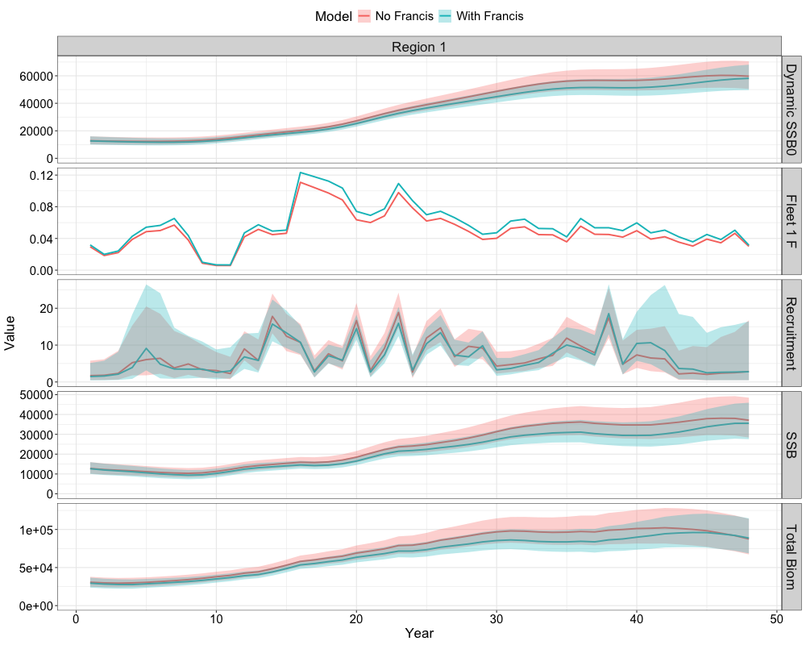

## Catch and Index Fits

We can also compare fits to the catch data and index data. This can be achieved by using the `get_catch_fits_plot` and `get_idx_fits_plot` functions. For fits to the catch data, this is given by the following code chunk.

```{r eval = FALSE}
get_catch_fits_plot(list(data, francis_data),
                    list(nofrancis_model$rep, francis_model$rep),
                    c("No Francis", "With Francis"))
```

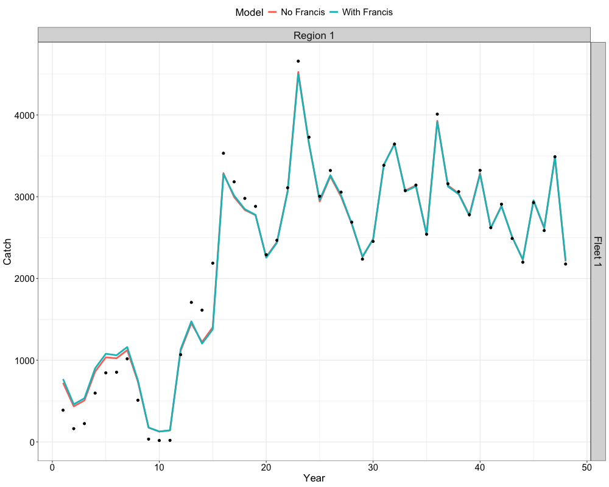

Fits to the index data can be illustrated in a similar manner and is given by the following code chunk.

```{r eval = FALSE}
get_idx_fits_plot(list(data, francis_data),
                  list(nofrancis_model$rep, francis_model$rep),
                  c("No Francis", "With Francis"))
```

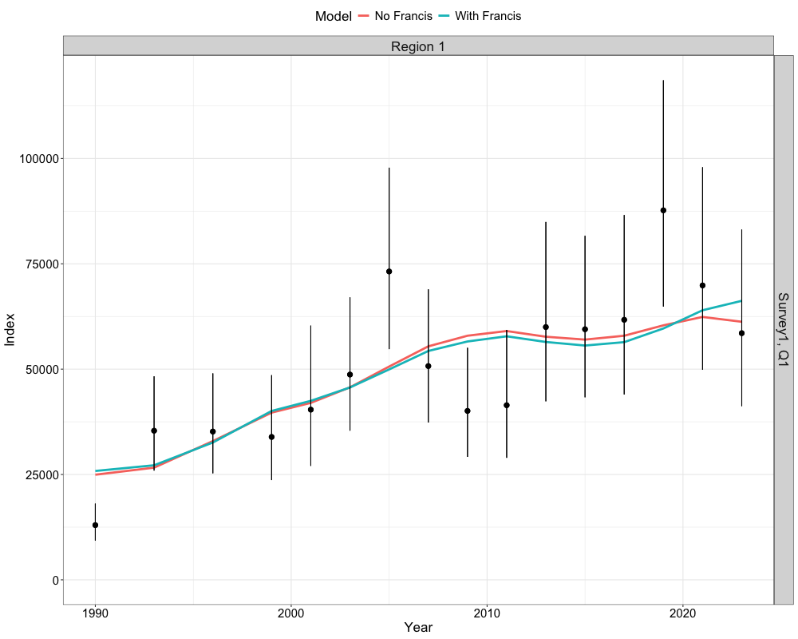

## Composition Fits
The GOA Dusky Rockfish model fits to a total of 3 composition datasets, which include fishery ages and lengths, as well as survey ages. To inspect these model fits, users can extract the observed and expected composition proportions using the `get_comp_prop` function.

```{r eval = FALSE}
# Extract observed and expected compositions
comp_prop <- get_comp_prop(francis_data,
                           francis_model$rep,
                           age_labels = 4:30,
                           len_labels = 21:52,
                           year_labels = 1977:2024)
```

Next, we can then obtain one-step-ahead (OSA) residuals, which uses the `afscOSA` package, as well as plot the aggregated fits. The following code chunk computes OSA residuals for composition data to assess model fit. The `get_osa` function computes these residuals by comparing observed (`Obs_FishAge_mat`) and predicted (`Pred_FishAge_mat`) age compositions, while accounting for effective sample sizes that combine the input sample size with Francis re-weighting factors, across the years and age bins of interest for fleet 1. We can then visualize these residuals with `SPoRC::plot_resids`, which generates diagnostic plots such as bubble plots and QQ plots. We can also additionally plot the aggregated fits to the composition data as a further diagnostic tool. 

### Fishery Ages
```{r eval = FALSE}
# get one step ahead fishery ages
fishages <- get_osa(obs_mat = comp_prop$Obs_FishAge_mat, # observed fishery age compositions
                    exp_mat = comp_prop$Pred_FishAge_mat, # predicted fishery age compositions
                    N = francis_data$ISS_FishAgeComps[1,which(francis_data$UseFishAgeComps[,,1] == 1),1,1] * # input sample size
                      unique(francis_data$Wt_FishAgeComps[1,which(francis_data$UseFishAgeComps[,,1] == 1),1,1]), # francis weight
                    years = which(francis_data$UseFishAgeComps[,,1] == 1), # years with fishery ages
                    fleet = 1, # fleet
                    bins = 4:30, # age bins
                    comp_type = 0, # composition type (age-specific)
                    bin_label = "Ages" # bin labels
                    )

# plot OSA residuals
resid_plot <- SPoRC::plot_resids(osa_results = fishages)

# Get Aggregated Plot
fishage_agg <- comp_prop$Fishery_Ages %>%
  group_by(Age, Fleet) %>%
  summarize(obs = mean(obs), pred = mean(pred)) %>%
  filter(Fleet == 1) %>%
  ggplot() +
  geom_col(aes(x = Age, y = obs), fill = 'darkgreen', alpha = 0.8) +
  geom_line(aes(x = Age, y = pred), col = 'black', lwd = 1.3) +
  theme_bw(base_size = 15) +
  labs(x = 'Age', y = 'Proportions')

cowplot::plot_grid(resid_plot[[2]], # Bubble
                   cowplot::plot_grid(resid_plot[[1]], fishage_agg, nrow = 1), # QQ and Aggregated
                   ncol = 1, rel_heights = c(0.6, 0.4))
```

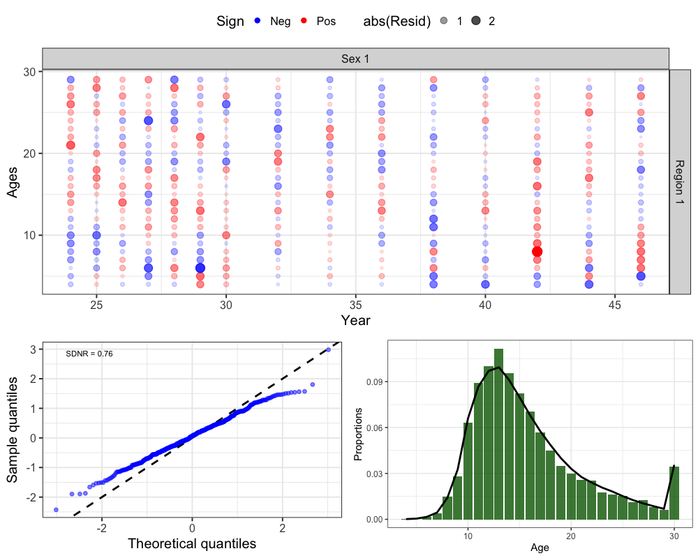

### Fishery Lengths
```{r eval = FALSE}
# get one step ahead fishery lengths
fishlens <- get_osa(obs_mat = comp_prop$Obs_FishLen_mat, # observed fishery length compositions
                    exp_mat = comp_prop$Pred_FishLen_mat, # predicted fishery length compositions
                    N = francis_data$ISS_FishLenComps[1,which(francis_data$UseFishLenComps[,,1] == 1),1,1] * # input sample size
                      unique(francis_data$Wt_FishLenComps[1,which(francis_data$UseFishLenComps[,,1] == 1),1,1]), # francis weight
                    years = which(francis_data$UseFishLenComps[,,1] == 1), # years with fishery ages
                    fleet = 1, # fleet
                    bins = 21:52, # age bins
                    comp_type = 0, # composition type (age-specific)
                    bin_label = "Lengths" # bin labels
)

# plot OSA residuals
resid_plot <- SPoRC::plot_resids(osa_results = fishlens)

# Get Aggregated Plot
fishlen_agg <- comp_prop$Fishery_Lens %>%
  group_by(Len, Fleet) %>%
  summarize(obs = mean(obs), pred = mean(pred)) %>%
  filter(Fleet == 1) %>%
  ggplot() +
  geom_col(aes(x = Len, y = obs), fill = 'darkgreen', alpha = 0.8) +
  geom_line(aes(x = Len, y = pred), col = 'black', lwd = 1.3) +
  theme_bw(base_size = 15) +
  labs(x = 'Lengths', y = 'Proportions')

cowplot::plot_grid(resid_plot[[2]], # Bubble
                   cowplot::plot_grid(resid_plot[[1]], fishlen_agg, nrow = 1), # QQ and Aggregated
                   ncol = 1, rel_heights = c(0.6, 0.4))
```
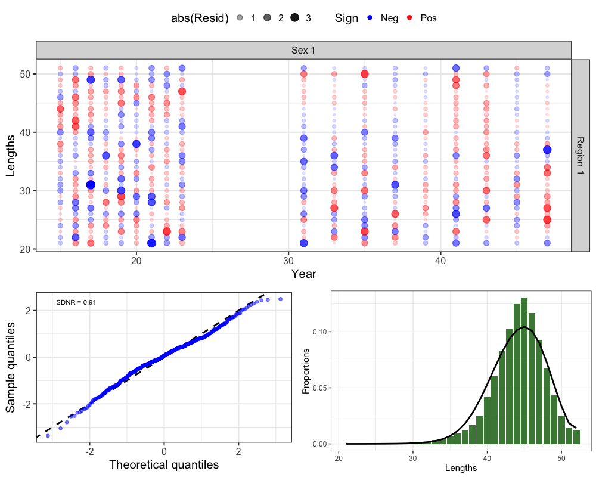

### Survey Ages
```{r eval = FALSE}
# get one step ahead survey ages
srvages <- get_osa(obs_mat = comp_prop$Obs_SrvAge_mat, # observed survey age compositions
                   exp_mat = comp_prop$Pred_SrvAge_mat, # predicted survey age compositions
                   N = francis_data$ISS_SrvAgeComps[1,which(francis_data$UseSrvAgeComps[,,1] == 1),1,1] * # input sample size
                     unique(francis_data$Wt_SrvAgeComps[1,which(francis_data$UseSrvAgeComps[,,1] == 1),1,1]), # francis weight
                   years = which(francis_data$UseSrvAgeComps[,,1] == 1), # years with survey ages
                   fleet = 1, # fleet
                   bins = 4:30, # age bins
                   comp_type = 0, # composition type (age-specific)
                   bin_label = "Ages" # bin labels
)

# plot OSA residuals
resid_plot <- SPoRC::plot_resids(osa_results = srvages)

# Get Aggregated Plot
srvage_agg <- comp_prop$Survey_Ages %>%
  group_by(Age, Fleet) %>%
  summarize(obs = mean(obs), pred = mean(pred)) %>%
  filter(Fleet == 1) %>%
  ggplot() +
  geom_col(aes(x = Age, y = obs), fill = 'darkgreen', alpha = 0.8) +
  geom_line(aes(x = Age, y = pred), col = 'black', lwd = 1.3) +
  theme_bw(base_size = 15) +
  labs(x = 'Age', y = 'Proportions')

cowplot::plot_grid(resid_plot[[2]], # Bubble
                   cowplot::plot_grid(resid_plot[[1]], srvage_agg, nrow = 1), # QQ and Aggregated
                   ncol = 1, rel_heights = c(0.6, 0.4))
```

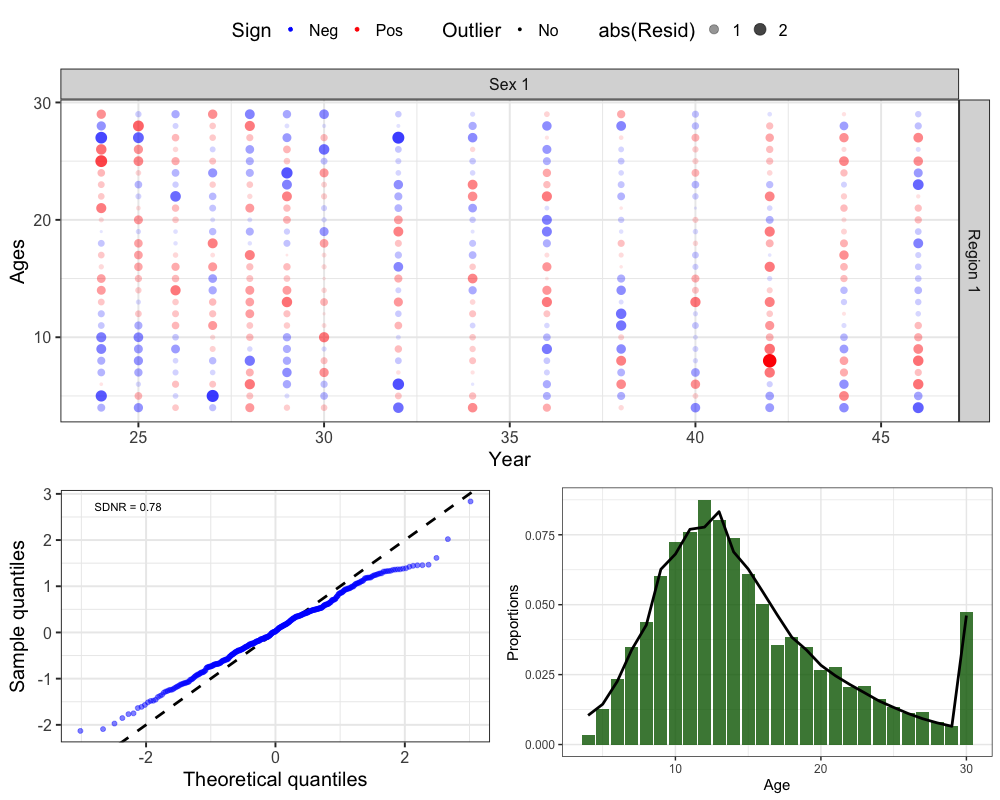

# Retrospectives
In addition to evaluating model fits, it is useful to examine the retrospective behavior of the model to identify potential misspecifications and assess the consistency of management advice over time. This can be done using the `do_retrospective` function, which performs a retrospective analysis by sequentially removing data from years prior to the terminal year. For models with Francis re-weighting, each retrospective peel also updates the composition weights, whereas models without re-weighting do not. The `get_retrospective_plot` function then generates visualizations of the retrospective results, including plots of relative differences, absolute scale differences, and a squid plot of recruitment.

## Retrospectives (Without Francis)
```{r eval = FALSE}
nofrancis_retro <- do_retrospective(
  n_retro = 10, # number of peels
  data = data, # data list (not francis data)
  parameters = parameters, # parameters list
  mapping = mapping, # mapping list
  random = NULL, # random effects
  do_par = TRUE, # whether to parallellize
  n_cores = 8,  # number of cores to use
  do_francis = FALSE,  # whether to do francis within a given retrospective peel
)

# get retrospective plots
nofrancis_retro_plot <- get_retrospective_plot(nofrancis_retro, Rec_Age = 4)
nofrancis_retro_plot[[1]]
nofrancis_retro_plot[[2]]
nofrancis_retro_plot[[3]]
```

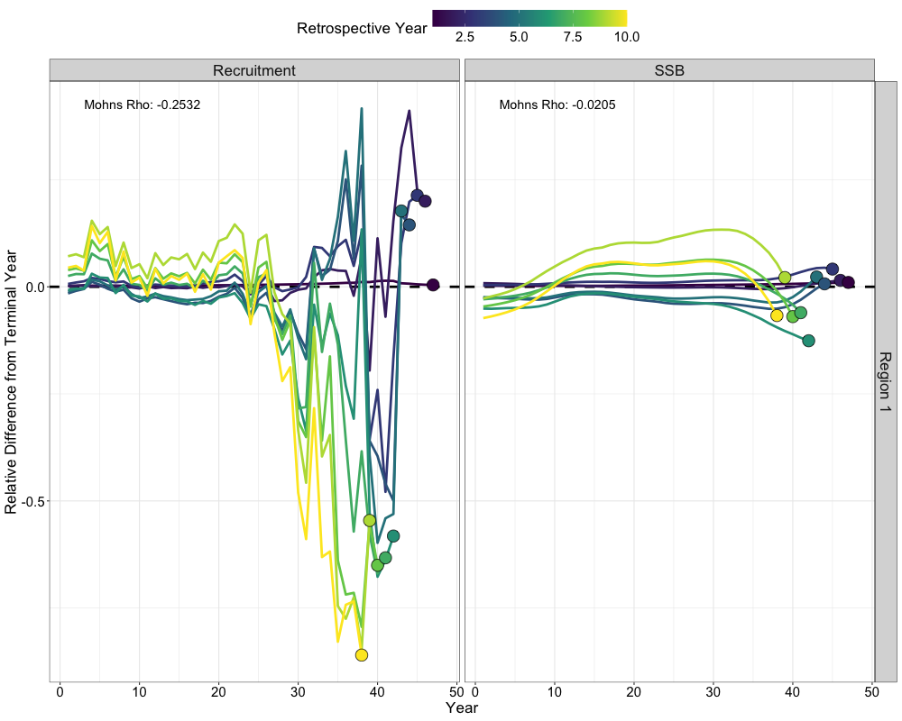

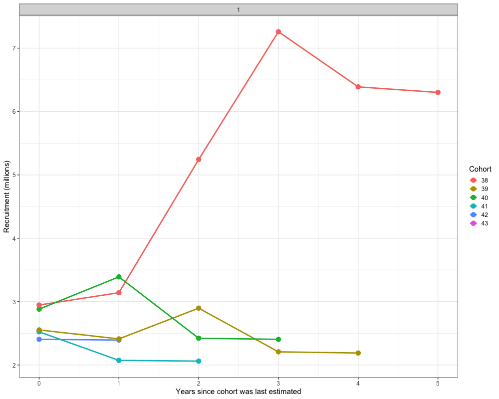

## Retrospectives (With Francis)
```{r eval = FALSE}
# do retrospective w/ francis
francis_retro <- do_retrospective(
  n_retro = 10, # number of peels
  data = francis_data, # data list (francis data)
  parameters = parameters, # parameters list
  mapping = mapping, # mapping list
  random = NULL, # random effects
  do_par = TRUE, # whether to parallellize
  n_cores = 8,  # number of cores to use
  do_francis = TRUE,  # whether to do francis within a given retrospective peel
  n_francis_iter = 10 # number of francis iterations to run within a given retrospective peel
)

# get retrospective plot
francis_retro_plot <- get_retrospective_plot(francis_retro, Rec_Age = 4)
francis_retro_plot[[1]]
francis_retro_plot[[2]]
francis_retro_plot[[3]]
```

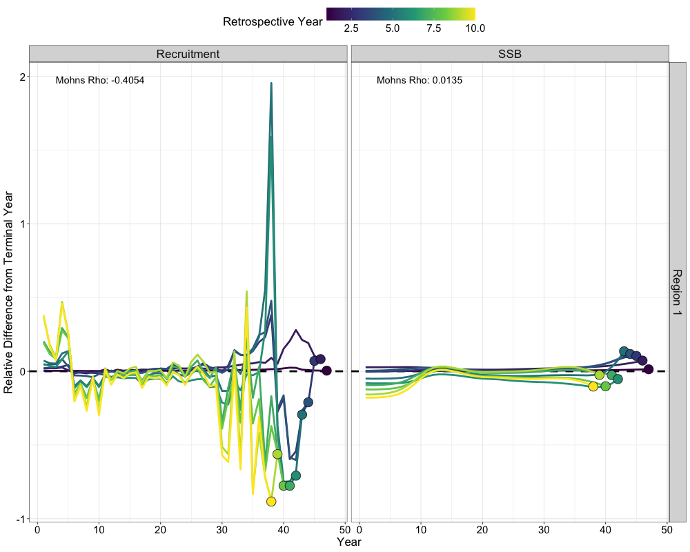
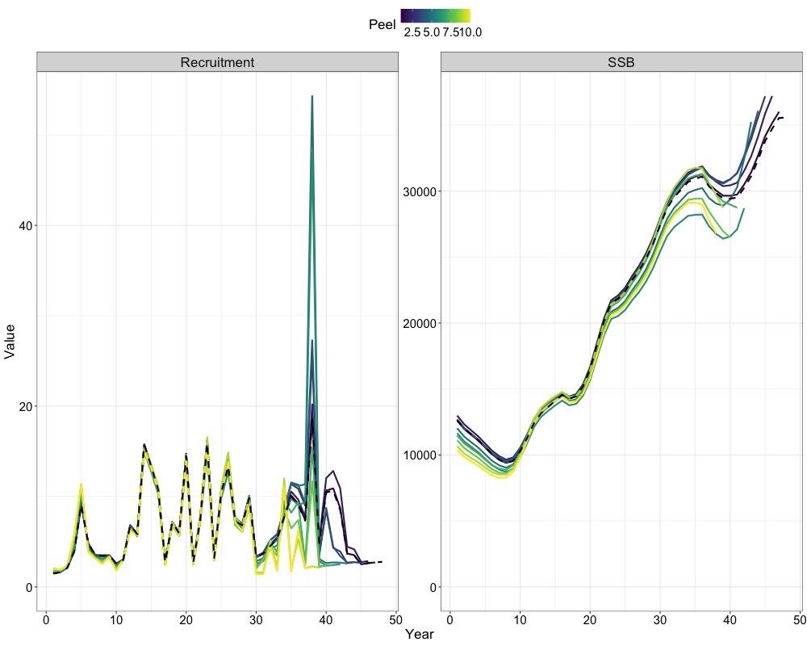


# Likelihood Profiles
Another useful diagnostic tool that can help identify data conflits and the potential need to re-parameterize the model are likelihood profiles. Here, the `do_likelihood_profile` function is used to profile the parameter `ln_global_R0` in the Francis re-weighted model. The function takes the data list, parameter list, and mapping list, and iteratively evaluates the likelihood across a specified range of values. The `do_likelihood_profile` then outputs a list of profiled values for each data component with their respective dimensions (e.g., likelihood profiles by fleet, region, year, etc.) as well likelihood profiles for each data component, aggregated across all their respective dimensions.

```{r eval = FALSE}
# do likelihood profile with francis weights
francis_meanrec_prof <- do_likelihood_profile(
  francis_data, # francis data list
  parameters, # parameter list
  mapping, # mapping list
  random = NULL, # random effects
  what = 'ln_global_R0', # parameter to profile
  min_val = log(francis_model$rep$R0) * 0.1,  # min values to profile across
  max_val = log(francis_model$rep$R0) * 2,  # max values to profile across
  inc = 0.1, # increment for min and max values to profile across
  do_par =  TRUE, # whether to parrallelize
  n_cores = 8 # number of cores
)

# summarize profile
francis_mean_rec_profile <- francis_meanrec_prof$agg_nLL %>%
  mutate(Summarized_Type = case_when(
    str_detect(type, "Pen|Prior") ~ "Other",
    str_detect(type, "Len") ~ "Length Comps",
    str_detect(type, "Age") ~ "Age Comps",
    str_detect(type, "Idx") ~ "Indices",
    str_detect(type, "Catch") ~ "Catch",
    str_detect(type, "jnLL") ~ "jnLL",
  )) %>%
  filter(value != 0) %>%
  group_by(Summarized_Type, prof_val) %>%
  summarize(value = sum(value), .groups = "drop") %>%
  group_by(Summarized_Type) %>%
  mutate(value = value - min(value))

ggplot(francis_mean_rec_profile, aes(x = prof_val, y = value, color = Summarized_Type)) +
  geom_line(lwd = 1.3) +
  geom_vline(xintercept = log(francis_model$rep$R0), lty = 2) +
  labs(x = 'Log Mean Recruitment', y = "Scaled nLL", color = "Type") +
  theme_bw(base_size = 15)
```

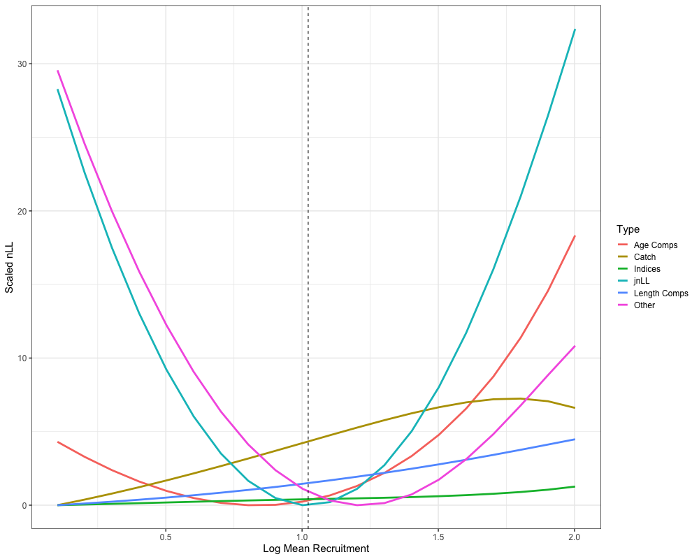

# Jitter Analysis
Jitter analysis is a useful diagnostic for assessing whether a model has truly converged, if it may be stuck in a local minimum, and to understand model stability. The `do_jitter` function perturbs the initial parameter values by adding random noise and refits the model multiple times. In this example, 50 jittered starts are generated for the Francis re-weighted model, with a standard deviation of 0.5 (additive normal) applied to the initial parameter values. Each jittered model is optimized using three Newton loops, and parallel processing with 8 cores is used to enhance computational speed. We can then plot the jitter results to understand the number of times the model has converged, whether a better solution was achieved, and trajectories of spawning biomass and recruitment from these jitter results.


```{r eval = FALSE}
# get jitter results
jitter_res <- do_jitter(data = francis_data, # francis data list
                               parameters = parameters, # parameter list
                               mapping = mapping, # mapping list
                               random = NULL, # random effects
                               sd = 0.5, # standard deviation for jitter
                               n_jitter = 50, # number of jitters
                               n_newton_loops = 3, # newton loops to od
                               do_par = TRUE, # whether to parrallelize
                               n_cores = 8 # number of cores to use
)

# get proportion converged
prop_converged <- jitter_res %>%
  filter(Year == 1, Type == 'Recruitment') %>%
  summarize(prop_conv = sum(Hessian) / length(Hessian))

# get jitter results
final_mod <- reshape2::melt(francis_model$rep$SSB) %>% rename(Region = Var1, Year = Var2) %>%
  mutate(Type = 'SSB') %>%
  bind_rows(reshape2::melt(francis_model$rep$Rec) %>%
              rename(Region = Var1, Year = Var2) %>% mutate(Type = 'Recruitment'))
```

```{r eval = FALSE}
ggplot() +
  geom_line(jitter_res, mapping = aes(x = Year + 1976, y = value, group = jitter, color = Hessian), lwd = 1) +
  geom_line(final_mod, mapping = aes(x = Year + 1976, y = value), color = "black", lwd = 1.3 , lty = 2) +
  facet_grid(Type~Region, scales = 'free',
             labeller = labeller(Region = function(x) paste0("Region ", x),
                                 Type = c("Recruitment" = "Age 2 Recruitment (millions)", "SSB" = 'SSB (kt)'))) +
  labs(x = "Year", y = "Value") +
  theme_bw(base_size = 20) +
  scale_color_manual(values = c("red", 'grey')) +
  geom_text(data = jitter_res %>% filter(Type == 'SSB', Year == 1, jitter == 1),
            aes(x = Inf, y = Inf, label = paste("Proportion Converged: ", round(prop_converged$prop_conv, 3))),
            hjust = 1.1, vjust = 1.9, size = 6, color = "black")
```

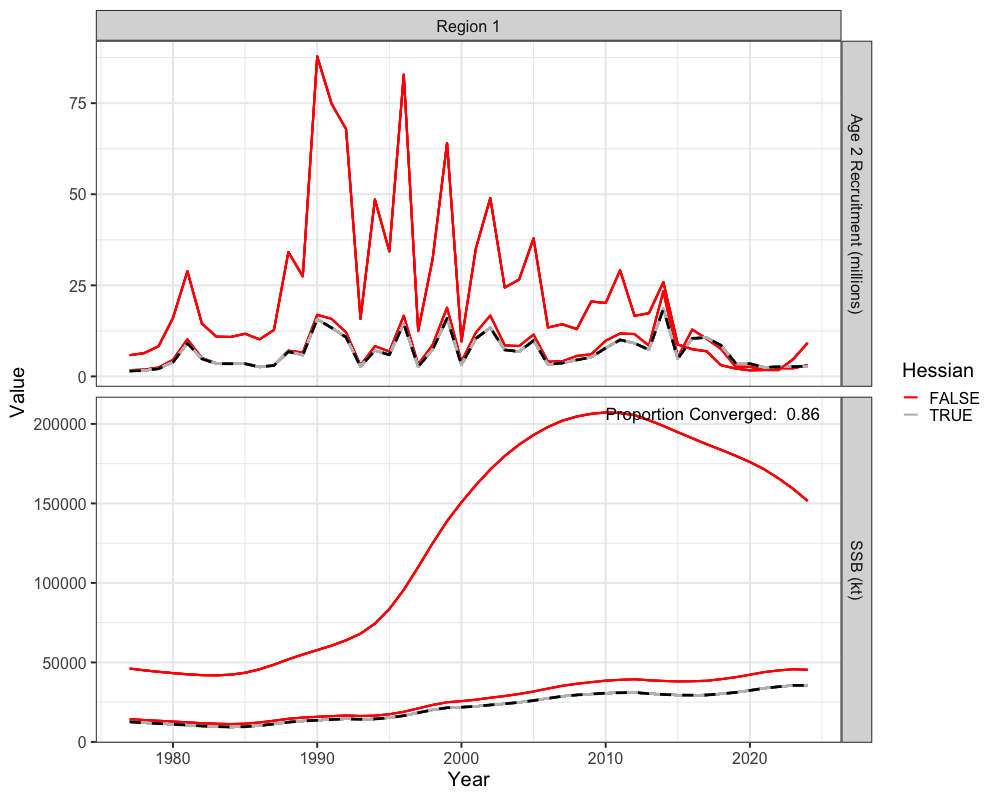

```{r eval = FALSE}
ggplot(jitter_res, aes(x = jitter, y = jnLL, color = Max_Gradient, shape = Hessian)) +
  geom_point(size = 5, alpha = 0.3) +
  geom_hline(yintercept = min(francis_model$rep$jnLL), lty = 2, size = 2, color = "blue") +
  facet_wrap(~Hessian, labeller = labeller(
    Hessian = c("FALSE" = "non-PD Hessian", "TRUE" = 'PD Hessian')
  )) +
  scale_color_viridis_c() +
  theme_bw(base_size = 20) +
  theme(legend.position = "bottom") +
  guides(color = guide_colorbar(barwidth = 15, barheight = 0.5)) +
  labs(x = 'Jitter') +
  geom_text(data = jitter_res %>% filter(Hessian == TRUE, Year == 1, jitter == 1),
            aes(x = Inf, y = Inf, label = paste("Proportion Converged: ", round(prop_converged$prop_conv, 3))),
            hjust = 1.1, vjust = 1.9, size = 6, color = "black")
```

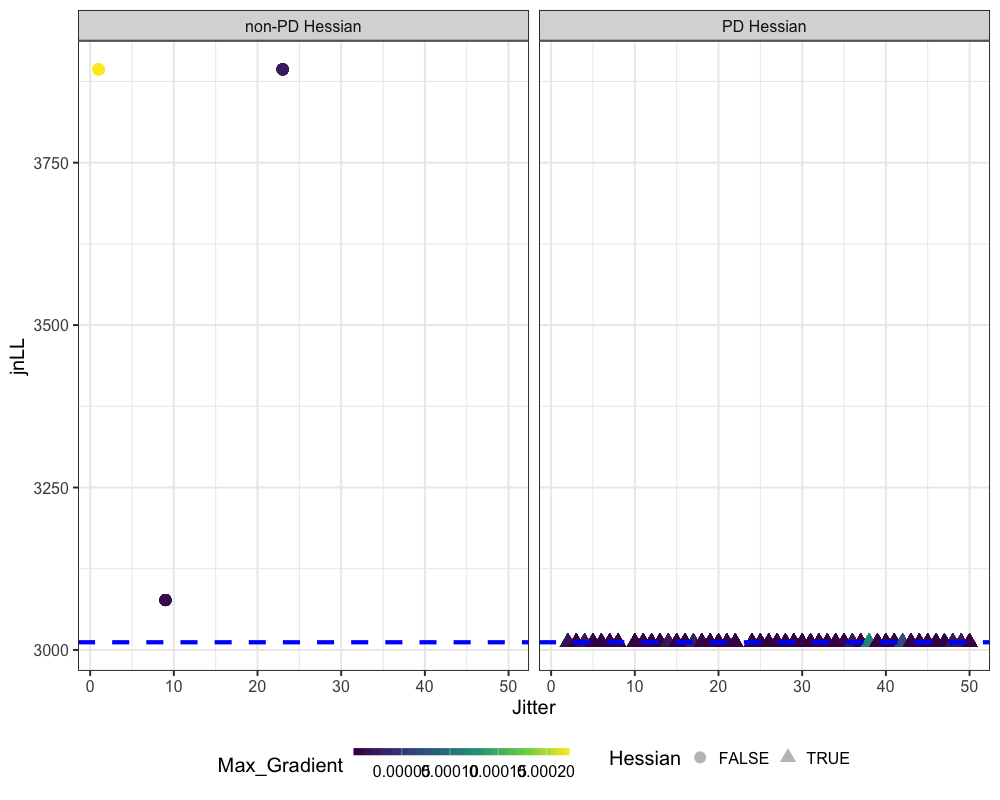

# MCMC
Lastly, SPoRC can also interact with other Bayesian software (i.e, `adnuts`) to conduct MCMC analysis, which not only estimates parameter uncertainty but also samples the full joint posterior, revealing parameter correlations, skewed distributions, or potential multimodality that MLE may miss. Comparing MCMC results with maximum likelihood estimates further helps assess consistency in point estimates and standard errors. In particular, we can utilize the native functionality built into `adnuts`, which seamlessly integrates with TMB and RTMB models, which will be demonstrated in the following sections. First, let us install and load in the relevant packages.

```{r, eval = FALSE}
# load in adnuts ans associated packages for MCMC
install.packages('StanEstimators', repos = c('<https://andrjohns.r-universe.dev>', '<https://cloud.r-project.org>'))
devtools::install_github('Cole-Monnahan-NOAA/adnuts')
library(adnuts)
```

The `sample_snuts` function in `adnuts` runs a Bayesian MCMC analysis using the RTMB model. In this example, four chains are run for 10,000 iterations each, along with 4 Markov chains. Additionally, the `adapt_delta` is set a 0.99 to ensure that the model takes smaller steps, which helps improve MCMC model convergence. Default settings are used throughout this example `sample_snuts` and users can refer to https://cole-monnahan-noaa.github.io/adnuts/ for further details. After running MCMC diagnostics, users can then inspect summary statistics from the model object, which includes posterior means, standard deviations, effective sample sizes (`n_eff`), and convergence diagnostics (`R_hat`).

```{r eval = FALSE}
# run MCMC
mcmc <- sample_snuts(francis_model, num_samples = 1e4, control = list(adapt_delta = 0.99))

# Check MCMC summary
diag_df <- mcmc$monitor
```

We can then inspect various model diagnostics, ranging from pairs plots, comparisons of the marginal distributions between MLE and MCMC, trace plots, and comparisons of uncertainty between MCMC and MLE. 
```{r eval = FALSE}
pairs(mcmc)
plot_marginals(mcmc)
plot_uncertainties(mcmc)
```

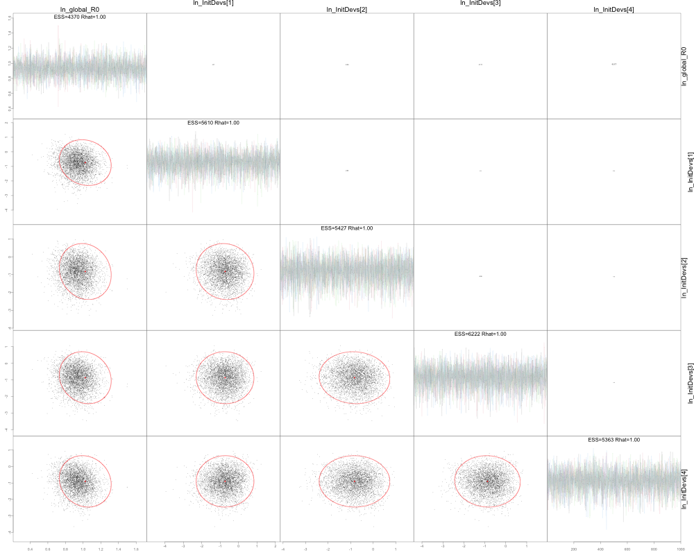

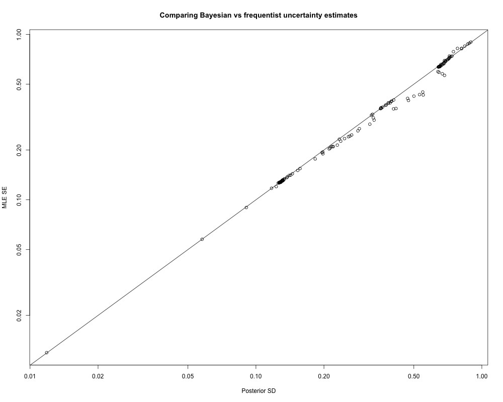

Time series of recruitment and spawning stock biomass derived from posterior samples can also readily be plotted. 
```{r eval = FALSE}
# get mcmc time series plots
mcmc_ts_plot <- get_model_rep_from_mcmc(rtmb_obj = francis_model, adnuts_obj = mcmc_short, what = c("SSB", "Rec"), n_cores = 4)

# ssb plot
# summarize results
ssb_summry <- mcmc_ts_plot$SSB %>%
  group_by(Var1, Var2) %>%
  summarize(median = median(value),
            lwr = quantile(value, 0.025),
            upr = quantile(value, 0.975))
ggplot() +
  geom_line(ssb_summry, mapping = aes(x = Var2, y = median)) +
  geom_ribbon(ssb_summry, mapping = aes(x = Var2, y = median, ymin = lwr, ymax = upr), alpha = 0.3) +
  geom_line(reshape2::melt(francis_model$rep$SSB), mapping = aes(x = Var2, y = value), col = 'red', lwd = 1.3, lty = 2) +
  coord_cartesian(ylim = c(0, NA)) +
  labs(x = 'Year', y = 'Spawning Stock Biomass') +
  theme_bw(base_size = 15)

# rec plot
# summarize results
rec_summry <- mcmc_ts_plot$Rec %>%
  group_by(Var1, Var2) %>%
  summarize(median = median(value),
            lwr = quantile(value, 0.025),
            upr = quantile(value, 0.975))
ggplot() +
  geom_line(rec_summry, mapping = aes(x = Var2, y = median)) +
  geom_ribbon(rec_summry, mapping = aes(x = Var2, y = median, ymin = lwr, ymax = upr), alpha = 0.3) +
  geom_line(reshape2::melt(francis_model$rep$Rec), mapping = aes(x = Var2, y = value), col = 'red', lwd = 1.3, lty = 2) +
  coord_cartesian(ylim = c(0, NA)) +
  labs(x = 'Year', y = 'Recruitment') +
  theme_bw(base_size = 15)
```

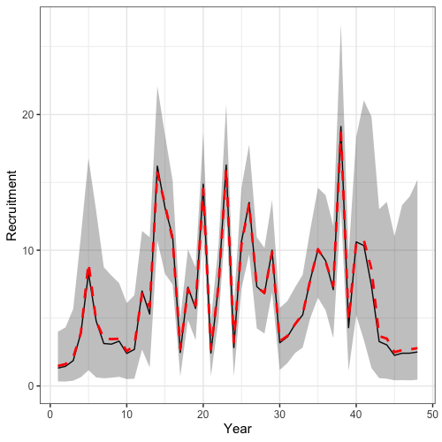

# Reference Points and Projections

The final step in the assessment workflow is to provide management advice based on reference points derived from model estimates. For the GOA Dusky Rockfish model, reference points are based on spawning potential ratios, aiming to maintain the population at $B_{40\%}$ by fishing at or below $F_{40\%}$. These reference points are then projected forward to generate catch advice for future years. Additionally, in compliance with the Magnuson-Stevens Reauthorization Act, a range of projection scenarios need to be conducted to evaluate whether the population is within sustainable limits.

## Reference Points

To derive reference points for catch advice and population projections, the `Get_Reference_Points` function is used. Reference points corresponding to $SPR_{35\%}$, $SPR_{40\%}$, and $SPR_{60\%}$ are calculated. The `calc_rec_st_yr` argument specifies the vector of estimated recruitment starting from year 3 (which corresponds to 1979), and subtracts the terminal year by `rec_age = 4` to compute the mean recruitment used in calculating $B_{x\%}$.

```{r eval = FALSE}
# get reference points
spr_35 <- Get_Reference_Points(data = francis_data,
                               rep = francis_model$rep,
                               SPR_x = 0.35, t_spwn = 0, sex_ratio_f = 0.5,
                               type = "single_region",
                               what = 'SPR',
                               calc_rec_st_yr = 3, rec_age = 4)

spr_40 <- Get_Reference_Points(data = francis_data,
                               rep = francis_model$rep,
                               type = "single_region",
                               what = 'SPR',
                               SPR_x = 0.4, t_spwn = 0, sex_ratio_f = 0.5,
                               calc_rec_st_yr = 3, rec_age = 4)

spr_60 <- Get_Reference_Points(data = francis_data,
                               rep = francis_model$rep,
                               type = "single_region",
                               what = 'SPR',
                               SPR_x = 0.6, t_spwn = 0, sex_ratio_f = 0.5,
                               calc_rec_st_yr = 3, rec_age = 4)

# Extract reference points
b40 <- spr_40$b_ref_pt
b60 <- spr_60$b_ref_pt
b35 <- spr_35$b_ref_pt
f40 <- spr_40$f_ref_pt
f35 <- spr_35$f_ref_pt
f60 <- spr_60$f_ref_pt
```

## Projections
The reference points derived above can be used to provide catch advice through population projections. First, a harvest control rule (HCR) is defined with the `HCR_function`, which determines fishing mortality based on stock status relative to a reference biomass $B_{x\%}$. If stock status is at or above the reference point, fishing occurs at the target $F_{x\%}$; if stock status falls between a lower threshold (`alpha`) and the reference point, fishing mortality is scaled linearly; and if stock status is below the threshold, fishing is set to zero. Projection parameters are then specified, including the number of simulations (`n_sims`), projection years (`n_proj_yrs`), sex ratio, number of regions, ages, and fleets. Arrays are initialized for terminal numbers-at-age (`terminal_NAA`), weight-at-age (`WAA` and `WAA_fish`), maturity-at-age (`MatAA`), selectivity (`fish_sel`), movement (not used in this single-region model), terminal fishing mortality (`terminal_F`), natural mortality (`natmort`), and recruitment, using the terminal values and historical recruitment from the fitted Francis re-weighted model. These inputs then form the basis for projecting future population dynamics and deriving catch advice under the specified HCR.

```{r eval = FALSE}
# Define HCR to use for projections
HCR_function <- function(x, frp, brp, alpha = 0.05) {
  stock_status <- x / brp # define stock status
  # If stock status is > 1
  if(stock_status >= 1) f <- frp
  # If stock status is between brp and alpha
  if(stock_status > alpha && stock_status < 1) f <- frp * (stock_status - alpha) / (1 - alpha)
  # If stock status is less than alpha
  if(stock_status < alpha) f <- 0
  return(f)
}

# define projection parameters
n_sims <- 1e3
t_spawn <- 0
n_proj_yrs <- 25
n_regions <- 1
n_ages <- length(francis_data$ages)
n_sexes <- 1
n_fish_fleets <- 1
n_sexes <- 1
do_recruits_move <- 0
terminal_NAA <- array(francis_model$rep$NAA[,length(francis_data$years),,], dim = c(n_regions, n_ages, n_sexes))
terminal_NAA0 <- array(francis_model$rep$NAA0[,length(francis_data$years),,], dim = c(n_regions, n_ages, n_sexes))
WAA <- array(rep(francis_data$WAA[,length(francis_data$years),,], each = n_proj_yrs), dim = c(n_regions, n_proj_yrs, n_ages, n_sexes)) # weight at age
WAA_fish <- array(rep(francis_data$WAA[,length(francis_data$years),,], each = n_proj_yrs), dim = c(n_regions, n_proj_yrs, n_ages, n_sexes, n_fish_fleets)) # weight at age for fishery
MatAA <- array(rep(francis_data$MatAA[,length(francis_data$years),,], each = n_proj_yrs), dim = c(n_regions, n_proj_yrs, n_ages, n_sexes)) # maturity at age
fish_sel <- array(rep(francis_model$rep$fish_sel[,length(francis_data$years),,,], each = n_proj_yrs), dim = c(n_regions, n_proj_yrs, n_ages, n_sexes, n_fish_fleets)) # selectivity
Movement <- array(rep(francis_model$rep$Movement[,,length(francis_data$years),,], each = n_proj_yrs), dim = c(n_regions, n_regions, n_proj_yrs, n_ages, n_sexes)) # movement - not used
terminal_F <- array(francis_model$rep$Fmort[,length(francis_data$years),], dim = c(n_regions, n_fish_fleets)) # terminal F
natmort <- array(rep(francis_model$rep$natmort[,length(francis_data$years),,], each = n_proj_yrs), dim = c(n_regions, n_proj_yrs, n_ages, n_sexes)) # natural mortaility
recruitment <- array(francis_model$rep$Rec[,3:(length(francis_data$years) - 4)], dim = c(n_regions, length(3:(length(francis_data$years) - 4)))) # recruitment from years 3 - terminal (corresponds to 1979)
sexratio <- array(1, dim = c(n_regions, n_proj_yrs, n_sexes)) # recruitment sex ratio 
```

Next, we can define the Alaska projection scenarios to understand if the stock is within sustainable limits. These scenarios vary in how fishing mortality is applied relative to biological reference points. Scenario 1 applies the harvest control rule (HCR) using $F_{40\%}$ as the maximum allowable fishing mortality, with the annual mean of catch across simulations providing the annual catch advice. Scenario 2 also uses the HCR but scales $F_{40\%}$ based on the previous year’s fishing mortality. Scenario 3 applies a constant fishing mortality equal to the average of the last five years. Scenario 4 applies fishing mortality using $F_{60\%}$, while Scenario 5 assumes no fishing. Scenario 6 applies the HCR with $F_{35\%}$, representing the overfishing limit (`FOFL`). Finally, Scenario 7 applies the HCR with $F_{40\%}$ in the first two projection years and then transitions to $F_{35\%}$ in later years.

```{r eval = FALSE}
# Define the F used for each scenario (Based on BSAI Intro Report - Alaska Scenarios)
proj_inputs <- list(
  # Scenario 1 - Using HCR to adjust maxFABC
  list(f_ref_pt = array(f40, dim = c(n_regions, n_proj_yrs)),
       b_ref_pt = array(b40, dim = c(n_regions, n_proj_yrs)),
       fmort_opt = 'HCR'
  ),
  # Scenario 2 - Using HCR to adjust maxFABC based on last year's value (constant fraction - author specified F)
  list(f_ref_pt = array(f40 * (f40 / 0.091), dim = c(n_regions, n_proj_yrs)),
       b_ref_pt = array(b40, dim = c(n_regions, n_proj_yrs)),
       fmort_opt = 'HCR'
  ),
  # Scenario 3 - Using an F input of last 5 years average F, and
  list(f_ref_pt = array(mean(francis_model$rep$Fmort[1, 43:47,]), dim = c(n_regions, n_proj_yrs)),
       b_ref_pt = NULL,
       fmort_opt = 'Input'
  ),
  # Scenario 4 - Using F60
  list(f_ref_pt = array(f60, dim = c(n_regions, n_proj_yrs)),
       b_ref_pt = NULL,
       fmort_opt = 'Input'
  ),
  # Scenario 5 - F is set at 0
  list(f_ref_pt = array(0, dim = c(n_regions, n_proj_yrs)),
       b_ref_pt = NULL,
       fmort_opt = 'Input'
  ),
  # Scenario 6 - Using HCR to adjust FOFL
  list(f_ref_pt = array(f35, dim = c(n_regions, n_proj_yrs)),
       b_ref_pt = array(b35, dim = c(n_regions, n_proj_yrs)),
       fmort_opt = 'HCR'
  ),
  # Scenario 7 - Using HCR to adjust FABC in first 2 projection years, and then later years are adjusting FOFL
  list(f_ref_pt = array(c(rep(f40, 2), rep(f35, n_proj_yrs - 2)), dim = c(n_regions, n_proj_yrs)),
       b_ref_pt = array(c(rep(b40, 2), rep(b35, n_proj_yrs - 2)), dim = c(n_regions, n_proj_yrs)),
       fmort_opt = 'HCR'
  )
)
```

Following the setup of the seven projection scenarios, we can then simulate the population dynamics forward under each case to evaluate future spawning biomass, fishing mortality, and catch. The code below loops over all projection scenarios and simulation replicates, keeping record of spawning stock biomass, fishing mortality, and catch, 

```{r eval = FALSE}
# store outputs
all_scenarios_f <- array(0, dim = c(n_regions, n_proj_yrs, n_sims, length(proj_inputs)))
all_scenarios_ssb <- array(0, dim = c(n_regions, n_proj_yrs, n_sims, length(proj_inputs)))
all_scenarios_catch <- array(0, dim = c(n_regions, n_proj_yrs, n_fish_fleets, n_sims, length(proj_inputs)))

set.seed(123)
for (i in seq_along(proj_inputs)) {
  for (sim in 1:n_sims) {

    # do population projection
    out <- SPoRC::Do_Population_Projection(n_proj_yrs = n_proj_yrs,
                                           n_regions = n_regions,
                                           n_ages = n_ages,
                                           n_sexes = n_sexes,
                                           sexratio = sexratio,
                                           n_fish_fleets = n_fish_fleets,
                                           do_recruits_move = do_recruits_move,
                                           recruitment = recruitment,
                                           terminal_NAA = terminal_NAA,
                                           terminal_NAA0 = terminal_NAA0,
                                           terminal_F = terminal_F,
                                           natmort = natmort,
                                           WAA = WAA,
                                           WAA_fish = WAA_fish,
                                           MatAA = MatAA,
                                           fish_sel = fish_sel,
                                           Movement = Movement,
                                           f_ref_pt = proj_inputs[[i]]$f_ref_pt,
                                           b_ref_pt = proj_inputs[[i]]$b_ref_pt,
                                           HCR_function = HCR_function,
                                           recruitment_opt = "inv_gauss",
                                           fmort_opt = proj_inputs[[i]]$fmort_opt,
                                           t_spawn = t_spawn
    )

    all_scenarios_ssb[,,sim,i] <- out$proj_SSB
    all_scenarios_catch[,,,sim,i] <- out$proj_Catch
    all_scenarios_f[,,sim,i] <- out$proj_F[,-(n_proj_yrs+1)] # remove last year, since it's not used
  } # end sim loop
  print(i)
} # end i loop
```

Projections of spawning stock biomass, catch advice, and fishing mortality can then be visualized as follows.

### Spawning Biomass Projections
```{r eval = FALSE}
# Get historical SSB
historical <- reshape2::melt(array(rep(francis_model$rep$SSB, n_sims),
                                   dim = c(n_regions, length(francis_data$years), n_sims))) %>%
  mutate(Year = Var2 + 1976,
         Scenario = "FABC (F40)",  # or change to match the scenarios you're plotting
         Type = "Historical") %>%
  rename(Region = Var1, Simulation = Var3, SSB = value)

# Get all scenario projections
scenarios <- reshape2::melt(all_scenarios_ssb) %>%
  mutate(Year = Var2 + 2023,
         Scenario = case_when(
           Var4 == 1 ~ "S1: FABC (F40)",
           Var4 == 2 ~ "S2: FABC Ratio",
           Var4 == 3 ~ "S3: F Last 5 Years",
           Var4 == 4 ~ "S4: F60 SPR",
           Var4 == 5 ~ "S5: No Fishing",
           Var4 == 6 ~ "S6: FOFL",
           Var4 == 7 ~ "S7: FABC -> FOFL",
           TRUE ~ paste("Scenario", Var4)
         ),
         Type = "Projection") %>%
  rename(Region = Var1, Simulation = Var3, SSB = value)

# expand historical SSB for plotting
scenarios_unique <- unique(scenarios$Scenario)
historical_expanded <- historical[rep(1:nrow(historical), times = length(scenarios_unique)), ]
historical_expanded$Scenario <- rep(scenarios_unique, each = nrow(historical))

# combine
combined_ssb <- bind_rows(historical_expanded, scenarios)
```

```{r eval = FALSE}
combined_ssb %>%
  ggplot(aes(x = Year, y = SSB, group = interaction(Scenario, Simulation), color = Type)) +
  geom_line(alpha = 0.05) +
  facet_wrap(~Scenario, scales = 'free') +
  geom_hline(yintercept = b40, lty = 2) +
  scale_color_manual(values = c("Historical" = "black", "Projection" = "blue")) +
  theme_bw(base_size = 15) +
  theme(legend.position = 'none')
```
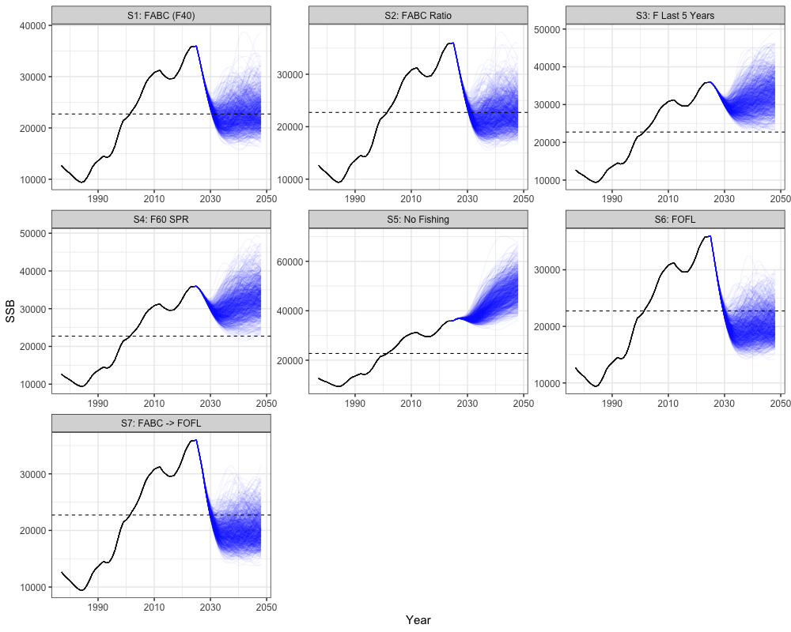

```{r eval = FALSE}
combined_ssb %>%
  filter(Year > 2024) %>%
  group_by(Year, Scenario, Type) %>%
  summarize(lwr = quantile(SSB, 0.025),
            upr = quantile(SSB, 0.975),
            SSB = mean(SSB)) %>%
  ggplot(aes(x = Year, y = SSB, ymin = lwr, ymax = upr)) +
  geom_line(alpha = 1, lwd = 1.3) +
  geom_ribbon(color = NA, alpha = 0.3) +
  facet_wrap(~Scenario) +
  coord_cartesian(ylim = c(0, NA)) +
  geom_hline(yintercept = b40, lty = 2) +
  theme_bw(base_size = 15) +
  theme(legend.position = 'none')
```
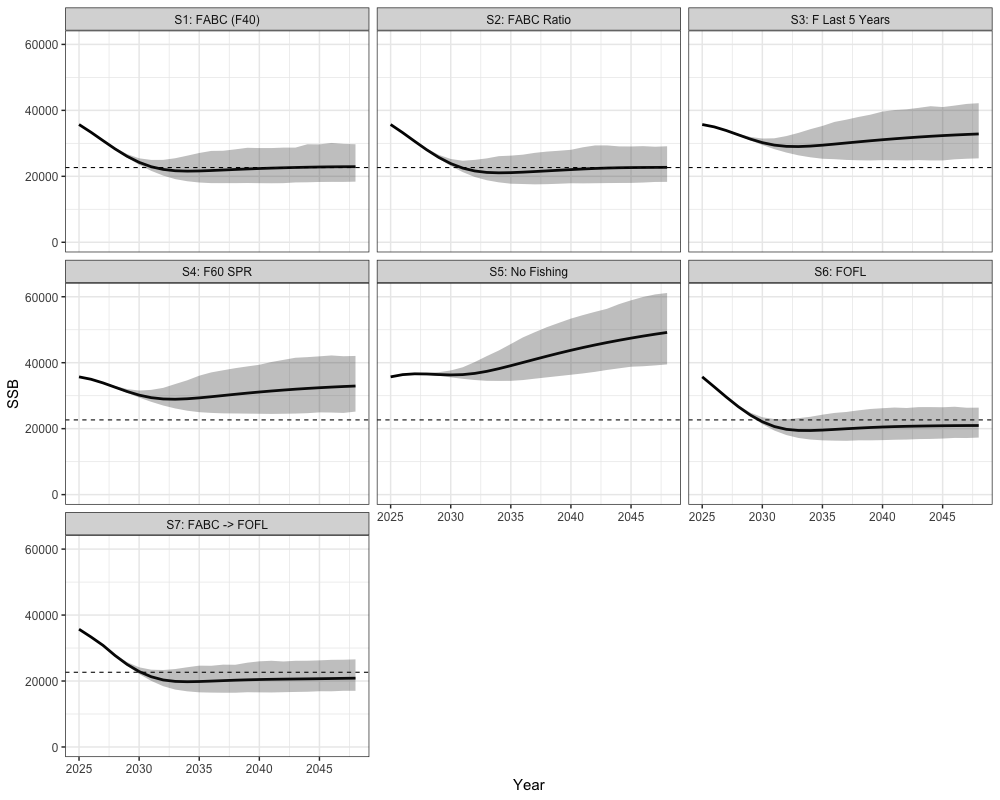

### Catch Projections
```{r eval = FALSE}
# Get historical catch
historical <- reshape2::melt(array(rep(francis_data$ObsCatch, n_sims),
                                   dim = c(n_regions, length(francis_data$years), francis_data$n_fish_fleets, n_sims))) %>%
  mutate(Year = Var2 + 1976,
         Scenario = "FABC (F40)",  # or change to match the scenarios you're plotting
         Type = "Historical") %>%
  rename(Region = Var1, Simulation = Var4, Fleet = Var3, Catch = value) %>%
  select(-Var2)

historical$Catch[is.na(historical$Catch)] <- 0

# Get all scenario projections
scenarios <- reshape2::melt(all_scenarios_catch) %>%
  mutate(Year = Var2 + 2023,
         Scenario = case_when(
           Var5 == 1 ~ "S1: FABC (F40)",
           Var5 == 2 ~ "S2: FABC Ratio",
           Var5 == 3 ~ "S3: F Last 5 Years",
           Var5 == 4 ~ "S4: F60 SPR",
           Var5 == 5 ~ "S5: No Fishing",
           Var5 == 6 ~ "S6: FOFL",
           Var5 == 7 ~ "S7: FABC -> FOFL",
           TRUE ~ paste("Scenario", Var5)
         ),
         Type = "Projection") %>%
  rename(Region = Var1, Simulation = Var4, Catch = value, Fleet = Var3) %>%
  select(-c(Var2, Var5))

# expand historical catch for plotting
scenarios_unique <- unique(scenarios$Scenario)
historical_expanded <- historical[rep(1:nrow(historical), times = length(scenarios_unique)), ]
historical_expanded$Scenario <- rep(scenarios_unique, each = nrow(historical))

# combine
combined_cat <- bind_rows(historical_expanded, scenarios)
```

```{r eval = FALSE}
combined_cat %>%
  group_by(Year, Scenario, Simulation, Type, Region) %>%
  summarize(Catch = sum(Catch)) %>%
  ggplot(aes(x = Year, y = Catch, group = interaction(Scenario, Simulation), color = Type)) +
  geom_line(alpha = 0.05) +
  facet_wrap(~Scenario) +
  coord_cartesian(ylim = c(0, NA)) +
  scale_color_manual(values = c("Historical" = "black", "Projection" = "blue")) +
  theme_bw(base_size = 15) +
  theme(legend.position = 'none')
```


```{r eval = FALSE}
combined_cat %>%
  filter(Year > 2024) %>%
  group_by(Year, Scenario, Simulation, Type, Region) %>%
  summarize(Catch = sum(Catch)) %>%
  group_by(Year, Scenario, Type) %>%
  summarize(lwr = quantile(Catch, 0.025),
            upr = quantile(Catch, 0.975),
            Catch = mean(Catch)) %>%
  ggplot(aes(x = Year, y = Catch, ymin = lwr, ymax = upr)) +
  geom_line(alpha = 1, lwd = 1.3) +
  geom_ribbon(color = NA, alpha = 0.3) +
  facet_wrap(~Scenario) +
  coord_cartesian(ylim = c(0, NA)) +
  theme_bw(base_size = 15) +
  theme(legend.position = 'none')
```

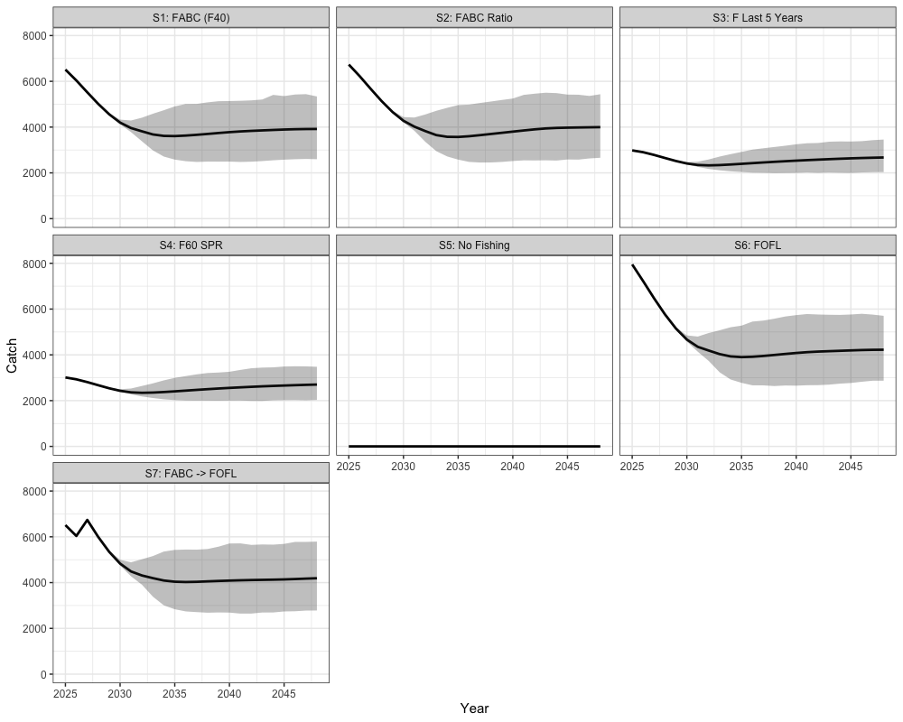

### Catch Advice under $F_{40\%}$

Catch advice is summarized by projecting forward under Scenario 1, which applies the harvest control rule with $F_{40\%}$ as the maximum allowable fishing mortality. The plots show the mean projected catch with 95% uncertainty intervals across simulations, providing the expected range of allowable catch in future years under this strategy.

```{r eval = FALSE}
combined_cat %>%
  filter(Year > 2024, Scenario == "S1: FABC (F40)") %>%
  group_by(Year, Scenario, Simulation, Type, Region) %>%
  summarize(Catch = sum(Catch)) %>%
  group_by(Year, Scenario, Type) %>%
  summarize(lwr = quantile(Catch, 0.025),
            upr = quantile(Catch, 0.975),
            Catch = mean(Catch))
```

```{r eval = FALSE}
combined_cat %>%
  filter(Year > 2024, Scenario == "S1: FABC (F40)") %>%
  group_by(Year, Scenario, Simulation, Type, Region) %>%
  summarize(Catch = sum(Catch)) %>%
  group_by(Year, Scenario, Type) %>%
  summarize(lwr = quantile(Catch, 0.025),
            upr = quantile(Catch, 0.975),
            Catch = mean(Catch)) %>%
  ggplot(aes(x = Year, y = Catch, ymin = lwr, ymax = upr)) +
  geom_line(alpha = 1, lwd = 1.3) +
  geom_ribbon(color = NA, alpha = 0.3) +
  coord_cartesian(ylim = c(0, NA)) +
  theme_bw(base_size = 15) +
  theme(legend.position = 'none')
```
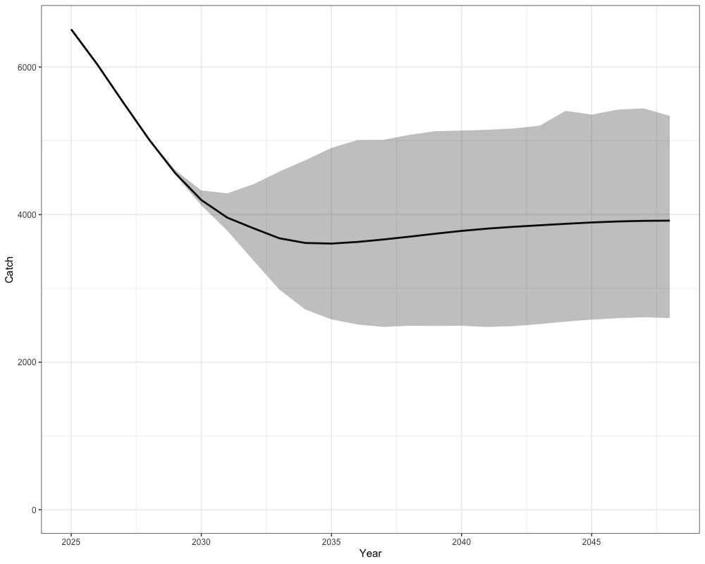


### Fishing Mortality Projections
```{r eval = FALSE}
# Get historical F
historical <- reshape2::melt(array(rep(as.vector(apply(francis_model$rep$Fmort, c(1,2), sum)), n_sims),
                                   dim = c(n_regions, length(francis_data$years), n_sims))) %>%
  mutate(Year = Var2 + 1976,
         Scenario = "FABC (F40)",  # or change to match the scenarios you're plotting
         Type = "Historical") %>%
  rename(Region = Var1, Simulation = Var3, Fmort = value)

# Get all scenario projections
scenarios <- reshape2::melt(all_scenarios_f) %>%
  mutate(Year = Var2 + 2023,
         Scenario = case_when(
           Var4 == 1 ~ "S1: FABC (F40)",
           Var4 == 2 ~ "S2: FABC Ratio",
           Var4 == 3 ~ "S3: F Last 5 Years",
           Var4 == 4 ~ "S4: F60 SPR",
           Var4 == 5 ~ "S5: No Fishing",
           Var4 == 6 ~ "S6: FOFL",
           Var4 == 7 ~ "S7: FABC -> FOFL",
           TRUE ~ paste("Scenario", Var4)
         ),
         Type = "Projection") %>%
  rename(Region = Var1, Simulation = Var3, Fmort = value)

# expand historical F for plotting
scenarios_unique <- unique(scenarios$Scenario)
historical_expanded <- historical[rep(1:nrow(historical), times = length(scenarios_unique)), ]
historical_expanded$Scenario <- rep(scenarios_unique, each = nrow(historical))

# combine
combined_fmort <- bind_rows(historical_expanded, scenarios)
```

```{r eval = FALSE}
combined_fmort %>%
  ggplot(aes(x = Year, y = Fmort, group = interaction(Scenario, Simulation), color = Type)) +
  geom_line(alpha = 0.05) +
  facet_wrap(~Scenario, scales = 'free') +
  scale_color_manual(values = c("Historical" = "black", "Projection" = "blue")) +
  theme_bw(base_size = 15) +
  theme(legend.position = 'none') +
  labs(y = 'Fully Selected Fishing Mortality')
```

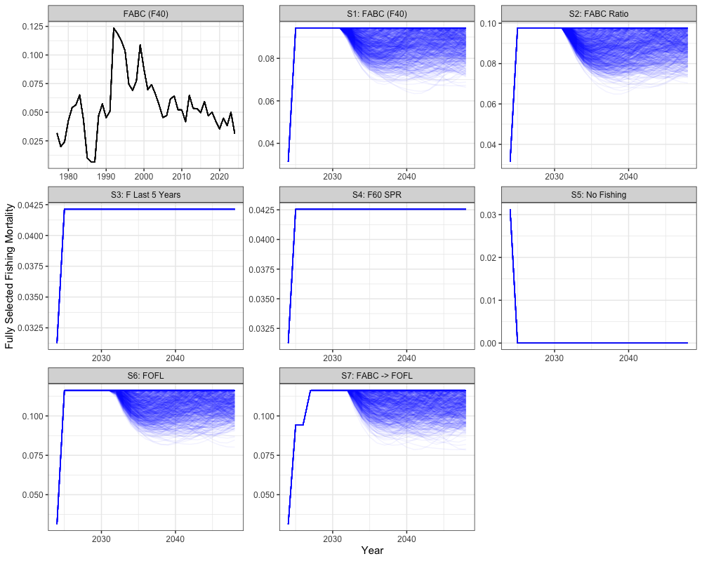

```{r eval = FALSE}
combined_fmort %>%
  filter(Year > 2024) %>%
  group_by(Year, Scenario, Type) %>%
  summarize(lwr = quantile(Fmort, 0.025),
            upr = quantile(Fmort, 0.975),
            Fmort = mean(Fmort)) %>%
  ggplot(aes(x = Year, y = Fmort, ymin = lwr, ymax = upr)) +
  geom_line(alpha = 1, lwd = 1.3) +
  geom_ribbon(color = NA, alpha = 0.3) +
  facet_wrap(~Scenario) +
  coord_cartesian(ylim = c(0, NA)) +
  theme_bw(base_size = 15) +
  theme(legend.position = 'none') +
  labs(y = 'Fully Selected Fishing Mortality')
```

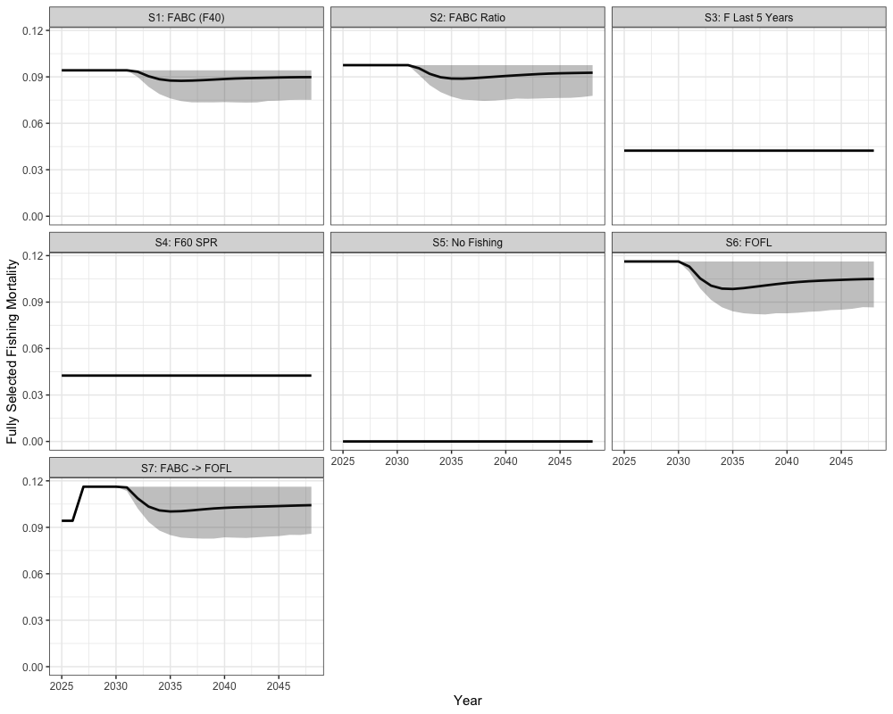
