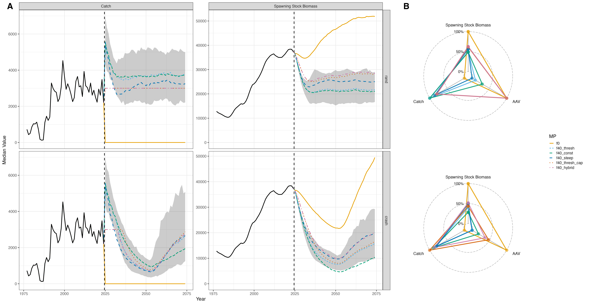

```{r, include = FALSE}
knitr::opts_chunk$set(
  collapse = TRUE,
  comment = "#>"
)
```

# Overview

We demonstrated how closed-loop simulations can be run in the *Run Closed Loop Simulations* vignette. For an introductory walkthrough, please refer to that vignette.  Here, we demonstrate how to test multiple management procedures (MPs) across different demographic scenarios to evaluate the robustness and performance of alternative strategies. We note that this is one way to define a closed-loop simulation.  Users can maintain flexibility in how the closed-loop is set up, for example by defining MPs using empirical control rules, alternative reference points, or custom projection strategies. This approach allows users to tailor the simulation to their specific management questions or data constraints.

In this vignette, six MPs will be evaluated:

1. **f0** – No fishing, serving as a baseline for comparison.  
2. **f40_thresh** – A threshold control rule using \( F_{40\%} \) and \( B_{40\%} \) as reference points.  
   Fishing mortality is set at \( F_{40\%} \) when \( SSB \ge B_{40\%} \) and declines linearly as \( SSB \) falls below \( B_{40\%} \).  
   No fishing occurs if \( SSB \le B_{5\%} \).  
   This rule represents the default strategy used for Gulf of Alaska Dusky Rockfish management (Omori et al., 2024).  
3. **f40_const** – A constant fishing mortality rate fixed at \( F_{40\%} \), regardless of \( SSB \).  
4. **f40_steep** – Similar to **f40_thresh**, but with a steeper ramp, where the target biomass reference point is set at \( B_{60\%} \).  
5. **f40_thresh_cap** – As in **f40_thresh**, but with catches capped at 3,000 t, approximating the mean of the historical catch time series.  
6. **f40_hybrid** – A hybrid rule combining elements of **f40_thresh**, **f40_steep**, and **f40_thresh_cap**.  

Two demographic (recruitment) scenarios will be evaluated:

1. **rand** – Recruitment is randomly resampled from the historical time series to mimic past recruitment variability.  
2. **crash** – Recruitment follows Beverton–Holt dynamics and declines sharply to mimic environmentally driven recruitment collapses.  
   During the first 23 years of the simulation period (2025–2046), recruitment is simulated at reduced values  
   (\( R_0 = 2.5, h = 0.5 \)), followed by a recovery phase (2047–2074) with higher productivity  
   (\( R_0 = 12, h = 0.75 \)).  

The performance metrics evaluated in this vignette include:

1. Spawning stock biomass  
2. Catch  
3. Average annual variation in catch  

Let us first set up the simulation by loading the requisite packages and data files.

```{r, eval = FALSE}
library(parallel)      
library(foreach)       
library(doParallel)    
library(ggplot2)       
library(here)          
library(SPoRC)         
library(ggradar)      
data("dusky_rtmb_model")
```

## Estimation Model

Next, we set up the estimation model (EM) that will be used within the closed-loop simulation framework.  The helper function `setup_em()` prepares all necessary inputs for the estimation model for a given simulation year and replicate.  It uses `SPoRC::simulation_data_to_SPoRC()` to convert the simulation output into the correct input structure for the `SPoRC` model.  

In general, this EM follows the structure introduced in the *Getting Started* vignette.  It represents a **single-area, single-sex, single-fishery, and single-survey model configuration.  Both fishery and survey fleets are modeled with logistic selectivity.  Recruitment follows a mean recruitment formulation, and the model is fit to:

- Catches  
- Fishery age and length compositions  
- Survey age compositions  

Additionally, the survey index is fit with a prior on catchability (`q`) to stabilize estimation.  

```{r, eval = FALSE}
#' Setup Estimation Model Inputs for Gulf of Alaska Dusky Rockfish
#'
#' Prepares the estimation model input list for a given simulation year
#' and replicate within the SPoRC closed-loop simulation framework.
#'
#' @param sim_env Simulation environment generated by `Setup_sim_env()`.
#' @param y Integer. Current simulation year index.
#' @param sim Integer. Simulation replicate index.
#'
#' @return A fully configured EM input list suitable for fitting with `fit_model()`.
setup_em <- function(sim_env, y, sim) {

  # Extract simulation data for current year and replicate
  sim_data <- SPoRC::simulation_data_to_SPoRC(sim_env, y, sim)

  # Initialize model dimensions
  input_list <- Setup_Mod_Dim(
    years = 1:y,
    ages = 1:sim_env$n_ages,
    lens = 1:sim_env$n_lens,
    n_regions = sim_env$n_regions,
    n_sexes = sim_env$n_sexes,
    n_fish_fleets = sim_env$n_fish_fleets,
    n_srv_fleets = sim_env$n_srv_fleets,
    verbose = FALSE
  )

  # Configure recruitment model
  input_list <- Setup_Mod_Rec(
    input_list = input_list,
    do_rec_bias_ramp = 1,  # Enable bias ramp (no lognormal bias correction)
    bias_year = rep(length(input_list$data$years), 4),
    sigmaR_switch = 1,  # Switch from early to late sigmaR in first year
    ln_sigmaR = rep(-0.1068576, 2),  # Early and late sigma values
    rec_model = "mean_rec",
    sigmaR_spec = "fix",  # Fix early and late sigmaR
    init_age_strc = 1,  # Geometric series for initial age structure
    ln_global_R0 = log(2.7),  # Starting value for mean recruitment
    t_spawn = 0  # Spawn timing
  )

  # Configure biological parameters
  input_list <- Setup_Mod_Biologicals(
    input_list = input_list,
    WAA = sim_data$WAA,
    MatAA = sim_data$MatAA,
    fit_lengths = 1,
    SizeAgeTrans = sim_data$SizeAgeTrans,
    AgeingError = sim_data$AgeingError,
    M_spec = "fix",  # Fix natural mortality at 0.07
    Fixed_natmort = array(0.07, dim = c(
      input_list$data$n_regions,
      length(input_list$data$years),
      length(input_list$data$ages),
      input_list$data$n_sexes
    )),
    addtocomp = 0.00001
  )

  # Configure movement and tagging (no tagging used)
  input_list <- Setup_Mod_Tagging(input_list = input_list, UseTagging = 0)
  input_list <- Setup_Mod_Movement(
    input_list = input_list,
    use_fixed_movement = 1,
    Fixed_Movement = NA,
    do_recruits_move = 0
  )

  # Configure fishery catch and fishing mortality
  input_list <- Setup_Mod_Catch_and_F(
    input_list = input_list,
    ObsCatch = sim_data$ObsCatch,
    Catch_Type = array(1, dim = c(length(input_list$data$years), input_list$data$n_fish_fleets)),
    UseCatch = sim_data$UseCatch,
    Use_F_pen = 1,
    sigmaC_spec = "fix",
    ln_sigmaC = sim_data$ln_sigmaC,
    ln_sigmaF = array(log(sqrt(1/2)), dim = c(input_list$data$n_regions, input_list$data$n_fish_fleets))
  )

  # Configure fishery indices and compositions
  input_list <- Setup_Mod_FishIdx_and_Comps(
    input_list = input_list,
    ObsFishIdx = sim_data$ObsFishIdx,
    ObsFishIdx_SE = sim_data$ObsFishIdx_SE,
    UseFishIdx = sim_data$UseFishIdx,
    ObsFishAgeComps = sim_data$ObsFishAgeComps,
    ObsFishLenComps = sim_data$ObsFishLenComps,
    UseFishAgeComps = sim_data$UseFishAgeComps,
    UseFishLenComps = sim_data$UseFishLenComps,
    ISS_FishAgeComps = sim_data$ISS_FishAgeComps,
    ISS_FishLenComps = sim_data$ISS_FishLenComps,
    fish_idx_type = c("none"),
    FishAgeComps_LikeType = c("Multinomial"),
    FishLenComps_LikeType = c("Multinomial"),
    FishAgeComps_Type = c("agg_Year_1-terminal_Fleet_1"),
    FishLenComps_Type = c("agg_Year_1-terminal_Fleet_1")
  )

  # Configure survey indices and compositions
  input_list <- Setup_Mod_SrvIdx_and_Comps(
    input_list = input_list,
    ObsSrvIdx = sim_data$ObsSrvIdx,
    ObsSrvIdx_SE = sim_data$ObsSrvIdx_SE,
    UseSrvIdx = sim_data$UseSrvIdx,
    ObsSrvAgeComps = sim_data$ObsSrvAgeComps,
    ObsSrvLenComps = sim_data$ObsSrvLenComps,
    UseSrvAgeComps = sim_data$UseSrvAgeComps,
    UseSrvLenComps = sim_data$UseSrvLenComps,
    ISS_SrvAgeComps = sim_data$ISS_SrvAgeComps,
    ISS_SrvLenComps = sim_data$ISS_SrvLenComps,
    srv_idx_type = c("biom"),
    SrvAgeComps_LikeType = c("Multinomial"),
    SrvLenComps_LikeType = c("Multinomial"),
    SrvAgeComps_Type = c("agg_Year_1-terminal_Fleet_1"),
    SrvLenComps_Type = c("agg_Year_1-terminal_Fleet_1")
  )

  # Configure fishery selectivity and catchability
  input_list <- Setup_Mod_Fishsel_and_Q(
    input_list = input_list,
    fish_sel_model = c("logist2_Fleet_1"),
    fish_fixed_sel_pars_spec = c("est_all"),
    fish_q_spec = c("fix")
  )

  # Configure survey selectivity and catchability with prior
  srv_q_prior <- data.frame(
    region = 1,
    block = 1,
    fleet = 1,
    mu = 1,
    sd = 0.447213595
  )

  input_list <- Setup_Mod_Srvsel_and_Q(
    input_list = input_list,
    srv_sel_model = c("logist2_Fleet_1"),
    srv_fixed_sel_pars_spec = c("est_all"),
    srv_q_spec = c("est_all"),
    Use_srv_q_prior = 1,
    srv_q_prior = srv_q_prior,
    t_srv = array(0, dim = c(input_list$data$n_regions, input_list$data$n_srv_fleets))
  )

  # Configure data weighting
  input_list <- Setup_Mod_Weighting(
    input_list = input_list,
    Wt_Catch = 1,
    Wt_FishIdx = 1,
    Wt_SrvIdx = 1,
    Wt_Rec = 1,
    Wt_F = 1,
    Wt_Tagging = 0,
    Wt_FishAgeComps = array(1, dim = c(input_list$data$n_regions, length(input_list$data$years),
                                       input_list$data$n_sexes, input_list$data$n_fish_fleets)),
    Wt_FishLenComps = array(1, dim = c(input_list$data$n_regions, length(input_list$data$years),
                                       input_list$data$n_sexes, input_list$data$n_fish_fleets)),
    Wt_SrvAgeComps = array(1, dim = c(input_list$data$n_regions, length(input_list$data$years),
                                      input_list$data$n_sexes, input_list$data$n_srv_fleets)),
    Wt_SrvLenComps = array(0, dim = c(input_list$data$n_regions, length(input_list$data$years),
                                      input_list$data$n_sexes, input_list$data$n_srv_fleets))
  )

  return(input_list)
}
```

## Projection Options
As part of the closed-loop simulation process, estimates from the estimation model (EM) are passed into a projection model, together with a defined management procedure (MP), to derive catch advice.  The following helper function can be embedded within a closed-loop simulation to generate catch advice from EM outputs.  

Further details on how the `Do_Population_Projection()` function operates and how it is applied are provided in the *Deriving Reference Points, Catch Advice, and Projections* vignette. In general, the following function extracts estimates from the terminal year to condition the population projections and derive catch advice. 

```{r, eval = FALSE}
#' Run Population Projection
#'
#' Performs forward projection of the population using assessment model outputs
#' and management procedure specifications.
#'
#' @param sim_env Simulation environment
#' @param obj Fitted assessment model object
#' @param reference_points Calculated reference points
#' @param asmt_data Assessment data list
#' @param mp_config Management procedure configuration
#' @param y Current year index
#'
#' @return Projection results including projected catch
run_projection <- function(sim_env, obj, reference_points, asmt_data, mp_config, y) {

  n_proj <- mp_config$proj_opt$n_proj_yrs

  # Extract terminal year numbers-at-age
  tmp_terminal_NAA <- array(
    obj$rep$NAA[, y, , ],
    dim = c(asmt_data$n_regions, length(asmt_data$ages), asmt_data$n_sexes)
  )
  tmp_terminal_NAA0 <- array(
    obj$rep$NAA0[, y, , ],
    dim = c(asmt_data$n_regions, length(asmt_data$ages), asmt_data$n_sexes)
  )

  # Replicate biological parameters for projection years
  tmp_WAA <- array(
    rep(asmt_data$WAA[, y, , ], each = n_proj),
    dim = c(asmt_data$n_regions, n_proj, length(asmt_data$ages), asmt_data$n_sexes)
  )

  tmp_WAA_fish <- array(
    rep(asmt_data$WAA_fish[, y, , , ], each = n_proj),
    dim = c(asmt_data$n_regions, n_proj, length(asmt_data$ages),
            asmt_data$n_sexes, asmt_data$n_fish_fleets)
  )

  tmp_MatAA <- array(
    rep(asmt_data$MatAA[, y, , ], each = n_proj),
    dim = c(asmt_data$n_regions, n_proj, length(asmt_data$ages), asmt_data$n_sexes)
  )

  tmp_fish_sel <- array(
    rep(obj$rep$fish_sel[, y, , , ], each = n_proj),
    dim = c(asmt_data$n_regions, n_proj, length(asmt_data$ages),
            asmt_data$n_sexes, asmt_data$n_fish_fleets)
  )

  tmp_natmort <- array(
    rep(obj$rep$natmort[, y, , ], each = n_proj),
    dim = c(asmt_data$n_regions, n_proj, length(asmt_data$ages), asmt_data$n_sexes)
  )

  # Extract terminal fishing mortality
  tmp_terminal_F <- array(
    obj$rep$Fmort[, y, ],
    dim = c(asmt_data$n_regions, asmt_data$n_fish_fleets)
  )

  # Extract recruitment history
  tmp_recruitment <- array(
    obj$rep$Rec[, 1:y],
    dim = c(asmt_data$n_regions, length(1:y))
  )

  # Replicate sex ratio for projection years
  tmp_sexratio <- array(
    replicate(n = n_proj, obj$rep$sexratio[, y, ]),
    dim = c(asmt_data$n_regions, n_proj, asmt_data$n_sexes)
  )

  # Replicate movement matrix for projection years
  tmp_Movement <- array(
    dim = c(asmt_data$n_regions, asmt_data$n_regions, n_proj,
            length(asmt_data$ages), asmt_data$n_sexes)
  )
  for (proj_yr in 1:n_proj) {
    tmp_Movement[, , proj_yr, , ] <- obj$rep$Movement[, , y, , ]
  }

  # Execute population projection
  proj_results <- SPoRC::Do_Population_Projection(
    n_proj_yrs = n_proj,
    n_regions = sim_env$n_regions,
    n_ages = sim_env$n_ages,
    n_sexes = sim_env$n_sexes,
    sexratio = tmp_sexratio,
    n_fish_fleets = sim_env$n_fish_fleets,
    do_recruits_move = sim_env$do_recruits_move,
    recruitment = tmp_recruitment,
    terminal_NAA = tmp_terminal_NAA,
    terminal_NAA0 = tmp_terminal_NAA0,
    terminal_F = tmp_terminal_F,
    natmort = tmp_natmort,
    WAA = tmp_WAA,
    WAA_fish = tmp_WAA_fish,
    MatAA = tmp_MatAA,
    fish_sel = tmp_fish_sel,
    Movement = tmp_Movement,
    f_ref_pt = reference_points$f_ref_pt,
    b_ref_pt = reference_points$virgin_b_ref_pt * mp_config$reference_points_opt$B_x,
    HCR_function = mp_config$proj_opt$HCR_function,
    recruitment_opt = mp_config$proj_opt$recruitment_opt,
    fmort_opt = mp_config$proj_opt$fmort_opt,
    t_spawn = sim_env$t_spawn,
    bh_rec_opt = mp_config$proj_opt$bh_rec_opt
  )
  
  return(proj_results)
}
```

## Functions to Determine Catch

Next, we define functions that determine how catches are constrained and how they translate into fishing mortality within the closed-loop simulation.  

In general, the helper functions below establish the feedback between catch advice and the operating model.  The first function applies management rules or constraints (i.e., caps) to the total allowable catch (TAC).  These constraints are applied through a user-specified function `catch_opt_func`, which modifies the input catch advice based on management procedures defined later.  

```{r, eval = FALSE}
#' Apply Catch Constraints
#'
#' Applies management procedure catch constraints (e.g., caps) to projected catch.
#'
#' @param tmp_TAC Array of projected TAC values
#' @param catch_opt_func Function defining catch constraints
#'
#' @return Modified TAC array with constraints applied
apply_catch_constraints <- function(tmp_TAC, catch_opt_func) {
  for (j in 1:dim(tmp_TAC)[2]) {
    tmp_TAC[, j, ] <- catch_opt_func(catch = tmp_TAC[, j, ])
  }
  return(tmp_TAC)
}
```

The next function converts the (possibly constrained) TAC into a corresponding fishing mortality rate (`Fmort`) used by the operating model.
This function uses a bisection algorithm to find the value of fishing mortality that achieves the specified TAC for each region and fleet combination.
The updated `Fmort` values are then stored in the simulation environment for use in the next time step of the closed-loop cycle.

```{r, eval = FALSE}
#' Convert TAC to Fishing Mortality
#'
#' Uses bisection method to find fishing mortality rate that achieves target TAC.
#'
#' @param sim_env Simulation environment
#' @param tmp_TAC Target total allowable catch
#' @param y Current year index
#' @param sim Simulation replicate index
#' @param assessment_years Vector of assessment year indices
#'
#' @return Updated simulation environment with new fishing mortality rates
tac_to_fmort <- function(sim_env, tmp_TAC, y, sim, assessment_years) {

  # Find most recent assessment year
  last_assess_year <- max(assessment_years[assessment_years <= y])
  tac_year_index <- y - last_assess_year + 1

  # Create grid of region-fleet combinations
  rf_grid <- expand.grid(
    r = seq_len(sim_env$n_regions),
    f = seq_len(sim_env$n_fish_fleets)
  )

  # Solve for F that achieves target catch for each region-fleet combination
  tmp_f <- mapply(
    function(r, f) {
      SPoRC::bisection_F(
        f_guess = 0.05,
        catch = tmp_TAC[r, tac_year_index, f],
        NAA = sim_env$NAA[r, y + 1, , , sim],
        WAA = sim_env$WAA[r, y + 1, , , sim],
        natmort = sim_env$natmort[r, y + 1, , , sim],
        fish_sel = sim_env$fish_sel[r, y + 1, , , f, sim]
      )
    },
    r = rf_grid$r,
    f = rf_grid$f
  )

  # Update fishing mortality in simulation environment
  sim_env$Fmort[, y + 1, , sim] <- array(tmp_f, dim = c(sim_env$n_regions, sim_env$n_fish_fleets))

  return(sim_env)
}
```

## Management Procedures
MPs define how catch advice is generated and applied within the closed-loop simulation. Each MP defined here includes rules for reference point calculation, control rule shape, and catch implementation. The helper functions below specify the shape of the control rules used across the different MPs. The *threshold* rule reduces fishing mortality as spawning biomass declines below a biomass reference point, while the *constant* rule maintains fishing mortality at a fixed rate regardless of biomass status.  

```{r}
#' Threshold Harvest Control Rule
#'
#' Implements a threshold HCR where F is reduced linearly as biomass declines
#' below the target biomass reference point.
#'
#' @param x Current biomass
#' @param frp Fishing mortality reference point (target F)
#' @param brp Biomass reference point (target biomass)
#' @param alpha Minimum biomass threshold (as fraction of brp)
#'
#' @return Fishing mortality rate
HCR_threshold <- function(x, frp, brp, alpha = 0.05) {
  stock_status <- x / brp

  if (stock_status >= 1) {
    f <- frp
  } else if (stock_status > alpha) {
    f <- frp * (stock_status - alpha) / (1 - alpha)
  } else {
    f <- 0
  }

  return(f)
}

#' Constant Harvest Control Rule
#'
#' Implements a constant catch HCR where F remains at the reference level
#' regardless of stock status.
#'
#' @param x Current biomass (unused)
#' @param frp Fishing mortality reference point (target F)
#' @param brp Biomass reference point (unused)
#' @param alpha Minimum biomass threshold (unused)
#'
#' @return Fishing mortality rate (constant at frp)
HCR_constant <- function(x, frp, brp = 0, alpha = 0.05) {
  return(frp)
}
```

The list below defines the specific MPs used in this example. Each configuration represents a different management strategy, varying in how strongly it responds to changes in biomass and whether catch caps are imposed. Each MP has the following components in this example:

1. **Reference point options (`reference_points_opt`)** — specify how biological reference points are calculated (e.g., target spawning potential ratio, biomass thresholds).  
2. **Projection options (`proj_opt`)** — define the harvest control rule (HCR) and how recruitment and fishing mortality are handled during projections.  
3. **Catch options (`catch_opt`)** — optionally constrain catches according to management limits (e.g., catch caps).  

Users have flexibility to modify and extend this structure to fit their specific modeling objectives.

```{r, eval = FALSE}
assess_freq <- 2           # Assessment frequency (every 2 years)

mp_list <- list(

  # 1. No fishing
  # Serves as a baseline scenario. No assessment, projection, or catch is applied.
  f0 = list(
    skip_assessment = TRUE,
    reference_points_opt = NULL,
    proj_opt = NULL,
    catch_opt = NULL
  ),

  # 2. F40% with B40% threshold
  # The assessment is performed and reference points are calculated based on an SPR of 40%.
  # A threshold rule (B40%) is applied, where F declines linearly as biomass drops below 40% of B_SPR.
  f40_thresh = list(
    skip_assessment = FALSE,
    reference_points_opt = list(
      n_avg_yrs = 1,
      SPR_x = 0.4,
      calc_rec_st_yr = 3,
      rec_age = 4,
      type = 'single_region',
      what = "SPR",
      B_x = 0.4
    ),
    proj_opt = list(
      n_proj_yrs = assess_freq + 1,
      HCR_function = HCR_threshold,
      recruitment_opt = 'mean_rec',
      fmort_opt = 'HCR',
      bh_rec_opt = NULL
    ),
    catch_opt = function(catch, prev_catch = NULL, catch_cap = NULL) catch
  ),

  # 3. F40% constant
  # Similar to f40_thresh, but no biomass threshold is applied.
  # Fishing mortality remains constant at F40%, regardless of biomass status.
  f40_const = list(
    skip_assessment = FALSE,
    reference_points_opt = list(
      n_avg_yrs = 1,
      SPR_x = 0.4,
      calc_rec_st_yr = 3,
      rec_age = 4,
      type = 'single_region',
      what = "SPR",
      B_x = NULL
    ),
    proj_opt = list(
      n_proj_yrs = assess_freq + 1,
      HCR_function = HCR_constant,
      recruitment_opt = 'mean_rec',
      fmort_opt = 'HCR',
      bh_rec_opt = NULL
    ),
    catch_opt = function(catch, prev_catch = NULL, catch_cap = NULL) catch
  ),

  # 4. F40% with B40% threshold and 3k ton catch cap
  # Same as f40_thresh, but adds an upper limit on allowable catch (3,000 tons).
  # The cap is applied after control rule-based advice is generated.
  f40_thresh_cap = list(
    skip_assessment = FALSE,
    reference_points_opt = list(
      n_avg_yrs = 1,
      SPR_x = 0.4,
      calc_rec_st_yr = 3,
      rec_age = 4,
      type = 'single_region',
      what = "SPR",
      B_x = 0.4
    ),
    proj_opt = list(
      n_proj_yrs = assess_freq + 1,
      HCR_function = HCR_threshold,
      recruitment_opt = 'mean_rec',
      fmort_opt = 'HCR',
      bh_rec_opt = NULL
    ),
    catch_opt = function(catch, prev_catch = NULL, catch_cap = 3000) {
      pmin(catch, catch_cap)
    }
  ),

  # 5. F40% with B60% threshold
  # A steeper control rule that initiates F reduction earlier (when biomass < 60% of B_SPR),
  # providing more precautionary harvest control at moderate depletion levels.
  f40_steep = list(
    skip_assessment = FALSE,
    reference_points_opt = list(
      n_avg_yrs = 1,
      SPR_x = 0.4,
      calc_rec_st_yr = 3,
      rec_age = 4,
      type = 'single_region',
      what = "SPR",
      B_x = 0.6
    ),
    proj_opt = list(
      n_proj_yrs = assess_freq + 1,
      HCR_function = HCR_threshold,
      recruitment_opt = 'mean_rec',
      fmort_opt = 'HCR',
      bh_rec_opt = NULL
    ),
    catch_opt = function(catch, prev_catch = NULL, catch_cap = NULL) catch
  ),

  # 6. F40% hybrid: B60% threshold with 3k ton catch cap
  # Combines a precautionary threshold (B60%) with a hard catch cap (3,000 tons).
  # This MP reduces F more aggressively at lower biomass and constrains annual catches
  # to prevent excessive harvest in high-recruitment years.
  f40_hybrid = list(
    skip_assessment = FALSE,
    reference_points_opt = list(
      n_avg_yrs = 1,
      SPR_x = 0.4,
      calc_rec_st_yr = 3,
      rec_age = 4,
      type = 'single_region',
      what = "SPR",
      B_x = 0.6
    ),
    proj_opt = list(
      n_proj_yrs = assess_freq + 1,
      HCR_function = HCR_threshold,
      recruitment_opt = 'mean_rec',
      fmort_opt = 'HCR',
      bh_rec_opt = NULL
    ),
    catch_opt = function(catch, prev_catch = NULL, catch_cap = 3000) {
      pmin(catch, catch_cap)
    }
  )
)

```

## Simulation Loop (Single Replicate)
The core of the closed-loop simulation involves iterating over years and replicates to simulate population dynamics, assessments, and management feedback. At each simulation year, the population is updated according to biological processes, recruitment, and fishing mortality.  When the feedback period is reached, management procedures are applied based on the latest assessment results or, in some cases, skipped if the MP specifies no fishing (e.g., F = 0).  Assessment model inputs are prepared using the `setup_em` helper, and the model is fit to available data (via `fit_model`). Once the assessment is complete, reference points are calculated, forward projections are run, and catch advice is determined. Catch constraints such as caps can be applied before converting the advice into the true fishing mortality rates used in the operating models for the next year.  This single-replicate loop serves as the building block for running multiple replicates in parallel, allowing us to evaluate the robustness and performance of different MPs under repeated simulations.  

```{r}
#' Run Single Simulation Replicate
#'
#' Executes one complete closed-loop simulation replicate including population
#' dynamics, assessments, and management feedback.
#'
#' @param sim Simulation replicate index
#' @param sim_list Simulation configuration list
#' @param mp_config Management procedure configuration
#' @param assessment_years Vector of years when assessments occur
#' @param years_to_use Vector of years with available data
#' @param assess_freq Assessment frequency (years)
#'
#' @return List containing simulation results (SSB, catch, F, NAA)
run_single_replicate <- function(sim, sim_list, mp_config, assessment_years,
                                 years_to_use, assess_freq) {
  
  # Initialize simulation environment
  sim_env <- Setup_sim_env(sim_list)

  # Loop through all simulation years
  for (y in 1:sim_env$n_yrs) {
    
    # Execute annual population dynamics
    run_annual_cycle(y, sim, sim_env)

    # Management feedback loop (after burn-in period)
    if (y >= sim_env$feedback_start_yr) {
      # Check if MP skips assessments (e.g., F=0)
      if (!is.null(mp_config$skip_assessment) && mp_config$skip_assessment) {
        if (y < sim_env$n_yrs) sim_env$Fmort[, y + 1, , sim] <- 0
      } else {
        # Normal assessment and management procedure
        if (y %in% assessment_years) {
          # Prepare estimation model inputs
          dusky_input_list <- setup_em(sim_env, y, sim)
          asmt_data <- dusky_input_list$data
          parameters <- dusky_input_list$par
          mapping <- dusky_input_list$map

          # Set indicators for unused data years to 0
          asmt_data <- SPoRC::set_data_indicator_unused(
            data = asmt_data,
            unused_years = setdiff(1:sim_env$n_yrs, years_to_use),
            what = c("FishIdx", "FishAgeComps", "SrvIdx", "SrvAgeComps", "FishLenComps", "SrvLenComps")
          )

          # Fit assessment model with error handling
          fit_result <- tryCatch({
            SPoRC::fit_model(
              asmt_data, parameters, mapping,
              random = NULL, newton_loops = 1, silent = TRUE
            )
          }, error = function(e) {
            message(sprintf("Model fit failed for replicate %d in year %d: %s",
                            sim, y, e$message))
            return(NULL)
          })

          # If model fitting failed, return NA results
          if (is.null(fit_result)) {
            return(list(
              sim = sim,
              rec = NA,
              ssb = NA,
              catch = NA,
              fmort = NA,
              naa = NA,
              failed = TRUE,
              failure_year = y
            ))
          }

          obj <- fit_result

          # Calculate biological reference points
          reference_points <- SPoRC::get_closed_loop_reference_points(
            use_true_values = FALSE,
            sim_env = sim_env,
            asmt_data = asmt_data,
            asmt_rep = obj$rep,
            y = y,
            sim = sim,
            reference_points_opt = mp_config$reference_points_opt,
            n_proj_yrs = mp_config$proj_opt$n_proj_yrs
          )

          # Run forward projections
          proj <- run_projection(sim_env, obj, reference_points, asmt_data, mp_config, y)

          # Apply catch constraints (e.g., caps)
          tmp_TAC <- apply_catch_constraints(
            proj$proj_Catch[, -1, , drop = FALSE],
            mp_config$catch_opt
          )
        }

        # Convert TAC to fishing mortality for next year
        if (y < sim_env$n_yrs) {
          sim_env <- tac_to_fmort(sim_env, tmp_TAC, y, sim, assessment_years)
        }
      }
    }
  }

  # Return successful replicate results
  list(
    sim = sim,
    rec = sim_env$Rec[,,sim,drop = FALSE],
    ssb = sim_env$SSB[, , sim, drop = FALSE],
    catch = sim_env$TrueCatch[, , , sim, drop = FALSE],
    fmort = sim_env$Fmort[, , , sim, drop = FALSE],
    naa = sim_env$NAA[, , , , sim, drop = FALSE],
    failed = FALSE
  )
}
```

## Simulation Loop (Parrallelized)
For efficiency, simulations can be executed in parallel across multiple management procedures and replicates. The `run_parallel_simulations` function sets up a parallel cluster, exports necessary functions and objects, and runs each replicate simultaneously.  Results from each replicate are collected and stored in arrays for spawning biomass, catch, fishing mortality, and numbers-at-age. Users can modify this in a custom manner to extract additional results necessary for their unique applications. 
```{r, eval = FALSE}
#' Run Parallel Simulations
#'
#' Executes multiple management procedures in parallel across all replicates.
#'
#' @param mp_list List of management procedure configurations
#' @param sim_list Simulation configuration list
#' @param n_cores Number of CPU cores to use 
#'
#' @return List of simulation results for each management procedure
run_parallel_simulations <- function(mp_list, sim_list, n_cores = max(1, detectCores() - 2)) {

  # Initialize parallel cluster
  cl <- makeCluster(n_cores)
  registerDoParallel(cl)

  # load in packages
  clusterEvalQ(cl, {
    library(SPoRC)
    library(here)
  })

  # export functions in env
  clusterExport(
    cl,
    c("sim_list", "assessment_years", "years_to_use", "assess_freq",
      "setup_em", "run_projection", "apply_catch_constraints",
      "tac_to_fmort", "run_single_replicate"),
    envir = environment()
  )

  # init results storage
  sim_res <- vector("list", length(mp_list))
  names(sim_res) <- names(mp_list)

  # loop through each management procedure
  for (i in seq_along(mp_list)) {

    message(sprintf(
      "Running MP %d/%d: %s on %d cores with %d replicates",
      i, length(mp_list), names(mp_list)[i], n_cores, sim_list$n_sims
    ))

    # export MP to par env
    current_mp_config <- mp_list[[i]]
    current_mp_name <- names(mp_list)[i]
    clusterExport(cl, c("current_mp_config", "current_mp_name"), envir = environment())

    # run replicates in parallel
    replicate_results <- parLapply(cl, 1:sim_list$n_sims, function(sim) {

      set.seed(123 + sim) 

      tryCatch({
        run_single_replicate(
          sim = sim,
          sim_list = sim_list,
          mp_config = current_mp_config,
          assessment_years = assessment_years,
          years_to_use = years_to_use,
          assess_freq = assess_freq
        )
      }, error = function(e) {
        list(error = TRUE, message = as.character(e), sim = sim)
      })
    })

    # get dimensions from first replicate
    n_regions <- dim(replicate_results[[1]]$ssb)[1]
    n_years <- dim(replicate_results[[1]]$ssb)[2]
    n_ages <- dim(replicate_results[[1]]$naa)[2]
    n_sexes <- dim(replicate_results[[1]]$naa)[3]
    n_fish_fleets <- dim(replicate_results[[1]]$fmort)[2]

    # init result arrays
    sim_res[[i]] <- list(
      mp_name = names(mp_list)[i],
      rec = array(dim = c(n_regions, n_years, sim_list$n_sims)),
      ssb = array(dim = c(n_regions, n_years, sim_list$n_sims)),
      catch = array(dim = c(n_regions, n_years, n_fish_fleets, sim_list$n_sims)),
      fmort = array(dim = c(n_regions, n_years, n_fish_fleets, sim_list$n_sims)),
      naa = array(dim = c(n_regions, n_years, n_ages, n_sexes, sim_list$n_sims))
    )

    # populate result arrays from replicate results
    for (sim in 1:sim_list$n_sims) {
      sim_res[[i]]$rec[, , sim] <- replicate_results[[sim]]$rec
      sim_res[[i]]$ssb[, , sim] <- replicate_results[[sim]]$ssb
      sim_res[[i]]$catch[, , , sim] <- replicate_results[[sim]]$catch
      sim_res[[i]]$fmort[, , , sim] <- replicate_results[[sim]]$fmort
      sim_res[[i]]$naa[, , , , sim] <- replicate_results[[sim]]$naa
    }
  }

  # reset parallel cluster
  stopCluster(cl)

  return(sim_res)
}
```

# Condition Closed Loop Simulation
Before running full closed-loop projections, we first condition the simulation to be based on historical dynamics estimated from the Gulf of Alaska Dusky Rockfish assessment. Two demographic scenarios are used to condition future recruitment dynamics in this simulation, which include the `rand` and `crash` scenarios. In the `rand ` scenario, recruitment is resampled from the input data to reflect natural variability in year-to-year recruitment. This generates multiple stochastic replicates that maintain historical patterns while incorporating random variability. By contrast, the `crash` scenario simulates future recruitment to mimic a population that crashes, followed by recovery The inputs `R0_input` and `h_input` are set to produce a period of low recruitment (crash) and a subsequent rebound, providing a scenario to test management procedure performance under extreme population dynamics. The assessment is conducted at a regular frequency (`assess_freq`; 2 years) after the burn-in period, and data are available at specified intervals (`data_yr_freq`; 2 years), 

```{r, eval = FALSE}
# Extract model components from dusky model
data <- dusky_rtmb_model$data
rep <- dusky_rtmb_model$rep
parameters <- dusky_rtmb_model$parameters
mapping <- dusky_rtmb_model$mapping
sd_rep <- dusky_rtmb_model$sdrep

# Define operating model parameters
closed_loop_yrs <- 50      # Years to project forward
n_years <- length(data$years)  # number of years
burnin_years <- 1:length(data$years)  # Historical conditioning period
n_sims <- 200              # Number of replicate simulations
assess_freq <- 2           # Assessment frequency (every 2 years)
data_yr_freq <- 2          # Data collection frequency
n_regions <- 1            # number of regions

# Condition closed-loop simulations
set.seed(123)

# random recruitment
sim_list_rand <- condition_closed_loop_simulations(
  closed_loop_yrs = closed_loop_yrs,
  n_sims = n_sims,
  data = data,
  parameters = parameters,
  mapping = mapping,
  sd_rep = sd_rep,
  rep = rep,
  random = NULL,
  recruitment_opt = 'resample_from_input',
  ISS_FishAgeComps_fill = "F_pattern",
  ISS_FishLenComps_fill = "F_pattern"
)

# beverton holt crash and recover
# setup R0 input to mimic crash scenario
R0_input <- array(0, dim = c(n_regions, n_years + closed_loop_yrs))
R0_input[,1:47] <- exp(parameters$ln_global_R0) # mean recruitment from EM
R0_input[,48:70] <- 2.5 # BH recruitment with crash R0
R0_input[,71:98] <- 12 # BH recruitment with rebound R0
R0_input <- replicate(n = n_sims, R0_input)

# setup h input to mimic crash scenario
h_input <- array(0, dim = c(n_regions, n_years + closed_loop_yrs))
h_input[,1:47] <- 0.999 # mean recruitment from EM
h_input[,48:70] <- 0.5 # steepness in crash
h_input[,71:98] <- 0.75 # steepness in rebound
h_input <- replicate(n = n_sims, h_input)

sim_list_crash <- condition_closed_loop_simulations(
  closed_loop_yrs = closed_loop_yrs,
  n_sims = n_sims,
  data = data,
  parameters = parameters,
  mapping = mapping,
  sd_rep = sd_rep,
  rep = rep,
  random = NULL,
  recruitment_opt = 'bh_rec',
  ISS_FishAgeComps_fill = "F_pattern",
  ISS_FishLenComps_fill = "F_pattern",
  R0_input = R0_input,
  h_input = h_input
)

# Define assessment and data years
assessment_years <- seq(sim_list_rand$feedback_start_yr, sim_list_rand$n_yrs, assess_freq)
years_to_use <- c(burnin_years, seq(sim_list_rand$feedback_start_yr, sim_list_rand$n_yrs, data_yr_freq))
```

# Run Simulations

With the simulation environments conditioned, we can now run the closed-loop projections for each management procedure and scenario. Results from both scenarios are combined into a single object (`sim_all`) for subsequent analysis and comparison of MP performance.
```{r, eval = FALSE}
sim_res_rand <- run_parallel_simulations(mp_list, sim_list_rand, n_cores = 8)
sim_res_crash <- run_parallel_simulations(mp_list, sim_list_crash, n_cores = 8)
sim_all <- list(rand = sim_res_rand, crash = sim_res_crash) # combine scenarios
```

# Process Results
After simulations have been performed, we can extract results and summarize them for visualization. Below, we extract spawning stock biomass, recruitment, catch, fishing mortality rates. We then summarize these quantities across their time-series (and within each time point) as the median and their associated 95% simulation intervals.
```{r, eval = FALSE}
# Process results
ssb_results <- data.frame()
rec_results <- data.frame()
catch_results <- data.frame()
f_results <- data.frame()

for(i in 1:length(sim_all)) {

  # extract out recruitment scenario
  sim_tmp <- sim_all[[i]]

  # get mp specific results
  for(j in 1:length(sim_tmp)) {
    # get ssb
    tmp_ssb <- reshape2::melt(sim_tmp[[j]]$ssb) %>%
      rename(Region = Var1, Year = Var2, Sim = Var3, SSB = value) %>%
      mutate(MP = sim_tmp[[j]]$mp_name,
             Scenario = names(sim_all)[i])

    # get rec
    tmp_rec <- reshape2::melt(sim_tmp[[j]]$rec) %>%
      rename(Region = Var1, Year = Var2, Sim = Var3, Rec = value) %>%
      mutate(MP = sim_tmp[[j]]$mp_name,
             Scenario = names(sim_all)[i])

    # get catch
    tmp_catch <- reshape2::melt(sim_tmp[[j]]$catch) %>%
      rename(Region = Var1, Year = Var2, Fleet = Var3, Sim = Var4, cat = value) %>%
      mutate(MP = sim_tmp[[j]]$mp_name,
             Scenario = names(sim_all)[i])
    # get f
    tmp_f <- reshape2::melt(sim_tmp[[j]]$fmort) %>%
      rename(Region = Var1, Year = Var2, Fleet = Var3, Sim = Var4, f = value) %>%
      mutate(MP = sim_tmp[[j]]$mp_name,
             Scenario = names(sim_all)[i])

    ssb_results <- rbind(ssb_results, tmp_ssb)
    rec_results <- rbind(rec_results, tmp_rec)
    catch_results <- rbind(catch_results, tmp_catch)
    f_results <- rbind(f_results, tmp_f)
  }

}

# get summary statistics for time series
sumry <- ssb_results %>% # ssb
  group_by(MP, Year, Scenario) %>%
  summarize(median = median(SSB),
            lwr = quantile(SSB, 0.025),
            upr = quantile(SSB, 0.975)) %>%
  mutate(Type = 'Spawning Stock Biomass') %>%
  bind_rows(
    catch_results %>% # catch
      group_by(MP, Year, Scenario) %>%
      summarize(median = median(cat),
                lwr = quantile(cat, 0.025),
                upr = quantile(cat, 0.975)) %>%
      mutate(Type = 'Catch')
  ) %>%
  bind_rows(
    f_results %>% # fishing mortality
      group_by(MP, Year, Scenario) %>%
      summarize(median = median(f),
                lwr = quantile(f, 0.025),
                upr = quantile(f, 0.975)) %>%
      mutate(Type = 'Fishing Mortality')
  ) %>%
  bind_rows(
    rec_results %>% # recruitment
      group_by(MP, Year, Scenario) %>%
      summarize(median = median(Rec),
                lwr = quantile(Rec, 0.025),
                upr = quantile(Rec, 0.975)) %>%
      mutate(Type = 'Recruitment')
  ) %>%
  mutate(Year = Year + 1976,
         Period = ifelse(Year <= 2024, "Historical", "Feedback"),
         MP = factor(MP, levels = c("f0", "f40_thresh", "f40_const", "f40_steep",
                                    "f40_thresh_cap", "f40_hybrid")),
         Scenario = factor(Scenario, levels = c("rand", "crash")))

# Calculate summary statistics across entire feedback period from raw data
period_summary <- ssb_results %>%
  filter(Year > 2024 - 1976) %>%  # feedback period (Year is relative to 1976)
  group_by(MP, Scenario) %>%
  summarize(
    median = median(SSB),
    lwr = quantile(SSB, 0.025),
    upr = quantile(SSB, 0.975),
    .groups = 'drop'
  ) %>%
  mutate(Type = 'Spawning Stock Biomass') %>%
  bind_rows(
    catch_results %>%
      filter(Year > 2024 - 1976) %>%
      group_by(MP, Scenario, Sim) %>%
      mutate(
        catch_mean = mean(cat, na.rm = TRUE),
        aav = if_else(catch_mean == 0, 0, abs((cat - lag(cat)) / catch_mean))
      ) %>%
      group_by(MP, Scenario) %>%
      summarize(
        median = median(aav, na.rm = TRUE),
        lwr = quantile(aav, 0.025, na.rm = TRUE),
        upr = quantile(aav, 0.975, na.rm = TRUE),
        .groups = 'drop'
      ) %>%
      mutate(Type = 'AAV')
  ) %>%
  bind_rows(
    rec_results %>%
      filter(Year > 2024 - 1976) %>%
      group_by(MP, Scenario) %>%
      summarize(
        median = median(Rec),
        lwr = quantile(Rec, 0.025),
        upr = quantile(Rec, 0.975),
        .groups = 'drop'
      ) %>%
      mutate(Type = 'Recruitment')
  ) %>%
  bind_rows(
    catch_results %>%
      filter(Year > 2024 - 1976) %>%
      group_by(MP, Scenario) %>%
      summarize(
        median = median(cat),
        lwr = quantile(cat, 0.025),
        upr = quantile(cat, 0.975),
        .groups = 'drop'
      ) %>%
      mutate(Type = 'Catch')
  ) %>%
  mutate(MP = factor(MP, levels = c("f0", "f40_thresh", "f40_const", "f40_steep",
                                    "f40_thresh_cap", "f40_hybrid")))
```

# Visualize
We can visualize results using line and radar plots. Across MPs, trade-offs are apparent: under the `rand` recruitment scenario, catch remained stable, with lower harvest for capped MPs (**f40_thresh_cap**, **f40_hybrid**) and higher harvest for uncapped MPs. Spawning stock biomass was higher where harvest was lower, and catch AAV was lowest for capped MPs. Under the `crash` scenario, differences became larger: MPs with higher biomass reference points (e.g., **f40_steep**) reduced catch early, maintaining higher SSB (but at the cost of increased catch variability), while **f40_const** allowed higher catch during low recruitment but lower catch after recovery. Overall, **f40_thresh_cap** and **f40_hybrid** offered balanced trade-offs, supporting intermediate catch, improved spawning stock biomass, and reduced catch variability.

```{r, eval = FALSE}
cols <- c("#E69F00", "#56B4E9", "#009E73", "#0072B2", "#D55E00", "#CC79A7") # colors

# plot time series
lineplot_with_legend <- ggplot() +
  geom_ribbon(sumry %>% filter(Year > 2024, !Type %in% c('Fishing Mortality', "Recruitment"), MP == 'f40_thresh'),
              mapping = aes(x = Year, y = median, ymin = lwr, ymax = upr),
              alpha = 0.25, color = NA) +
  geom_line(sumry %>% filter(!Type %in% c('Fishing Mortality', "Recruitment")),
            mapping = aes(x = Year, y = median, color = MP, linetype = MP), lwd = 1.1) +
  geom_line(sumry %>% filter(Year < 2025, !Type %in% c('Fishing Mortality', "Recruitment")),
            mapping = aes(x = Year, y = median), lwd = 1.1, color = 'black') +
  geom_vline(xintercept = 2024.5, lty = 2, lwd = 1) +
  scale_color_manual(values = cols) +
  scale_fill_manual(values = cols) +
  coord_cartesian(ylim = c(0, NA)) +
  ggh4x::facet_grid2(Scenario ~ Type, scales = "free", independent = "y") +
  theme_bw(base_size = 17) +
  theme(legend.position = c(0.09, 0.875),
        legend.background = element_blank()) +  # show it for extraction
  labs(x = "Year", y = "Median Value", color = "Management Procedure", lty = "Management Procedure") +
  theme(
    plot.background = element_rect(fill = NA, color = NA),
    panel.background = element_rect(fill = NA, color = NA)
  )

# radar plot for crash scenario
radar1 <- ggradar(
  period_summary %>%
    filter(Scenario == 'crash', Type != 'Recruitment') %>%
    mutate(median = ifelse(Type == 'AAV', median + 1e-5, median)) %>%
    select(MP,median, Type) %>%
    group_by(Type) %>%
    mutate(median = median / max(median)) %>%
    mutate(median = ifelse(Type == 'AAV', 1 - median, median)) %>%  # Flip AAV
    pivot_wider(names_from = 'Type', id_cols = 'MP', values_from = 'median'),
  line.alpha = 0.85,
  axis.label.size = 5,
  point.alpha = 0.55,
  group.point.size = 4.5,
  background.circle.colour = NA,
  background.circle.transparency = 0,
  axis.line.colour = "gray60",
  gridline.min.colour = "gray60",
  gridline.mid.colour = "gray60",
  gridline.max.colour = "gray60",
  group.colours = cols,
  legend.position = 'none'
) +
  theme(
    plot.background = element_rect(fill = NA, color = NA),
    panel.background = element_rect(fill = NA, color = NA)
  )

# radar plot for random recruitment scenario
radar2 <- ggradar(
  period_summary %>%
    filter(Scenario == 'rand', Type != 'Recruitment') %>%
    mutate(median = ifelse(Type == 'AAV', median + 1e-5, median)) %>%
    select(MP, median, Type) %>%
    group_by(Type) %>%
    mutate(median = median / max(median)) %>%
    mutate(median = ifelse(Type == 'AAV', 1 - median, median)) %>%
    pivot_wider(names_from = 'Type', id_cols = 'MP', values_from = 'median'),
  line.alpha = 0.85,
  axis.label.size = 5,
  point.alpha = 0.55,
  group.point.size = 4.5,
  background.circle.colour = NA,
  background.circle.transparency = 0,
  axis.line.colour = "gray60",
  gridline.min.colour = "gray60",
  gridline.mid.colour = "gray60",
  gridline.max.colour = "gray60",
  group.colours = cols,
  legend.position = 'none'
) +
  theme(
    plot.background = element_rect(fill = NA, color = NA),
    panel.background = element_rect(fill = NA, color = NA)
  )

radar_combo <- cowplot::plot_grid(radar2, radar1, ncol = 1, labels = 'B', label_size = 30, label_x = 0.05)
main_plot <- cowplot::plot_grid(lineplot_with_legend, radar_combo, rel_widths = c(0.75, 0.25), labels = 'A', label_size = 30, label_x = 0.01)
main_plot
```


